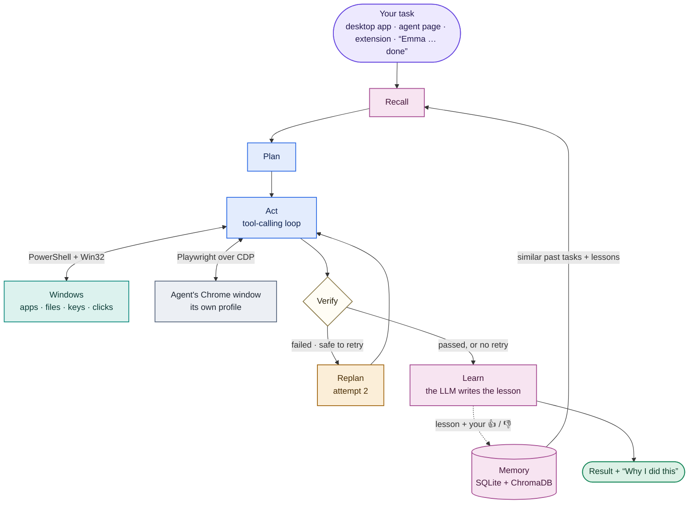

# 🤖 Emma — Smart Agent

*A self-learning agent for your local device and browser, with speech in and speech out.*

An agent that does tasks on **your computer and in your browser** from a typed or spoken instruction, and **learns from every run**: it remembers what worked and what failed, recalls similar past tasks before starting a new one, and explains why it did what it did.

> "Emma … open WhatsApp and send Rakesh a hello … done"

## Documentation

| Read this | What you get |
|---|---|
| **[working.md](working.md)** | The complete explanation: every technology and why it was chosen, how each action on Windows and in Chrome is performed, the full task workflow, learning, safety and settings, with **47 diagrams** (flowcharts, sequence and state charts, in Mermaid) and a [flowchart index](working.md#22-flowchart-index). |
| **[flowcharts.html](flowcharts.html)** | An illustrated flow guide: 26 designed figures with notes, from the system map to the safety guards. Open it in any browser (double-click the file). |
| This README | What it does, setup, and how to use it. |

The Mermaid charts render in VS Code's Markdown preview (**Ctrl+Shift+V**) and on GitHub.

## What it can do

- **Desktop tasks:** open apps and type or click inside them (WhatsApp, Notepad…); install apps from the Microsoft Store or winget; create folders; write, read, move, copy and delete files (deletes go to the Recycle Bin); read PDF, Word, PowerPoint and Excel documents; search by file name or for text **inside** files; use the clipboard; run PowerShell for anything else.
- **Email:** check your mail and read any email (attachments can be saved to Downloads); look up a person's address by name; write an email with To, Cc, Bcc, subject, text and attachments, save it as a draft, or send it — from your own mailbox, after `setup_email.bat` (see below).
- **Browser tasks:** navigate, search, fill forms, click, extract data, attach a file from your computer to a page (chat attachments, upload forms), download files into your Downloads folder, and add products to a cart (it asks for the size when a shop needs one, and never buys). It works in its own Chrome window next to yours: sign in there once to the sites it should use, and your own Chrome profiles stay signed in.
- **Hands-free voice:** say **"Emma"**, give the task, say **"done"** (without "done" nothing is run). Rate the last task the same way: **"Emma … good job … done"** or **"Emma … wrong, <what went wrong> … done"**.
- **She speaks back.** Results and answers are spoken aloud, in a natural voice, with three voices tried in order so she is never silent (Groq Orpheus → Gemini → Windows offline). Numbers, times, prices, file paths and task ids are said the way a person would say them. She never wakes herself: while she is speaking the microphone accepts only *stop*, *quiet* or *wait*, and treats anything she is mid-sentence on as her own echo. Private text — one-time codes, passwords, the contents of mail — is spoken only by the offline voice and never sent to a voice service.
- **Ask her things, don't only give her jobs.** A question gets a spoken answer; a job gets done. *"What did you just do?"*, *"how does the wake word work?"* and *"hello"* are answered in a sentence, while *"open Myntra and filter under 1000"* is carried out. Wording that could be either is settled by the model rather than guessed. The Local Agent window has two microphones for this: 🎙️ sends a **task**, and the round 🗣️ one holds a **conversation** that keeps its turn until you end it.
- **Reads a screen as text, instead of guessing at it.** `read_page_as_markdown` returns a web page as clean Markdown plus every control named the way a screen reader announces it — including icon-only buttons and controls hidden inside web components — with its state and position. `read_window_as_markdown` does the same for a desktop window through Windows' own accessibility service: exact, instant, no vision model and no API call. Vision remains the fallback for canvases, games and apps that draw their own interface.
- **Learning (Level 3):**
  - Every task is stored in local semantic memory (ChromaDB).
  - Before a new task, similar past tasks, and past lessons relevant to it, are recalled.
  - An LLM turns them into a strategy, and after the task it writes the lesson.
  - **👎 asks what went wrong.** Your note is stored with the task and shown to the agent the next time it plans something similar, so it avoids exactly that. You can also say it (see **Hands-free voice** above).
  - **👍 marks the run as correct.** Its steps are kept and offered as a flow to learn from and adapt (not replayed), and it ranks first in recall.
  - Approaches that keep failing ("anti-skills") are avoided.
- **Automatic retry** with a different plan when a safe-to-repeat task fails.
- **Explanations:** every task ends with "why I did this": the steps, the similar past tasks it used, and the strategy.
- **Safety:** payments and checkouts need your confirmation, installing an app asks you first, you see and approve every email before it is sent, a message or email already sent is never sent twice, and the agent never types into, opens or closes your own Chrome.

## Free to run

Only **free** API keys are used:

| Job | Model |
|---|---|
| Planning, actions, reflection, verification | Groq `openai/gpt-oss-120b`; `gpt-oss-20b` for routine steps |
| Fallback when Groq is rate-limited or down | Gemini `gemini-3.6-flash`, then `gemini-2.5-flash-lite` |
| Understanding screenshots (vision) | Gemini first, Groq `qwen/qwen3.8-27b` as backup |
| Voice to text | Groq Whisper `whisper-large-v3-turbo`, given the names it should expect |
| Text to voice | Groq `canopylabs/orpheus-v1-english`, then Gemini `gemini-3.1-flash-tts-preview`, then Windows' offline voice |
| Wake word "Emma" / stop word "done" | Vosk, offline on your PC |
| Semantic memory embeddings | `all-MiniLM-L6-v2`, offline on your PC |

## Setup (once)

Prerequisites: Windows 11, Python 3.11+, Google Chrome, a free [Groq API key](https://console.groq.com/keys) and a free [Gemini API key](https://aistudio.google.com/apikey).

```powershell
git clone https://github.com/Sam2126/Emma--Smart-Agent-.git
cd Emma--Smart-Agent-

cd backend
python -m venv .venv
.venv\Scripts\pip install -r requirements.txt
.venv\Scripts\playwright install chromium

copy ..\.env.example ..\.env        # then put your GROQ_API_KEYS and GEMINI_API_KEY in .env
.venv\Scripts\python scripts\install_vosk_model.py      # offline wake word model (~40 MB)
.venv\Scripts\python scripts\install_desktop_app.py     # Desktop + Start menu icon
```

## Use it

**Desktop app (recommended).** Open **Self-Improving Agent** from the Desktop or Start menu.
- It starts the agent in the background and opens its window.
- Say **"Emma"**, your task, then **"done"**, or type the task. After a task, say **"Emma, good job, done"** or **"Emma, wrong, … done"** to rate it (two short beeps confirm).
- **Closing the window stops everything**: the agent, its Chrome window and the wake word. Nothing keeps listening.
- To keep it listening without a window, use the tray menu → **Hide window, keep listening**; the tray icon stays visible, and **Quit** there stops it.
- Tray menu → **Start with Windows** starts it hidden in the tray right after you log in (a notification says it is listening).

**Chrome extension (browser-only tasks).** Open `chrome://extensions`, enable Developer mode, click **Load unpacked**, and select the `extension/` folder. The side panel shows live steps, the explanation, and 👍/👎.

**From a terminal (development).** Run `.\start_agent.ps1` from the project folder; the console shows every step.
- **Ctrl+C stops the agent completely**, wake word included.
- If the agent is already running (started by the desktop app), the script shows its **live log** instead of starting a second one. Starting both at the same time is safe too: whichever agent comes up first is the one that keeps running, and the desktop app attaches to it. There, **Ctrl+C or Q stops everything** (the desktop app and the agent); **D** only stops watching.
- `.\start_agent.ps1 -Force` quits the desktop app, stops its agent and runs one in your console instead.
- To stop everything from a script or shortcut: `backend\.venv\Scripts\pythonw.exe desktop\agent_desktop.pyw --quit`.

**Email (once).** Double-click `setup_email.bat` in the project folder. It asks for your address and an **App Password** (Gmail: [myaccount.google.com/apppasswords](https://myaccount.google.com/apppasswords), with 2-Step Verification on), checks that reading and sending work without sending anything, and saves them to `.env`. Then say or type things like *"check my mail"*, *"draft an email to Ankit about tomorrow's meeting"* or *"email the report from Downloads to priya@company.in, cc boss@company.in"*. A college Google Workspace address (such as `@bmu.edu.in`) works like Gmail.

**The agent's Chrome window.** Browser tasks run in a separate Chrome window titled **Self-Improving Agent**, with its own profile. The agent opens it on the first browser task, and `start_chrome_debugging.bat` opens it ahead of time so you can sign in to sites (Gemini, WhatsApp Web, shops). Your own Chrome and all its profiles are never launched, copied or closed, so they stay signed in and keep opening normally.

## Running the tests

```powershell
cd backend
.venv\Scripts\python -m pytest tests/ -q
```

**761 tests.** They cover the agent engine, the browser and desktop tools, email, learning and memory, the voice, and telling a question from a job. Nothing is mocked where it matters: the browser tests drive a real headless Chromium, and the page reader is checked against real DOM and shadow DOM. The tests that need a microphone or a live voice service stub those out, so the suite runs anywhere.

## What is in this repository

| Folder | What it holds |
|---|---|
| `backend/app/agent/` | The engine: recall → plan → act → verify → learn, and the tool registry |
| `backend/app/tools/` | What it can actually do: browser, desktop, files, email, apps |
| `backend/app/state/` | Memory: SQLite skills and failure patterns, ChromaDB semantic memory |
| `backend/app/tts.py`, `conversation.py`, `speech_vocab.py` | Speaking, telling a question from a job, hearing names correctly |
| `backend/app/wake_listener.py` | The always-on wake word, the stop word and barge-in |
| `backend/tests/` | The test suite |
| `desktop/` | The Windows desktop app and tray icon |
| `extension/` | The Chrome side-panel extension |

## Licence

None. All rights reserved — the code is here to be read, not reused. Ask first if you would like to use any of it.

## How it works

Every task goes through the same loop, and every run leaves something behind for the next similar task:



- **recall:** at the same time, it runs SQL memory, semantic search over past tasks and lessons, the page's starting state, and the tool set. The reflection LLM writes a STRATEGY / AVOID note from similar tasks.
- **act:** a native tool-calling loop. It streams each action and its result to the UI.
- **verify:** local tasks check the report and that the in-app steps really happened. Browser tasks use site or generic rules, a text judge, and a screenshot (vision) judge.
- **learn:**
  - The episodic log, skills and failure patterns go into SQLite.
  - The LLM lesson goes into ChromaDB, in the background.
  - After a retry, the lesson compares the failed attempt with the successful one.

Each of these steps has its own flowchart in [working.md](working.md#22-flowchart-index): [the whole task](working.md#flowchart-one-task-end-to-end), [scope routing](working.md#flowchart-scope-routing), [the actor loop](working.md#flowchart-the-actor-loop), [verify and retry](working.md#flowchart-verify-and-retry), [what is learned](working.md#flowchart-what-is-written-after-a-task), [recall ranking](working.md#flowchart-recall-and-ranking) and [free-key LLM calls](working.md#flowchart-one-llm-call-on-free-keys).

## Project structure

```
Self_Improving_RK/
├── backend/
│   ├── app/
│   │   ├── agent/        LangGraph engine: graph, nodes (recall, planner, actor, verifier,
│   │   │                 replanner, learner), prompts, toolkit, explanations, runner
│   │   ├── tools/        desktop, local-file, app-install (winget), email (IMAP/SMTP) and browser tools
│   │   ├── browser/      Chrome/Playwright controller, page state
│   │   ├── state/        SQLite brain, ChromaDB semantic memory, LLM reflection
│   │   ├── verifier/     rule checks, generic + site rules, text and vision judges
│   │   ├── utils/        model routing, LiteLLM patch (Groq key pool + Gemini fallback), vision
│   │   ├── websocket/    protocol + server for the UIs
│   │   ├── rl/           reinforcement-learning pipeline (kept for later: needs more data)
│   │   ├── evals/        benchmark runner (python -m app.evals.run_eval)
│   │   ├── static/       Local Agent page
│   │   ├── wake_listener.py, voice.py, voice_feedback.py, config.py, main.py
│   ├── scripts/          install_desktop_app, install_vosk_model, the agent's Chrome window, RL smoke test
│   └── tests/            pytest suite (fixtures/voice: real recordings, see ATTRIBUTION.md)
├── desktop/              desktop app (agent_desktop.pyw): WebView2 window + tray
├── extension/            Chrome extension (MV3 side panel)
├── working.md            full explanation + 47 diagrams
├── flowcharts.html       illustrated flow guide (open in a browser)
├── rl_implementation_plan_v2.md
├── start_agent.ps1, start_chrome_debugging.bat
└── .env.example
```

## API

```bash
curl http://localhost:8000/health                                   # status, wake word, key pool
curl -X POST "http://localhost:8000/task?instruction=list+my+recent+downloads&scope=local"
curl -X POST "http://localhost:8000/tasks/<task_id>/feedback?rating=1"   # 👍 (-1 for 👎)
curl "http://localhost:8000/brain/experiences?query=message+on+whatsapp" # what it remembers
curl http://localhost:8000/brain/models                             # which model serves each role
```

## Tests

```powershell
cd backend
.venv\Scripts\python -m pytest -q                               # 621 tests
.venv\Scripts\python ..\desktop\agent_desktop.pyw --smoke-test   # desktop app end to end
```

Tests run against a scratch database and memory store, never the agent's real memory. The fixes from the 16 September 2026 review, each with its test, are listed in [working.md, section 19](working.md#19-reliability-fixes-from-the-2026-09-16-review).

## Roadmap

- **Done:**
  - Level 3 learning: ChromaDB semantic memory, LLM reflection, feedback, anti-skills
  - one LangGraph engine
  - vision perception and verification
  - offline wake word
  - free Groq + Gemini routing
  - desktop app
- **Next, Level 4:** activate the RL pipeline in `backend/app/rl/` (SFT → DPO → GRPO/PPO) once enough verified task trajectories have been collected. See `rl_implementation_plan_v2.md`.
