# How the Self-Improving Agent Works

A complete guide to this project: what every part does, which technology it uses and why, how the parts talk to each other, exactly how the agent performs actions on this Windows computer and in Chrome, and what happens, step by step, from the moment you give a task until the agent has learned from it.

*Last updated: 2026-09-17 — after a full review of the codebase (≈23,500 lines) and the fixes listed in [section 19](#19-reliability-fixes-from-the-2026-09-16-review). Test suite: 551 passing.*

**Flowcharts.** Every section has flowcharts that show the flow step by step ([how to read them](#reading-the-flowcharts), [list of all charts](#22-flowchart-index)). The same flows, drawn as a designed, illustrated guide with notes, are in **[flowcharts.html](flowcharts.html)**. Open that file in any browser.

---

## Contents

1. [What the project is](#1-what-the-project-is)
2. [The big picture](#2-the-big-picture)
3. [Technology stack, and why each piece was chosen](#3-technology-stack-and-why-each-piece-was-chosen) · [how the technologies connect](#33-how-the-technologies-connect)
4. [Where everything lives](#4-where-everything-lives)
5. [How the pieces are connected](#5-how-the-pieces-are-connected)
6. [Start-up: from the desktop icon to "Listening for Emma"](#6-start-up-from-the-desktop-icon-to-listening-for-emma) · [every way to stop it](#flowchart-every-way-to-stop-the-agent)
7. [The complete workflow of one task](#7-the-complete-workflow-of-one-task)
8. [How the agent operates this computer](#8-how-the-agent-operates-this-computer)
9. [How the agent operates Chrome](#9-how-the-agent-operates-chrome)
10. [Voice: the mic button and the wake word](#10-voice-the-mic-button-and-the-wake-word) · [rating a task by voice](#103-rating-a-task-by-voice-voice_feedbackpy)
11. [How the agent learns](#11-how-the-agent-learns)
12. [LLM routing on free API keys](#12-llm-routing-on-free-api-keys)
13. [Verification: deciding whether a task really worked](#13-verification-deciding-whether-a-task-really-worked)
14. [Safety rules](#14-safety-rules)
15. [The desktop app](#15-the-desktop-app)
16. [The Chrome extension](#16-the-chrome-extension)
17. [APIs, messages and configuration](#17-apis-messages-and-configuration)
18. [Data on disk, logs, tests and the RL pipeline](#18-data-on-disk-logs-tests-and-the-rl-pipeline)
19. [Reliability fixes from the 2026-09-16 review](#19-reliability-fixes-from-the-2026-09-16-review)
20. [Known limitations](#20-known-limitations)
21. [Glossary](#21-glossary)
22. [Flowchart index](#22-flowchart-index)

---

## Reading the flowcharts

The charts are written in Mermaid. VS Code's Markdown preview (**Ctrl+Shift+V**) and GitHub draw them as pictures. In the preview, hold **Alt** and scroll to zoom a chart, or right-click it to copy its source.

Colours and shapes mean the same thing in every chart:

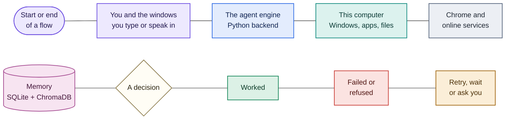
```mermaid
flowchart LR
    L1(["Start or end<br/>of a flow"]):::ui
    L2["You and the windows<br/>you type or speak in"]:::ui
    L3["The agent engine<br/>Python backend"]:::engine
    L4["This computer<br/>Windows, apps, files"]:::local
    L5["Chrome and<br/>online services"]:::ext
    L6[("Memory<br/>SQLite + ChromaDB")]:::mem
    L7{"A decision"}:::dec
    L8["Worked"]:::ok
    L9["Failed or<br/>refused"]:::bad
    L10["Retry, wait<br/>or ask you"]:::warn
    L1 --- L2 --- L3 --- L4 --- L5
    L6 --- L7 --- L8 --- L9 --- L10

    classDef ui fill:#ede9fe,stroke:#6a4be0,stroke-width:1.5px,color:#22184d
    classDef engine fill:#e3ecfd,stroke:#2d6be4,stroke-width:1.5px,color:#0f2350
    classDef local fill:#dcf2ee,stroke:#0f8a7e,stroke-width:1.5px,color:#0b3b36
    classDef ext fill:#eceff4,stroke:#56657d,stroke-width:1.5px,color:#1f2733
    classDef mem fill:#f7e4f1,stroke:#a3478f,stroke-width:1.5px,color:#45173b
    classDef ok fill:#dcf1e6,stroke:#17875a,stroke-width:1.5px,color:#0d3d29
    classDef bad fill:#fbe3e1,stroke:#c93d36,stroke-width:1.5px,color:#4f1411
    classDef warn fill:#fbeed8,stroke:#a0650f,stroke-width:1.5px,color:#4a2e05
    classDef dec fill:#fffdf5,stroke:#8b7a4a,stroke-width:1.5px,color:#2b2410
```

- **Rounded ends** mark where a flow starts or finishes. **Rectangles** are steps. **Diamonds** are decisions, and the labels on their arrows are the answers. **Cylinders** are stored data.
- A **dotted arrow** is a path that is optional or happens later (for example, a rating that shapes the *next* similar task).
- **Sequence charts** read top to bottom: each arrow is one message between the parts named across the top.

---

## 1. What the project is

The Self-Improving Agent takes an instruction — typed, spoken, or said hands-free after the wake word **"Emma"** — and carries it out on **your Windows computer** and **in your Chrome browser**. Examples:

- "create a folder on the desktop called MAYANK and put a prime-number program in it"
- "open WhatsApp, search Rakesh and say hello to him"
- "open chrome, go to Gemini, attach the last PPT from Downloads and ask for a summary"
- "search inside the files on my desktop for is_prime"
- "install Spotify from the Microsoft Store"
- "open Myntra, find black running shoes and add size 9 to my bag"
- "download the syllabus PDF from this page"

After every task it **learns**: it stores what it did and whether it worked, an LLM writes the lesson, and before the next similar task it recalls those experiences and plans with them. Your 👍 / 👎 (with a note on what went wrong) is the strongest teaching signal, and you can also say it: "Emma … wrong, you should have … done" (section 10.3).

Everything runs on **free** services: Groq and Google Gemini API keys for the language and vision models, and offline, on-device models for the wake word and for memory search.

---

## 2. The big picture

```
 ┌──────────────────────── WAYS TO GIVE A TASK ───────────────────────────┐
 │ Desktop app window    Local Agent page     Chrome extension   Wake word │
 │ (WebView2, tray)      localhost:8000/local (side panel)       "Emma…done"
 │        │                     │                   │                │     │
 │        └──── WebSocket ws://localhost:8765 ──────┘                │     │
 │                              │                        (same process)    │
 │  REST: POST localhost:8000/task ──────────────┐                   │     │
 └──────────────────────────────┼────────────────┼───────────────────┼─────┘
                                ▼                ▼                   ▼
 ┌──────────────────────── BACKEND (one Python process) ──────────────────┐
 │  FastAPI + WebSocket server + wake-word thread                         │
 │                                                                        │
 │  AgentRunner ──► LangGraph engine                                      │
 │                                                                        │
 │    recall ─► planner ─► act ─► verify ──success──► learn ─► result     │
 │                          ▲       │                                     │
 │                          └replan◄┘ (one safe retry)                    │
 │                                                                        │
 │  Tools ─┬─ local:   files, folders, documents, apps, installs, keys,   │
 │         │           clicks, screenshots + vision, clipboard, PowerShell│
 │         └─ browser: navigate, perceive, see, type, click, upload,      │
 │                     download, add to cart, keys, scroll, login wait    │
 │                                                                        │
 │  Memory: SQLite (history, skills, selectors, failure patterns)         │
 │          ChromaDB (experiences + lessons, searched by meaning)         │
 └──────┬──────────────────────┬─────────────────────────┬────────────────┘
        │ PowerShell + Win32   │ Chrome DevTools          │ HTTPS
        ▼                      ▼ Protocol (port 9222)      ▼
   Windows apps, files    Chrome (agent tab)        Groq (LLMs, Whisper)
   (WhatsApp, Explorer…)  via Playwright            Gemini (fallback, vision)
```

In one sentence: **the UIs send an instruction over a WebSocket, a LangGraph state machine plans and executes it with tools that drive Windows and Chrome, a verifier checks the result, and a learning layer stores the experience so the next similar task goes better.**

#### Flowchart: system map

The same picture as a flowchart. Purple boxes are how you reach the agent, blue boxes are the engine inside the one backend process, and the bottom row is what the backend drives.

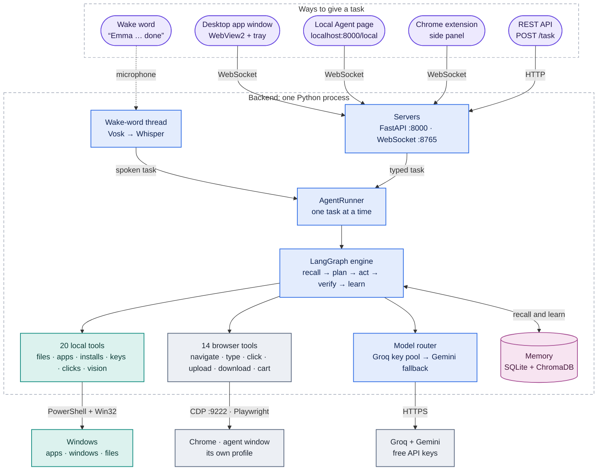
```mermaid
flowchart TB
    subgraph IN["Ways to give a task"]
        direction LR
        WW(["Wake word<br/>“Emma … done”"]):::ui
        DA(["Desktop app window<br/>WebView2 + tray"]):::ui
        LP(["Local Agent page<br/>localhost:8000/local"]):::ui
        EX(["Chrome extension<br/>side panel"]):::ui
        RS(["REST API<br/>POST /task"]):::ui
    end

    subgraph BE["Backend: one Python process"]
        WT["Wake-word thread<br/>Vosk → Whisper"]:::engine
        SV["Servers<br/>FastAPI :8000 · WebSocket :8765"]:::engine
        AR["AgentRunner<br/>one task at a time"]:::engine
        LG["LangGraph engine<br/>recall → plan → act → verify → learn"]:::engine
        LT["20 local tools<br/>files · apps · installs · keys · clicks · vision"]:::local
        BT["14 browser tools<br/>navigate · type · click · upload · download · cart"]:::ext
        MR["Model router<br/>Groq key pool → Gemini fallback"]:::engine
        MEM[("Memory<br/>SQLite + ChromaDB")]:::mem
    end

    WIN["Windows<br/>apps · windows · files"]:::local
    CH["Chrome · agent window<br/>its own profile"]:::ext
    LLM["Groq + Gemini<br/>free API keys"]:::ext

    WW -. microphone .-> WT
    DA & LP & EX -->|WebSocket| SV
    RS -->|HTTP| SV
    WT -->|spoken task| AR
    SV -->|typed task| AR
    AR --> LG
    LG --> LT & BT & MR
    LG <-->|recall and learn| MEM
    LT -->|PowerShell + Win32| WIN
    BT -->|"CDP :9222 · Playwright"| CH
    MR -->|HTTPS| LLM

    classDef ui fill:#ede9fe,stroke:#6a4be0,stroke-width:1.5px,color:#22184d
    classDef engine fill:#e3ecfd,stroke:#2d6be4,stroke-width:1.5px,color:#0f2350
    classDef local fill:#dcf2ee,stroke:#0f8a7e,stroke-width:1.5px,color:#0b3b36
    classDef ext fill:#eceff4,stroke:#56657d,stroke-width:1.5px,color:#1f2733
    classDef mem fill:#f7e4f1,stroke:#a3478f,stroke-width:1.5px,color:#45173b
    style IN fill:transparent,stroke:#8a94a6,stroke-width:1px,stroke-dasharray:6 4
    style BE fill:transparent,stroke:#8a94a6,stroke-width:1px,stroke-dasharray:6 4
```

---

## 3. Technology stack, and why each piece was chosen

### 3.1 Summary table

| Layer | Technology | What it does here |
|---|---|---|
| Language | **Python 3.12** | Backend, tools, desktop app, tests |
| Web server | **FastAPI** + **Uvicorn** | REST API, `/health`, serves the Local Agent page |
| Live channel | **websockets** | Streams progress, confirmations, feedback to the UIs |
| Agent engine | **LangGraph** | The recall → plan → act → verify → replan → learn state machine |
| LLM client | **LiteLLM** (patched) | One OpenAI-style API for Groq and Gemini; key rotation and fallback |
| Main LLMs | **Groq**: `openai/gpt-oss-120b`, `openai/gpt-oss-20b` | Planning, tool calling, reflection, judging |
| Fallback + vision | **Google Gemini**: `gemini-3.6-flash`, `gemini-2.5-flash-lite` | Used when Groq is rate-limited; first choice for screenshots |
| Vision backup | **Groq** `qwen/qwen3.8-27b` | Screenshot understanding if Gemini fails |
| Speech to text | **Groq Whisper** `whisper-large-v3-turbo` | Transcribes spoken instructions |
| Wake word | **Vosk** (offline) + **SpeechRecognition** + **PyAudio** | Hears "Emma" and "done" without internet |
| Semantic memory | **ChromaDB** + **all-MiniLM-L6-v2** (onnxruntime) | Stores experiences; finds similar ones by meaning, offline |
| Structured memory | **SQLite** via **SQLAlchemy (async)** + **aiosqlite** | Task history, skills, selectors, failure patterns, stats |
| Browser control | **Playwright** over **Chrome DevTools Protocol** | Drives the agent's own Chrome window (its own profile and logins) |
| Windows control | **PowerShell** + **Win32 API** (C# compiled at run time) | Finds/focuses windows, types, clicks, captures screenshots |
| Windows shell | **ctypes** (`SHFileOperationW`), **winreg** | Recycle Bin deletes, real Desktop/Documents locations |
| Documents | **pypdf**, **python-docx**, **python-pptx**, **openpyxl** | Reads PDF, Word, PowerPoint, Excel |
| App installs | **winget** (App Installer, part of Windows 11) | Installs Microsoft Store and winget-catalogue apps without opening the Store |
| Images | **Pillow** | Detects app splash screens; tray icon |
| Desktop app | **pywebview** (Edge WebView2) + **pystray** | Native window + system-tray icon |
| Extension | **Chrome Manifest V3** (service worker + side panel) | Browser-only task panel |
| Config | **pydantic-settings** | Typed settings from `.env` |
| Logging | **structlog** | Readable `key=value` logs |
| HTTP | **httpx** | Model lists, Whisper, Groq vision |
| Tests | **pytest** + **pytest-asyncio** | 551 tests |
| Level 4 (dormant) | **PyTorch**, **transformers**, **PEFT**, **TRL** | SFT / DPO / GRPO / PPO training, for later |

### 3.2 Why these choices, and why not the alternatives

**Agent engine — LangGraph** (not CrewAI, AutoGen, or a hand-written loop)
- The project started on **CrewAI**. It ran tasks on a second code path next to an unused LangGraph graph ("two paths, two sets of bugs", `agent/graph.py`), and its strict-mode tool schemas marked *every* argument as required, so Groq rejected valid calls such as `send_keys(window_hint='WhatsApp', keys='^f')` (`tools/base.py`).
- LangGraph gives an explicit graph: each step is a small function, the state is a plain typed dictionary, and the retry loop is a visible edge. That makes the flow testable node by node.
- AutoGen and similar multi-agent frameworks add conversation between agents, which costs extra tokens — expensive on free rate limits.

**Language models — Groq + Gemini, free keys only** (not OpenAI, Anthropic, or local Ollama)
- The project deliberately uses **only free API keys**.
- **Groq** is free, very fast, supports OpenAI-style tool calling, and also hosts Whisper. Several free keys are pooled and rotated to multiply the free rate limit.
- **Gemini** (Google AI Studio) is free, reads images well, and has separate daily quotas per model, so it doubles as the fallback provider and the first vision provider.
- **OpenAI / Anthropic** are paid. An `LLM_PROVIDER=openai` switch exists in code but is not used.
- **Ollama / local LLMs** need large downloads and a strong GPU; on a laptop CPU they are too slow for step-by-step tool calling.
- The models are validated against Groq's live `/models` list at start-up. On this account no Llama chat models are offered, so the configured `gpt-oss` models are used (see the `model_routing` log line).

**One client for all providers — LiteLLM** (not separate SDKs)
- One `acompletion()` call works for `groq/…`, `gemini/…` and `openai/…` models. The project patches it once (`utils/litellm_patch.py`) to add key rotation, rate-limit handling and Gemini fallback for every call.

**Semantic memory — ChromaDB + MiniLM** (not FAISS, Qdrant, Pinecone, or pgvector)
- ChromaDB is **embedded**: no server to run, data persists in `backend/data/chroma`, and it stores metadata (success, tools, lesson, feedback) next to each vector.
- Its default embedding model, **all-MiniLM-L6-v2**, runs **offline on the CPU** through onnxruntime — no API calls, no cost, fast.
- **FAISS** has no built-in persistence or metadata. **Qdrant / Weaviate / Milvus** need a separate server. **pgvector** needs PostgreSQL. **Pinecone** is a cloud service with limits.

**Structured memory — SQLite** (not PostgreSQL or MongoDB)
- One file, zero setup, enough for one user. SQLAlchemy's async engine keeps the same code ready for PostgreSQL if ever needed.

**Browser automation — Playwright over CDP** (not Selenium or Puppeteer)
- `connect_over_cdp` **attaches to a real, installed Chrome** (the agent's own window), so sites behave as they do for you, and the logins made in that window are kept.
- It waits for elements automatically, handles iframes, and can **intercept the file-picker dialog** (used by `upload_file`), which Selenium cannot do cleanly.
- **Selenium** needs a matching driver and cannot easily attach to a normal profile. **Puppeteer** is Node.js only.

**Windows control — PowerShell + Win32 via `Add-Type`** (not pyautogui or pywinauto)
- No extra Python packages: a small C# class (`OaskUI` in `tools/desktop.py`) is compiled inside PowerShell and calls `user32.dll` directly.
- It **finds the right window** (scoring candidates, because WhatsApp shows two windows with the same title), **verifies focus** before typing, and types with `SendInput` + `KEYEVENTF_UNICODE`, which works in Chromium/WebView2 apps and in any language. .NET `SendKeys` silently did nothing in WhatsApp.
- **pyautogui** types into whatever window happens to be in front, with no targeting or focus check. **pywinauto**'s UI Automation tree is unreliable for WebView2 apps like WhatsApp.

**Seeing inside apps — screenshots + a vision model** (not Windows UI Automation)
- Modern apps (WebView2, Electron) expose poor accessibility trees; a screenshot works for any app. The vision model is asked for positions as **percentages**, which models estimate far better than pixels; the tool converts them to pixels using the real window size.

**Wake word — Vosk** (not Porcupine, openWakeWord, or Google's recognizer)
- **Offline and free.** Porcupine needs an access key and trained keyword files. The Google recognizer needs internet and has rate limits (it is kept as an automatic fallback).
- Vosk runs with a **grammar** — only the wake word ("Emma"), "done", and look-alike *decoy* words — so it acts as a keyword spotter. Measured on real recordings: "Emma" 4/4 detected and 0 of 59 other words woke it (anna, hammer, karma, drama, llama, all the "hello" and "done" clips, …); for the earlier wake word "hello": 6/6 "hello", 6/6 "done", 0/24 false triggers.

**Transcribing the instruction — Groq Whisper** (not the free Google recognizer)
- Whisper transcribes the whole recording in one accurate pass (and handles Indian names and mixed languages much better). The free Google recognizer returned garbled or empty text for short chunks.

**Desktop app — pywebview + pystray on Edge WebView2** (not Electron or Tauri)
- WebView2 already ships with Windows 11, so there is **no ~100 MB browser engine** to bundle and start. The app reuses the backend's Python environment.
- Tray icon, single instance, start-with-Windows and crash restart come from small pieces (pystray, a named mutex, the `Run` registry key).
- **Electron** bundles Chromium (heavy, slow start). **Tauri** needs a Rust toolchain.

**Web server — FastAPI + a separate websockets server** (not Flask or Django)
- Everything in the backend is `asyncio` (Playwright, LiteLLM, SQLAlchemy, ChromaDB wrappers), and FastAPI is async-native with typed request validation and start-up/shut-down hooks. Flask and Django are synchronous by default and heavier.

**Installing apps — winget** (not clicking through the Microsoft Store app)
- winget ships with Windows 11. One command installs Store apps (`msstore`) and ordinary programs (`winget`), and `winget list` says plainly whether an app is already there.
- Driving the Store window with screenshots and clicks would be slow and break whenever the Store's layout changes.

**Configuration — pydantic-settings**, **logging — structlog**
- Settings are typed and validated from `.env`. structlog writes `event key=value` lines that are easy to search — every bug in section 19 was diagnosed from these logs.

### 3.3 How the technologies connect

Each arrow is a real call in the code, labelled with what travels along it. Apart from the front ends and the boxes at the far right (Chrome, Windows, your files, the online services and the data on disk), every box is a Python library inside **one backend process**, on one `asyncio` event loop. The other processes are the desktop app, Chrome, short-lived PowerShell processes and the Playwright driver.

**How a task gets in.** Every way of giving a task ends at AgentRunner:

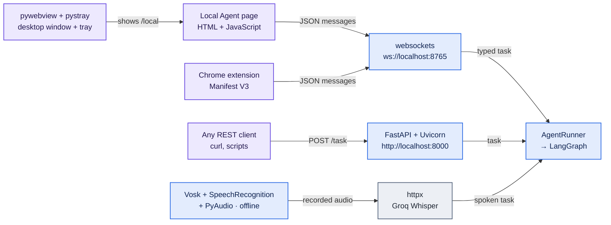
```mermaid
flowchart LR
    PW["pywebview + pystray<br/>desktop window + tray"]:::ui -->|"shows /local"| PAGE["Local Agent page<br/>HTML + JavaScript"]:::ui
    PAGE -->|JSON messages| WS["websockets<br/>ws://localhost:8765"]:::engine
    MV3["Chrome extension<br/>Manifest V3"]:::ui -->|JSON messages| WS
    CURL["Any REST client<br/>curl, scripts"]:::ui -->|"POST /task"| FA["FastAPI + Uvicorn<br/>http://localhost:8000"]:::engine
    MIC["Vosk + SpeechRecognition<br/>+ PyAudio · offline"]:::engine -->|recorded audio| HX["httpx<br/>Groq Whisper"]:::ext
    WS -->|typed task| AR["AgentRunner<br/>→ LangGraph"]:::engine
    FA -->|task| AR
    HX -->|spoken task| AR

    classDef ui fill:#ede9fe,stroke:#6a4be0,stroke-width:1.5px,color:#22184d
    classDef engine fill:#e3ecfd,stroke:#2d6be4,stroke-width:1.5px,color:#0f2350
    classDef ext fill:#eceff4,stroke:#56657d,stroke-width:1.5px,color:#1f2733
```

**What the engine drives.** Each tool family uses one library, and each library has one way out of the process:

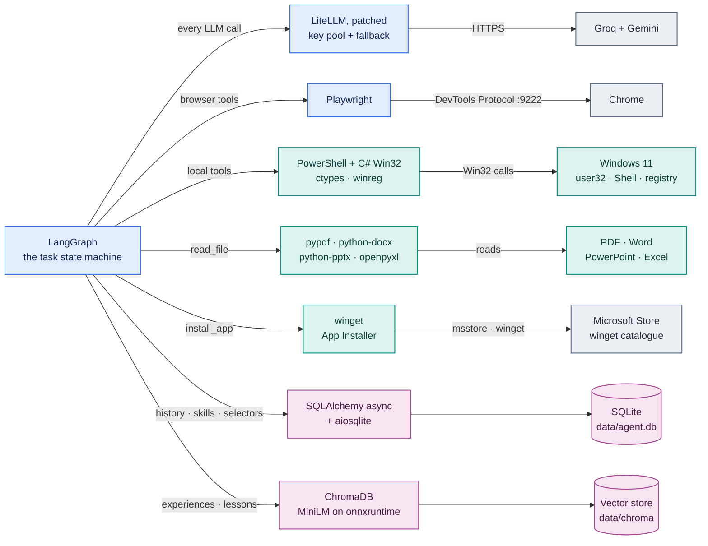
```mermaid
flowchart LR
    LGR["LangGraph<br/>the task state machine"]:::engine
    LGR -->|every LLM call| LL["LiteLLM, patched<br/>key pool + fallback"]:::engine -->|HTTPS| AI["Groq + Gemini"]:::ext
    LGR -->|browser tools| PWR["Playwright"]:::engine -->|"DevTools Protocol :9222"| CHR["Chrome"]:::ext
    LGR -->|local tools| PSH["PowerShell + C# Win32<br/>ctypes · winreg"]:::local -->|Win32 calls| WIN["Windows 11<br/>user32 · Shell · registry"]:::local
    LGR -->|read_file| DOC["pypdf · python-docx<br/>python-pptx · openpyxl"]:::local -->|reads| FILES["PDF · Word<br/>PowerPoint · Excel"]:::local
    LGR -->|install_app| WG["winget<br/>App Installer"]:::local -->|"msstore · winget"| STORE["Microsoft Store<br/>winget catalogue"]:::ext
    LGR -->|"history · skills · selectors"| SQL["SQLAlchemy async<br/>+ aiosqlite"]:::mem --> DB[("SQLite<br/>data/agent.db")]:::mem
    LGR -->|"experiences · lessons"| CH["ChromaDB<br/>MiniLM on onnxruntime"]:::mem --> VEC[("Vector store<br/>data/chroma")]:::mem

    classDef engine fill:#e3ecfd,stroke:#2d6be4,stroke-width:1.5px,color:#0f2350
    classDef local fill:#dcf2ee,stroke:#0f8a7e,stroke-width:1.5px,color:#0b3b36
    classDef ext fill:#eceff4,stroke:#56657d,stroke-width:1.5px,color:#1f2733
    classDef mem fill:#f7e4f1,stroke:#a3478f,stroke-width:1.5px,color:#45173b
```

- **Front ends never touch the engine directly.** They only exchange JSON messages over the WebSocket (section 17.2), so the desktop window, the Local Agent page and the extension behave the same way.
- **LiteLLM is the only door to the language models.** The patch in `utils/litellm_patch.py` wraps it once, so key rotation and the Gemini fallback apply to every call (section 12). Whisper and model lists use `httpx` directly.
- **Settings and logs** reach every box above: `pydantic-settings` reads `.env` into typed settings, and `structlog` writes each event as one searchable line.
- **Two kinds of memory, one engine.** SQLite answers exact questions (this site's selectors, this skill's success rate); ChromaDB answers "what have I done that *means* the same thing?" (section 11).

---

## 4. Where everything lives

```
Self_Improving_RK/
├── .env / .env.example        settings and API keys (.env is private, never committed)
├── start_agent.ps1            run the agent in a console (or tail the running agent's log)
├── start_chrome_debugging.bat open the agent's Chrome window (to sign in to sites)
├── README.md                  quick start
├── working.md                 this document
├── rl_implementation_plan_v2.md   the Level 4 (reinforcement learning) plan
├── desktop/
│   ├── agent_desktop.pyw      the desktop app (window + tray + backend supervisor)
│   └── assets/icon.ico|png
├── extension/                 Chrome extension (Manifest V3)
│   ├── manifest.json, background.js (WebSocket relay), content.js
│   └── sidepanel.html|css|js  the side-panel UI
└── backend/
    ├── requirements.txt, requirements-rl.txt, pyproject.toml
    ├── scripts/               install_desktop_app, install_vosk_model,
    │                          launch_linked_chrome (the agent's Chrome window), smoke_rl_training
    ├── tests/                 551 tests (fixtures/voice: 63 real recordings)
    ├── data/                  runtime data (see section 18)
    └── app/
        ├── main.py            FastAPI app, start-up/shut-down, REST endpoints
        ├── config.py          all settings
        ├── voice.py           Groq Whisper transcription
        ├── voice_feedback.py  "Emma … good job … done": spoken ratings
        ├── wake_listener.py   always-on "Emma … done" listener (thread)
        ├── websocket/         protocol.py (message types), server.py (routing, scope)
        ├── agent/
        │   ├── runner.py      AgentRunner: one entry point for every task
        │   ├── graph.py       the LangGraph state machine
        │   ├── state.py       AgentState (the data that flows through the graph)
        │   ├── context.py     RunContext (callbacks, tool set, deadline)
        │   ├── nodes/         recall, planner, actor, verifier, replanner, learner
        │   ├── toolkit.py     tool registry, execution, success/failure checks, guards
        │   ├── prompts.py     planner and actor prompts
        │   ├── explain.py     "Why I did this" text
        │   └── services.py    the shared BrainMemory and EpisodicLogger
        ├── tools/
        │   ├── base.py        minimal tool base class (schema → LLM function)
        │   ├── runtime.py     how tool bodies are executed (threads / event loop)
        │   ├── local.py       file, folder, document, app, keyboard, shell, clipboard tools
        │   ├── desktop.py     window list/focus, see_window (vision), click_window
        │   ├── apps.py        install_app: Microsoft Store and winget installs
        │   └── browser.py     the 14 browser tools
        ├── browser/           controller.py (Chrome connection), actions.py (click/type/…),
        │                      page_state.py (page snapshot), registry.py
        ├── state/             brain.py (SQL learning), semantic_memory.py (ChromaDB),
        │                      reflection.py (LLM lessons), domain_memory.py,
        │                      episodic_log.py, database.py, models.py
        ├── verifier/          engine.py, llm_judge.py, rule_checks.py, rules/
        ├── utils/             llm.py (model routing), litellm_patch.py, key_pool.py,
        │                      vision.py, confirmation.py, loop.py
        ├── static/local_agent.html   the Local Agent chat page
        ├── evals/             frozen benchmark runner
        └── rl/                Level 4 reinforcement-learning pipeline (dormant)
```

---

## 5. How the pieces are connected

### 5.1 Processes and ports

| Process | Started by | Talks to |
|---|---|---|
| **Desktop app** (`pythonw agent_desktop.pyw`) | Desktop / Start-menu icon, or Windows log-in | Backend over HTTP `127.0.0.1:8000`; listens on **8767** for "show" requests from a second launch |
| **Backend** (`python -m app.main`) | The desktop app (or `start_agent.ps1`) | Serves **8000** (REST + page) and **8765** (WebSocket); drives Chrome on **9222**; starts PowerShell; calls Groq/Gemini over HTTPS |
| **Chrome** (agent window) | The backend, on the first browser task | Exposes the DevTools Protocol on **9222** |
| **PowerShell** (short-lived) | Local/desktop tools | Win32 API, files, Start-menu apps |
| **Playwright driver** (node) | The backend | Chrome over CDP |

### 5.2 Threads inside the backend

| Thread | Job |
|---|---|
| **Main event loop** | FastAPI, the WebSocket server, the LangGraph engine, every LLM call, every Playwright call |
| **Wake-word thread** | Microphone → Vosk → recording; hands transcription and the task back to the main loop |
| **Tool worker threads** | Each tool call runs in `asyncio.to_thread` |

How a tool call is executed (`tools/runtime.py`):

- **Browser tools** (`run_sync`): the worker thread sends the tool's body back to the **main loop**, because Playwright objects belong to that loop, and waits for it. The body is truly asynchronous, so the loop stays free.
- **Local and desktop tools** (`run_in_worker`): the body runs **in the worker thread** on its own small event loop, because it blocks (PowerShell, folder scans, a window watch of up to a minute). The one network call inside `see_window` (vision) is handed to the main loop with `on_main_loop`.
- Every tool call is capped at **300 s** (`TOOL_TIMEOUT_SECONDS`); a stuck tool gives the task back.

#### Sequence: how a tool call is executed

Two tool calls, one after the other: a local tool whose blocking work stays in the worker thread, and a browser tool whose work is handed back to the main loop, because Playwright objects belong to that loop.

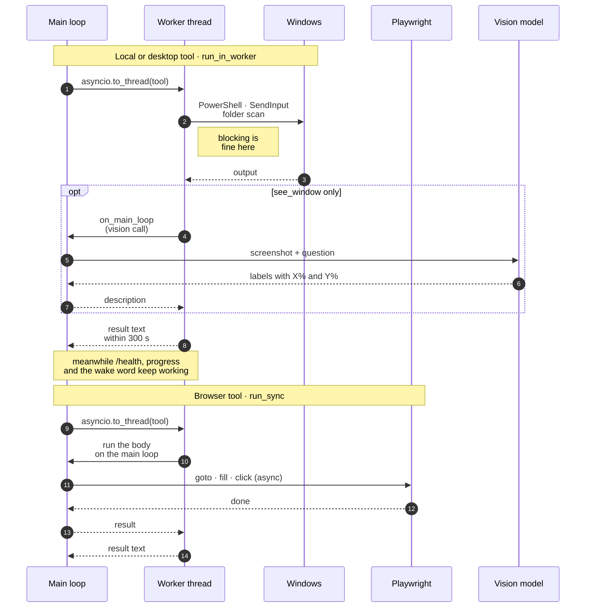
```mermaid
sequenceDiagram
    autonumber
    participant ML as Main loop
    participant WK as Worker thread
    participant OS as Windows
    participant PL as Playwright
    participant VM as Vision model

    Note over ML,OS: Local or desktop tool · run_in_worker
    ML->>WK: asyncio.to_thread(tool)
    WK->>OS: PowerShell · SendInput<br/>folder scan
    Note right of WK: blocking is<br/>fine here
    OS-->>WK: output
    opt see_window only
        WK->>ML: on_main_loop<br/>(vision call)
        ML->>VM: screenshot + question
        VM-->>ML: labels with X% and Y%
        ML-->>WK: description
    end
    WK-->>ML: result text<br/>within 300 s
    Note over ML,WK: meanwhile /health, progress<br/>and the wake word keep working

    Note over ML,PL: Browser tool · run_sync
    ML->>WK: asyncio.to_thread(tool)
    WK->>ML: run the body<br/>on the main loop
    ML->>PL: goto · fill · click (async)
    PL-->>ML: done
    ML-->>WK: result
    WK-->>ML: result text
```

### 5.3 Inside the engine

```
AgentRunner.run_task(instruction, task_id, scope)
   ├─ waits for the "task lane" (one task at a time: tasks share the tab, keyboard and mouse)
   ├─ RunContext: status callback (streaming), 180 s deadline, tool set
   ├─ Confirmer: asks the UI before payments and uploads (context variable)
   └─ LangGraph: create_initial_state() ─► graph.ainvoke()
           state = { task_id, instruction, scope, experiences, strategy, plan,
                     trajectory[], final_report, success, error, attempt, … }
```

#### Flowchart: the LangGraph engine

The graph exactly as `agent/graph.py` builds it: six nodes, one conditional edge after `verify`, and `replan` going straight back to `act` with its new plan.

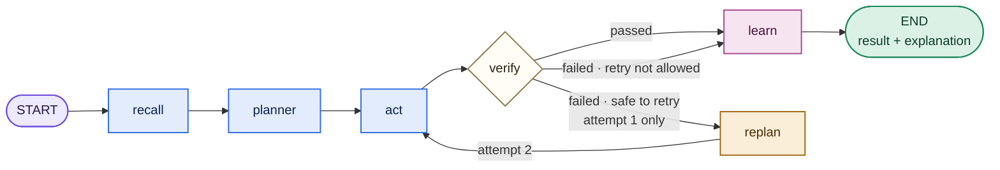
```mermaid
flowchart LR
    S(["START"]):::ui --> R["recall"]:::engine --> P["planner"]:::engine --> A["act"]:::engine --> V{"verify"}:::dec
    V -->|passed| L["learn"]:::mem
    V -->|"failed · retry not allowed"| L
    V -->|"failed · safe to retry<br/>attempt 1 only"| RP["replan"]:::warn
    RP -->|attempt 2| A
    L --> E(["END<br/>result + explanation"]):::ok

    classDef ui fill:#ede9fe,stroke:#6a4be0,stroke-width:1.5px,color:#22184d
    classDef engine fill:#e3ecfd,stroke:#2d6be4,stroke-width:1.5px,color:#0f2350
    classDef mem fill:#f7e4f1,stroke:#a3478f,stroke-width:1.5px,color:#45173b
    classDef ok fill:#dcf1e6,stroke:#17875a,stroke-width:1.5px,color:#0d3d29
    classDef warn fill:#fbeed8,stroke:#a0650f,stroke-width:1.5px,color:#4a2e05
    classDef dec fill:#fffdf5,stroke:#8b7a4a,stroke-width:1.5px,color:#2b2410
```

---

## 6. Start-up: from the desktop icon to "Listening for Emma"

1. **You open the icon.** `pythonw.exe desktop\agent_desktop.pyw` starts.
2. **Single instance.** The app takes the Windows mutex `Local\SelfImprovingAgentDesktop`. If another copy already runs, it sends `show` to port 8767 and exits; the running copy opens its window with a **new chat** — and, if the code on disk is newer than the code running, restarts the agent first (section 15).
3. **Window and tray.** A WebView2 window shows a loading page; the tray icon appears.
4. **Backend.** The app checks `http://127.0.0.1:8000/health`. If an agent already answers, it attaches; if that agent is out of date, it stops it and starts a fresh one. Otherwise it starts `python -m app.main` hidden, with output going to `backend/data/logs/backend.log`.
5. **Backend start-up** (`main.py` → `lifespan`):
   1. Opens the SQLite database and creates tables.
   2. Builds the Groq key pool from `GROQ_API_KEYS`.
   3. Registers the browser controller and **only attaches** to a Chrome already on port 9222 — it never opens a browser window at start-up.
   4. Starts the WebSocket server on 8765.
   5. In the background: validates the models against Groq and Gemini (logs `model_routing`) and warms ChromaDB (loads the embedding model, back-fills the lessons index).
   6. Starts the wake-word thread: calibrates the microphone for 2 s, loads Vosk, prints `READY! Say "EMMA"`.
6. **Ready.** The window loads `http://localhost:8000/local`; the tray shows *Listening for "emma" (offline wake word)*. Every 15 s the app checks `/health` and shows the status; it never starts or restarts the agent on its own (section 15).

#### Flowchart: start-up

Steps 1 to 6 as one flow. The left column is the desktop app; the box on the right is the backend's own start-up.

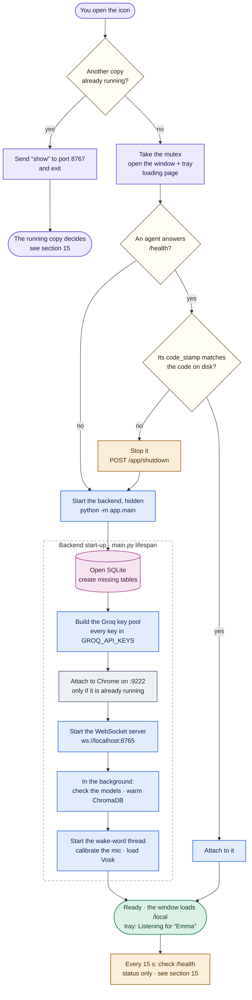
```mermaid
flowchart TD
    I(["You open the icon"]):::ui --> M{"Another copy<br/>already running?"}:::dec
    M -->|yes| SH["Send “show” to port 8767<br/>and exit"]:::ui
    SH --> RC(["The running copy decides<br/>see section 15"]):::ui
    M -->|no| W["Take the mutex<br/>open the window + tray<br/>loading page"]:::ui
    W --> H{"An agent answers<br/>/health?"}:::dec
    H -->|no| ST["Start the backend, hidden<br/>python -m app.main"]:::engine
    H -->|yes| C{"Its code_stamp matches<br/>the code on disk?"}:::dec
    C -->|yes| AT["Attach to it"]:::engine
    C -->|no| STOP["Stop it<br/>POST /app/shutdown"]:::warn
    STOP --> ST
    ST --> B1

    subgraph LS["Backend start-up · main.py lifespan"]
        B1[("Open SQLite<br/>create missing tables")]:::mem
        B2["Build the Groq key pool<br/>every key in GROQ_API_KEYS"]:::engine
        B3["Attach to Chrome on :9222<br/>only if it is already running"]:::ext
        B4["Start the WebSocket server<br/>ws://localhost:8765"]:::engine
        B5["In the background:<br/>check the models · warm ChromaDB"]:::engine
        B6["Start the wake-word thread<br/>calibrate the mic · load Vosk"]:::engine
        B1 --> B2 --> B3 --> B4 --> B5 --> B6
    end

    B6 --> RD
    AT --> RD(["Ready · the window loads /local<br/>tray: Listening for “Emma”"]):::ok
    RD --> HW["Every 15 s: check /health<br/>status only · see section 15"]:::warn

    classDef ui fill:#ede9fe,stroke:#6a4be0,stroke-width:1.5px,color:#22184d
    classDef engine fill:#e3ecfd,stroke:#2d6be4,stroke-width:1.5px,color:#0f2350
    classDef ext fill:#eceff4,stroke:#56657d,stroke-width:1.5px,color:#1f2733
    classDef mem fill:#f7e4f1,stroke:#a3478f,stroke-width:1.5px,color:#45173b
    classDef ok fill:#dcf1e6,stroke:#17875a,stroke-width:1.5px,color:#0d3d29
    classDef warn fill:#fbeed8,stroke:#a0650f,stroke-width:1.5px,color:#4a2e05
    classDef dec fill:#fffdf5,stroke:#8b7a4a,stroke-width:1.5px,color:#2b2410
    style LS fill:transparent,stroke:#8a94a6,stroke-width:1px,stroke-dasharray:6 4
```

Shut-down (the window's X button, tray → Quit, Ctrl+C in `start_agent.ps1`, `agent_desktop.pyw --quit`, or `POST /app/shutdown`): the wake listener stops, running tasks are cancelled and recorded, background learning gets up to 8 s to finish, the agent's Chrome window is closed normally so cookies are saved (also one left open by an earlier run), and the database is closed. A backend started by the desktop app also shuts itself down within a few seconds if the app disappears (killed or crashed): the app passes its process id in `AGENT_PARENT_PID`, and the backend watches it.

#### Flowchart: shut-down

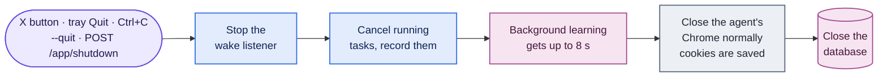
```mermaid
flowchart LR
    Q(["X button · tray Quit · Ctrl+C<br/>--quit · POST /app/shutdown"]):::ui --> S1["Stop the<br/>wake listener"]:::engine --> S2["Cancel running<br/>tasks, record them"]:::engine
    S2 --> S3["Background learning<br/>gets up to 8 s"]:::mem --> S4["Close the agent's<br/>Chrome normally<br/>cookies are saved"]:::ext --> S5[("Close the<br/>database")]:::mem

    classDef ui fill:#ede9fe,stroke:#6a4be0,stroke-width:1.5px,color:#22184d
    classDef engine fill:#e3ecfd,stroke:#2d6be4,stroke-width:1.5px,color:#0f2350
    classDef ext fill:#eceff4,stroke:#56657d,stroke-width:1.5px,color:#1f2733
    classDef mem fill:#f7e4f1,stroke:#a3478f,stroke-width:1.5px,color:#45173b
```

#### Flowchart: every way to stop the agent

Found 2026-09-17: after the project was stopped, the agent was still listening, heard people talking and ran it as a task. Every way of stopping now ends with nothing running:

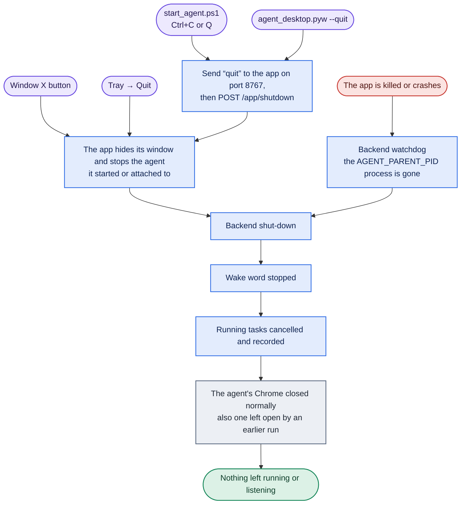
```mermaid
flowchart TD
    X(["Window X button"]):::ui --> QUIT
    TQ(["Tray → Quit"]):::ui --> QUIT
    PS(["start_agent.ps1<br/>Ctrl+C or Q"]):::ui --> SA
    QF(["agent_desktop.pyw --quit"]):::ui --> SA["Send “quit” to the app on port 8767,<br/>then POST /app/shutdown"]:::engine
    SA --> QUIT
    QUIT["The app hides its window and stops the agent<br/>it started or attached to"]:::engine --> SD
    KILL(["The app is killed or crashes"]):::bad --> WD["Backend watchdog<br/>the AGENT_PARENT_PID process is gone"]:::engine --> SD
    SD["Backend shut-down"]:::engine --> S1["Wake word stopped"]:::engine --> S2["Running tasks cancelled and recorded"]:::engine
    S2 --> S3["The agent's Chrome closed normally<br/>also one left open by an earlier run"]:::ext --> S4(["Nothing left running or listening"]):::ok

    classDef ui fill:#ede9fe,stroke:#6a4be0,stroke-width:1.5px,color:#22184d
    classDef engine fill:#e3ecfd,stroke:#2d6be4,stroke-width:1.5px,color:#0f2350
    classDef ext fill:#eceff4,stroke:#56657d,stroke-width:1.5px,color:#1f2733
    classDef ok fill:#dcf1e6,stroke:#17875a,stroke-width:1.5px,color:#0d3d29
    classDef bad fill:#fbe3e1,stroke:#c93d36,stroke-width:1.5px,color:#4f1411
```

---

## 7. The complete workflow of one task

### 7.1 Overview

```
you ─► UI ─► WebSocket ─► scope routing ─► AgentRunner
                                              │
   ┌──────────────────────────────────────────┘
   ▼
 RECALL ──► PLANNER ──► ACTOR (tool loop) ──► VERIFY ──┬─ success ─────────────► LEARN ─► result + "why"
   │                        ▲                          ├─ failed, retry unsafe ─► LEARN
   │                        │                          └─ failed, retry safe ──► REPLAN ─┐
   │                        └────────────────────────────────────────────────────────────┘
   └─ SQL memory + similar past tasks (ChromaDB) + tools + page state + LLM strategy
                                                                        then 👍 / 👎 ─► memory
```

#### Flowchart: one task, end to end

The overview above, in full. Every box is explained in the steps of section 7.2.

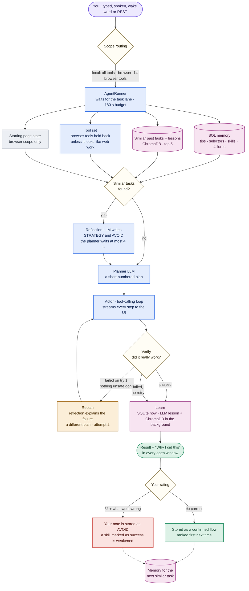
```mermaid
flowchart TD
    U(["You · typed, spoken, wake word or REST"]):::ui --> SR{"Scope routing"}:::dec
    SR -->|"local: all tools · browser: 14 browser tools"| RN
    RN["AgentRunner<br/>waits for the task lane · 180 s budget"]:::engine

    RN --> M1[("SQL memory<br/>tips · selectors · skills · failures")]:::mem
    RN --> M2[("Similar past tasks + lessons<br/>ChromaDB · top 5")]:::mem
    RN --> M3["Tool set<br/>browser tools held back<br/>unless it looks like web work"]:::engine
    RN --> M4["Starting page state<br/>browser scope only"]:::ext
    M1 & M2 & M3 & M4 --> SIM{"Similar tasks<br/>found?"}:::dec

    SIM -->|yes| STR["Reflection LLM writes<br/>STRATEGY and AVOID<br/>the planner waits at most 4 s"]:::engine
    SIM -->|no| PL
    STR --> PL["Planner LLM<br/>a short numbered plan"]:::engine
    PL --> ACT["Actor · tool-calling loop<br/>streams every step to the UI"]:::engine
    ACT --> VER{"Verify<br/>did it really work?"}:::dec
    VER -->|"failed on try 1,<br/>nothing unsafe done"| RP["Replan<br/>reflection explains the failure<br/>a different plan · attempt 2"]:::warn
    RP --> ACT
    VER -->|passed| LRN
    VER -->|"failed,<br/>no retry"| LRN
    LRN["Learn<br/>SQLite now · LLM lesson + ChromaDB in the background"]:::mem
    LRN --> RES(["Result + “Why I did this”<br/>in every open window"]):::ok
    RES --> FB{"Your rating"}:::dec
    FB -->|"👍 correct"| FBP["Stored as a confirmed flow<br/>ranked first next time"]:::ok
    FB -->|"👎 + what went wrong"| FBN["Your note is stored as AVOID<br/>a skill marked as success is weakened"]:::bad
    FBP & FBN -.-> NEXT[("Memory for the<br/>next similar task")]:::mem

    classDef ui fill:#ede9fe,stroke:#6a4be0,stroke-width:1.5px,color:#22184d
    classDef engine fill:#e3ecfd,stroke:#2d6be4,stroke-width:1.5px,color:#0f2350
    classDef ext fill:#eceff4,stroke:#56657d,stroke-width:1.5px,color:#1f2733
    classDef mem fill:#f7e4f1,stroke:#a3478f,stroke-width:1.5px,color:#45173b
    classDef ok fill:#dcf1e6,stroke:#17875a,stroke-width:1.5px,color:#0d3d29
    classDef bad fill:#fbe3e1,stroke:#c93d36,stroke-width:1.5px,color:#4f1411
    classDef warn fill:#fbeed8,stroke:#a0650f,stroke-width:1.5px,color:#4a2e05
    classDef dec fill:#fffdf5,stroke:#8b7a4a,stroke-width:1.5px,color:#2b2410
```

### 7.2 Step by step

**Step 1 — You give the task.**
- *Typed* in the Local Agent page or desktop window → `{"type": "task_submit", "instruction": …, "scope": "local"}`.
- *Typed* in the extension → the same message, scope `"browser"`.
- *Mic button* → the page records audio (`MediaRecorder`), sends it base64 as `voice_task`; the server transcribes it with Whisper, shows it back as `voice_transcript`, then submits it as a task.
- *Wake word* → section 10; the listener submits the task directly inside the backend and broadcasts its progress to every open window.
- *REST* → `POST /task?instruction=…&scope=local` (no confirmation channel).

**Step 2 — Scope routing** (`websocket/server.py`, `_resolve_voice_scope`). Scope decides which tools the task gets:

| Order | Rule | Result |
|---|---|---|
| 1 | Says "on this device", "my computer", "locally", … | `local` |
| 2 | Names a file or folder on this laptop: downloads, desktop, documents, attach, upload, ppt, pdf, docx, xlsx, resume, screenshot, … | `local` |
| 3 | Says "open chrome", "in the browser", "search the web", a URL, ".com", … | `browser` |
| 4 | Came from the Local Agent page / wake word | `local` |
| 5 | Looks like an OS task: "open notepad", "task manager", "wifi", … | `local` |
| 6 | Anything else | `local` |

`local` scope has **both** local and browser tools; `browser` scope has only the 14 browser tools. Rule 2 exists because "open chrome … attach the last ppt from downloads" used to be sent to browser scope, where no tool can look inside Downloads.

#### Flowchart: scope routing

The rules are checked from the top, and the first match wins. Rule 3 applies to every window: "open chrome and search shoes" typed in the Local Agent page still runs with browser tools only. A task from the extension that matches no rule goes to local scope, which has the browser tools too.

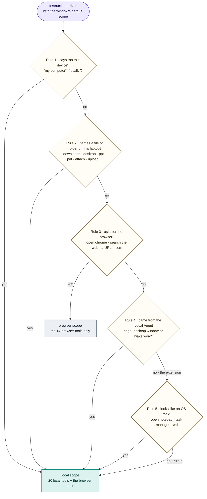
```mermaid
flowchart TD
    T(["Instruction arrives<br/>with the window's default scope"]):::ui --> R1{"Rule 1 · says “on this device”,<br/>“my computer”, “locally”?"}:::dec
    R1 -->|yes| LOC
    R1 -->|no| R2{"Rule 2 · names a file or folder on this laptop?<br/>downloads · desktop · ppt · pdf · attach · upload …"}:::dec
    R2 -->|yes| LOC
    R2 -->|no| R3{"Rule 3 · asks for the browser?<br/>open chrome · search the web · a URL · .com"}:::dec
    R3 -->|yes| BRO
    R3 -->|no| R4{"Rule 4 · came from the Local Agent<br/>page, desktop window or wake word?"}:::dec
    R4 -->|yes| LOC
    R4 -->|"no · the extension"| R5{"Rule 5 · looks like an OS task?<br/>open notepad · task manager · wifi"}:::dec
    R5 -->|yes| LOC
    R5 -->|"no · rule 6"| LOC
    LOC["local scope<br/>20 local tools + the browser tools"]:::local
    BRO["browser scope<br/>the 14 browser tools only"]:::ext

    classDef ui fill:#ede9fe,stroke:#6a4be0,stroke-width:1.5px,color:#22184d
    classDef local fill:#dcf2ee,stroke:#0f8a7e,stroke-width:1.5px,color:#0b3b36
    classDef ext fill:#eceff4,stroke:#56657d,stroke-width:1.5px,color:#1f2733
    classDef dec fill:#fffdf5,stroke:#8b7a4a,stroke-width:1.5px,color:#2b2410
```

**Step 3 — AgentRunner** (`agent/runner.py`). Assigns a `task_id`, waits for the task lane if another task is running (the UI shows "⏳ Waiting for the current task to finish…"), records the task start in SQLite, installs the confirmation channel, and runs the graph with a **180 s** budget.

**Step 4 — RECALL** (`nodes/recall.py`). Four things happen **at the same time**:
1. **SQL memory.** Local tasks: the last 2,000 characters of tips learned on this computer. Browser tasks: the site's known selectors and quirks, reusable skills, known failure patterns and past reflections for that domain, plus overall stats.
2. **Semantic recall.** The instruction is embedded once, and ChromaDB returns up to 5 similar past **experiences** — matched either by similar wording (similarity ≥ 0.35) or by a relevant stored **lesson** (≥ 0.30). Section 11.3 explains the ranking.
3. **Tool set.** `build_toolset(scope)`. For a local task that does not look like web work, the 14 browser tools are held back and replaced by one `use_browser` tool (saves ~1,500 tokens per call on the free tier); the model can enable them any time.
4. **Starting page state** (browser scope only): URL, title, accessibility snapshot, visible text — used later to verify changes.

If similar experiences exist, the **reflection LLM** writes a short *STRATEGY / AVOID* note from them (what worked, what failed, any flow you confirmed with 👍, anything you complained about with 👎). It is streamed, and the planner gets whatever has arrived within **4 s**, so a slow reply never stalls the task. Without an LLM, a rule-based summary is used.

**Step 5 — PLANNER** (`nodes/planner.py`). One LLM call (role `planner`) turns the instruction, the memory and the strategy into a short numbered plan, each step naming a tool. A planning failure does not fail the task — the actor can work from the instruction alone.

**Step 6 — ACTOR** (`nodes/actor.py`). A native tool-calling loop:
1. The model receives the system prompt (the operating rules for local or browser work), the task, an **exact-spellings** list (names, identifiers and file names it must copy verbatim), the plan and any retry notes.
2. Each turn the model either **calls a tool** or writes the **final report**.
3. **Which model:** the strong model (`actor`) on the first turn, right after a failed step, after any look at the screen, and every 5th turn; the fast model (`actor_fast`) for routine steps. If the fast model errors or is rate-limited, the strong one takes over.
4. Before each call, a progress line streams to the UI ("⌨️ Typing 'Rakesh' in WhatsApp"); after a successful call, a result line ("✅ Folder ready: …").
5. **Guards:** a 180 s deadline; at most 30 tool steps (local) or 20 (browser); up to two nudges if the model replies with nothing; the **duplicate-send guard** refuses to type a message that was already sent in that window, and ends the task if the model keeps trying.
6. Every call becomes a **trajectory step**: tool name, arguments, success, output (first 300 characters), duration.

#### Flowchart: the actor loop

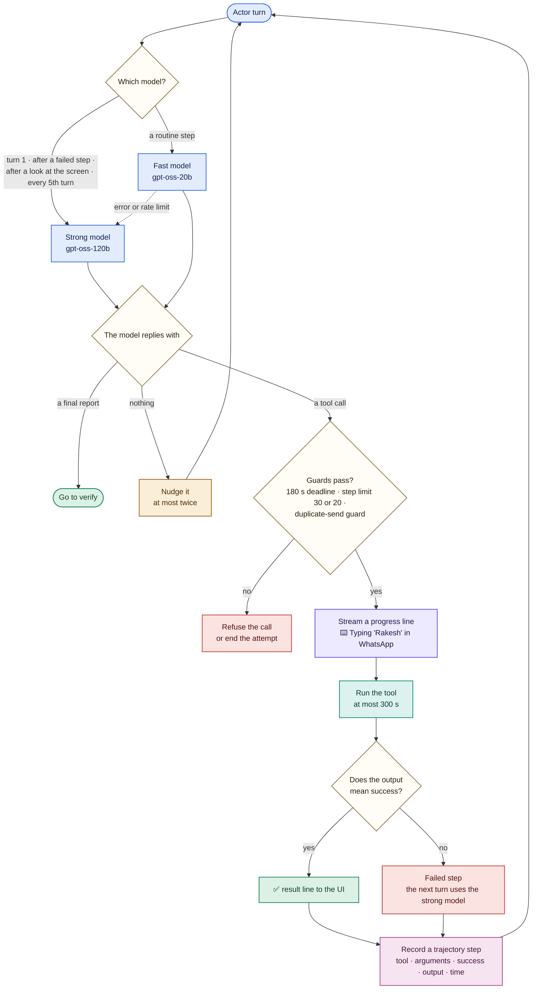
```mermaid
flowchart TD
    S(["Actor turn"]):::engine --> MS{"Which model?"}:::dec
    MS -->|"turn 1 · after a failed step ·<br/>after a look at the screen · every 5th turn"| STRONG["Strong model<br/>gpt-oss-120b"]:::engine
    MS -->|a routine step| FAST["Fast model<br/>gpt-oss-20b"]:::engine
    FAST -.->|"error or rate limit"| STRONG
    STRONG & FAST --> OUT{"The model replies with"}:::dec
    OUT -->|a final report| DONE(["Go to verify"]):::ok
    OUT -->|nothing| NUDGE["Nudge it<br/>at most twice"]:::warn
    NUDGE --> S
    OUT -->|a tool call| G{"Guards pass?<br/>180 s deadline · step limit 30 or 20 ·<br/>duplicate-send guard"}:::dec
    G -->|no| STOPG["Refuse the call<br/>or end the attempt"]:::bad
    G -->|yes| PROG["Stream a progress line<br/>⌨️ Typing 'Rakesh' in WhatsApp"]:::ui
    PROG --> RUN["Run the tool<br/>at most 300 s"]:::local
    RUN --> CHK{"Does the output<br/>mean success?"}:::dec
    CHK -->|yes| OKS["✅ result line to the UI"]:::ok
    CHK -->|no| BADS["Failed step<br/>the next turn uses the strong model"]:::bad
    OKS & BADS --> REC["Record a trajectory step<br/>tool · arguments · success · output · time"]:::mem
    REC --> S

    classDef ui fill:#ede9fe,stroke:#6a4be0,stroke-width:1.5px,color:#22184d
    classDef engine fill:#e3ecfd,stroke:#2d6be4,stroke-width:1.5px,color:#0f2350
    classDef local fill:#dcf2ee,stroke:#0f8a7e,stroke-width:1.5px,color:#0b3b36
    classDef mem fill:#f7e4f1,stroke:#a3478f,stroke-width:1.5px,color:#45173b
    classDef ok fill:#dcf1e6,stroke:#17875a,stroke-width:1.5px,color:#0d3d29
    classDef bad fill:#fbe3e1,stroke:#c93d36,stroke-width:1.5px,color:#4f1411
    classDef warn fill:#fbeed8,stroke:#a0650f,stroke-width:1.5px,color:#4a2e05
    classDef dec fill:#fffdf5,stroke:#8b7a4a,stroke-width:1.5px,color:#2b2410
```

How a step's success is decided (`toolkit.output_indicates_failure`):
- Tools with a fixed success message (`send_keys` → "Sent to …", `write_file` → "Wrote …", `create_folder` → "Folder ready: …", `install_app` → "Installed: …", `download_file` → "Downloaded: …", `add_to_cart` → "Added to cart: …", `delete_path`, `open_app`, `click_window`, `focus_window`, `find_files`, …) succeed **only** when their output starts with that message. Your own text inside the message — a WhatsApp message saying "can't", a file called `errors.txt` — can no longer make a success look like a failure, and a quiet refusal ("…refused, so NOTHING was sent") can no longer look like a success.
- Descriptive tools (`see_page`, `read_file`, `list_folder`, …) fail only when their output *starts* with a failure phrase, because their content naturally contains words like "error".
- Everything else is scanned for failure words ("not found", "failed", "cannot", …) in its first 240 characters.

#### Flowchart: is this step a success?

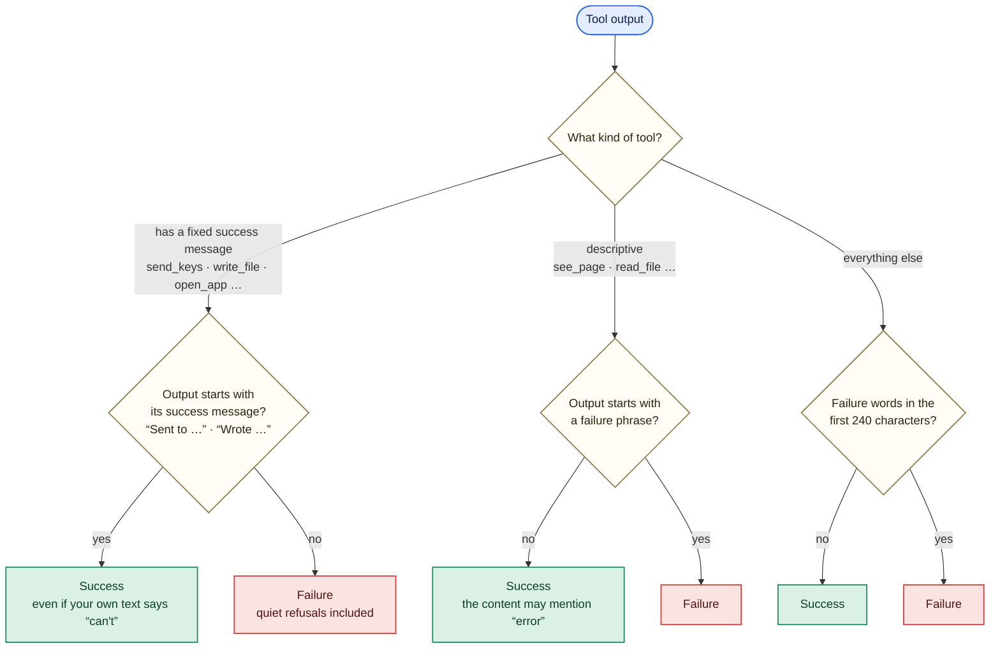
```mermaid
flowchart TD
    O(["Tool output"]):::engine --> K{"What kind of tool?"}:::dec
    K -->|"has a fixed success message<br/>send_keys · write_file · open_app …"| P{"Output starts with<br/>its success message?<br/>“Sent to …” · “Wrote …”"}:::dec
    P -->|yes| S1["Success<br/>even if your own text says “can't”"]:::ok
    P -->|no| F1["Failure<br/>quiet refusals included"]:::bad
    K -->|"descriptive<br/>see_page · read_file …"| D{"Output starts with<br/>a failure phrase?"}:::dec
    D -->|no| S2["Success<br/>the content may mention “error”"]:::ok
    D -->|yes| F2["Failure"]:::bad
    K -->|everything else| W{"Failure words in the<br/>first 240 characters?"}:::dec
    W -->|no| S3["Success"]:::ok
    W -->|yes| F3["Failure"]:::bad

    classDef engine fill:#e3ecfd,stroke:#2d6be4,stroke-width:1.5px,color:#0f2350
    classDef ok fill:#dcf1e6,stroke:#17875a,stroke-width:1.5px,color:#0d3d29
    classDef bad fill:#fbe3e1,stroke:#c93d36,stroke-width:1.5px,color:#4f1411
    classDef dec fill:#fffdf5,stroke:#8b7a4a,stroke-width:1.5px,color:#2b2410
```

**Step 7 — VERIFY** (`nodes/verifier.py`). The actor's own report is never trusted alone:
- **Local tasks:** the report must not describe a failure (mentions like "no errors" are ignored), **and** the tools used must match the request — an action request with no tool at all, or "open WhatsApp and message X" where only `open_app` ran, is marked **incomplete**.
- **Browser tasks:** the final page is checked by rules, a text judge, and, if still needed, a screenshot judge (section 13).

It also decides whether a **retry** is allowed: only on the first attempt, only if automatic retry is on, not after a timeout, and **never** if the first attempt already did something unsafe to repeat (typing, clicking, sending, writing, running commands).

**Step 8 — REPLAN** (only if the retry is allowed, `nodes/replanner.py`). The reflection LLM explains why the attempt failed; that failed attempt is stored as an experience (unless it ran no tool at all); the planner writes a *different* plan with a "PREVIOUS ATTEMPT FAILED — use a different approach" note; the actor runs again (attempt 2). Attempt 2 is never retried.

#### Flowchart: verify and retry

Steps 7 and 8 together: how the result is judged, and when a failed attempt earns exactly one retry.

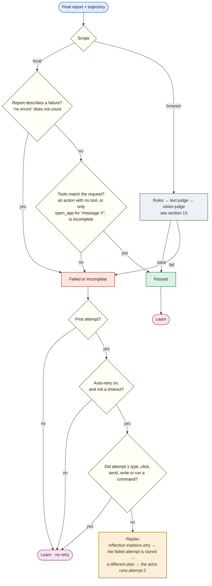
```mermaid
flowchart TD
    V(["Final report + trajectory"]):::engine --> SC{"Scope"}:::dec
    SC -->|local| L1{"Report describes a failure?<br/>“no errors” does not count"}:::dec
    L1 -->|yes| FAIL
    L1 -->|no| L2{"Tools match the request?<br/>an action with no tool, or only<br/>open_app for “message X”, is incomplete"}:::dec
    L2 -->|no| FAIL["Failed or incomplete"]:::bad
    L2 -->|yes| PASS["Passed"]:::ok
    SC -->|browser| BV["Rules → text judge → vision judge<br/>see section 13"]:::ext
    BV -->|pass| PASS
    BV -->|fail| FAIL
    PASS --> LEARN2(["Learn"]):::mem
    FAIL --> Q1{"First attempt?"}:::dec
    Q1 -->|no| LEARN
    Q1 -->|yes| Q2{"Auto-retry on,<br/>and not a timeout?"}:::dec
    Q2 -->|no| LEARN
    Q2 -->|yes| Q3{"Did attempt 1 type, click,<br/>send, write or run a command?"}:::dec
    Q3 -->|yes| LEARN(["Learn · no retry"]):::mem
    Q3 -->|no| RP["Replan<br/>reflection explains why → the failed attempt is stored →<br/>a different plan → the actor runs attempt 2"]:::warn

    classDef engine fill:#e3ecfd,stroke:#2d6be4,stroke-width:1.5px,color:#0f2350
    classDef ext fill:#eceff4,stroke:#56657d,stroke-width:1.5px,color:#1f2733
    classDef mem fill:#f7e4f1,stroke:#a3478f,stroke-width:1.5px,color:#45173b
    classDef ok fill:#dcf1e6,stroke:#17875a,stroke-width:1.5px,color:#0d3d29
    classDef bad fill:#fbe3e1,stroke:#c93d36,stroke-width:1.5px,color:#4f1411
    classDef warn fill:#fbeed8,stroke:#a0650f,stroke-width:1.5px,color:#4a2e05
    classDef dec fill:#fffdf5,stroke:#8b7a4a,stroke-width:1.5px,color:#2b2410
```

**Step 9 — LEARN** (`nodes/learner.py`). Section 11 in detail. In short:
- *Awaited (fast, local):* finish the task record; add a tip to local memory; update SQL skills, selectors, failure patterns and stats.
- *In the background (so you get the result immediately):* the reflection LLM writes the lesson — comparing with similar past attempts, and after a retry, with the failed first attempt — and the experience is stored in ChromaDB.
- A run in which **no tool ran** is not stored (nothing was done), but it is kept aside so that if you rate it, your rating and note are stored.
- The **explanation** is built from facts only: the steps taken, the past tasks that were used, the strategy followed, and why there was or was no retry.

**Step 10 — Result and feedback.** The UI shows ✅/❌, the report, "Why I did this", and 👍 / 👎.
- 👎 opens a box: *"What went wrong? (it will avoid this next time)"*. The rating and note are stored on the experience; if the agent had marked the run a success, the run is marked **disputed** and the skill it taught is down-weighted.
- 👍 marks the run **correct**; if the agent had marked it failed, it now counts as a success, and its steps are offered to the planner next time as a flow to learn from and adapt (never replayed blindly).

### 7.3 Example: a local task

*"create a new folder in desktop named MAYANK and create a .txt file in it containing the prime number code"* — a real run, 10 s:

```
scope: local (Local Agent page)             tools: 20 local + use_browser
recall:  4 similar tasks (1 worked, 2 got 👎 "it didn't do anything correctly")
         strategy: use create_folder and write_file, then read_file to verify
plan:    1. create_folder  2. write_file  3. read_file
act:     ✓ create_folder(Desktop\MAYANK)   → Folder ready: C:\Users\samar\OneDrive\Desktop\MAYANK
         ✓ write_file(Desktop\MAYANK\prime_code.txt, "def is_prime(n): …")
         ✓ read_file(Desktop\MAYANK\prime_code.txt)
verify:  report OK, tools match the request → success
learn:   lesson stored; explanation lists the 4 similar tasks and your earlier complaint
```

"Desktop" resolves to your real Desktop (`OneDrive\Desktop`) through Windows' Known Folders — section 8.1.

#### Sequence: the local example

The same run as messages between the parts:

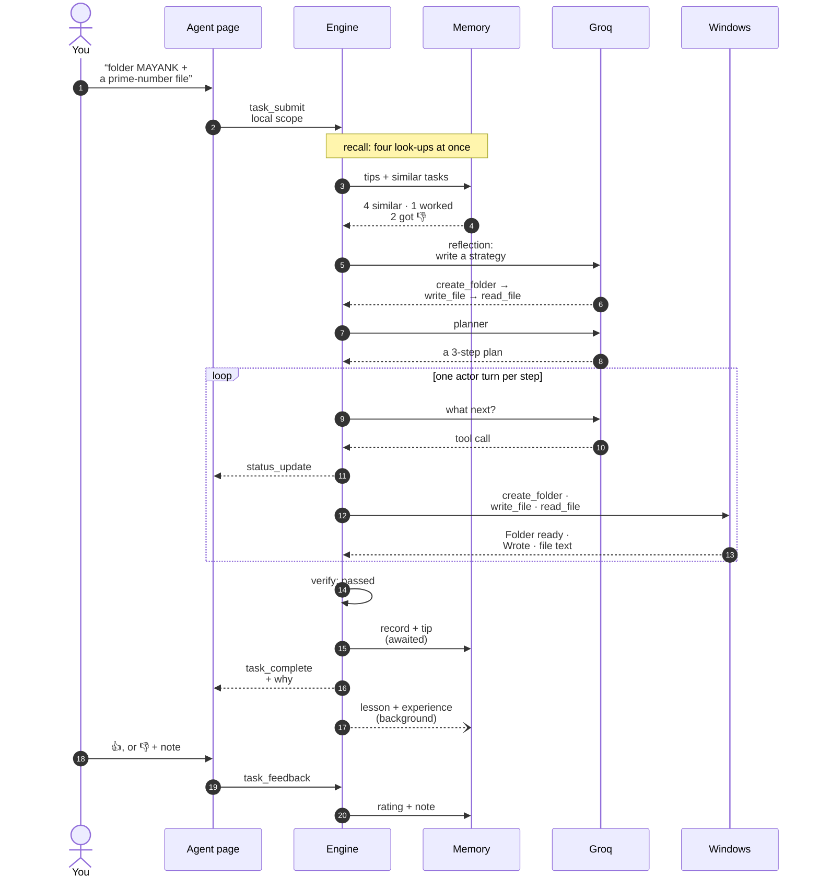
```mermaid
sequenceDiagram
    autonumber
    actor You
    participant UI as Agent page
    participant EN as Engine
    participant MEM as Memory
    participant LLM as Groq
    participant WIN as Windows

    You->>UI: “folder MAYANK +<br/>a prime-number file”
    UI->>EN: task_submit<br/>local scope
    Note over EN,MEM: recall: four look-ups at once
    EN->>MEM: tips + similar tasks
    MEM-->>EN: 4 similar · 1 worked<br/>2 got 👎
    EN->>LLM: reflection:<br/>write a strategy
    LLM-->>EN: create_folder →<br/>write_file → read_file
    EN->>LLM: planner
    LLM-->>EN: a 3-step plan
    loop one actor turn per step
        EN->>LLM: what next?
        LLM-->>EN: tool call
        EN-->>UI: status_update
        EN->>WIN: create_folder ·<br/>write_file · read_file
        WIN-->>EN: Folder ready ·<br/>Wrote · file text
    end
    EN->>EN: verify: passed
    EN->>MEM: record + tip<br/>(awaited)
    EN-->>UI: task_complete<br/>+ why
    EN--)MEM: lesson + experience<br/>(background)
    You->>UI: 👍, or 👎 + note
    UI->>EN: task_feedback
    EN->>MEM: rating + note
```

### 7.4 Example: a mixed local + web task

*"open chrome, search gemini, add the last ppt from downloads and ask it to create a summary"* — the designed flow:

```
scope: local (rule 2: "ppt", "downloads")   tools: 20 local + 14 browser (web words seen)
plan:    1. find_files(".pptx", downloads)  2. navigate_browser(gemini.google.com)
         3. perceive_page  4. upload_file(<path>)  5. see_page
         6. type_into_element(<prompt>, press_enter=True)
act:     find_files → newest first: "Engineering Philosophy … Robot (2).pptx"
         navigate_browser → Chrome opens (or attaches) and loads Gemini
         upload_file → YOU are asked: "Upload '… .pptx' (N MB) from your computer to gemini.google.com"
                     → on "Yes": clicks Gemini's attach button, fills the file picker directly
         see_page → confirms the attachment finished
         type_into_element → types the request and presses Enter
verify:  in-app work happened (upload + typing) → success unless the report says otherwise
```

#### Sequence: the mixed example

The same flow as messages. Step 9 is the pause where you decide whether the file may leave the computer; nothing is uploaded before you say yes.

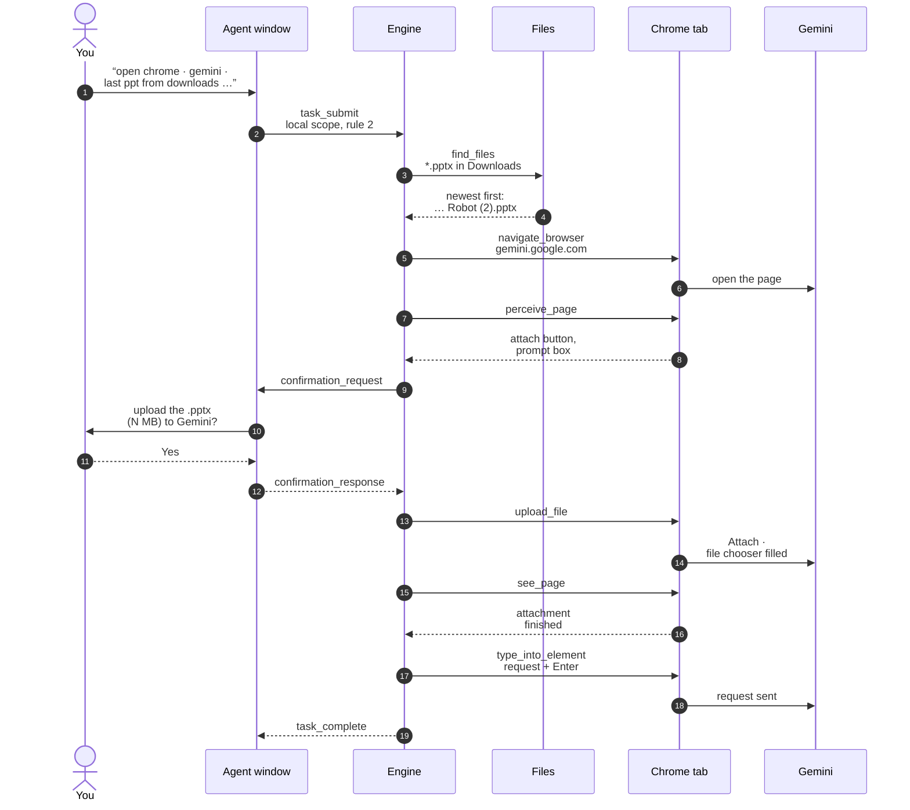
```mermaid
sequenceDiagram
    autonumber
    actor You
    participant UI as Agent window
    participant EN as Engine
    participant PC as Files
    participant CH as Chrome tab
    participant GM as Gemini

    You->>UI: “open chrome · gemini ·<br/>last ppt from downloads …”
    UI->>EN: task_submit<br/>local scope, rule 2
    EN->>PC: find_files<br/>*.pptx in Downloads
    PC-->>EN: newest first:<br/>… Robot (2).pptx
    EN->>CH: navigate_browser<br/>gemini.google.com
    CH->>GM: open the page
    EN->>CH: perceive_page
    CH-->>EN: attach button,<br/>prompt box
    EN->>UI: confirmation_request
    UI->>You: upload the .pptx<br/>(N MB) to Gemini?
    You-->>UI: Yes
    UI-->>EN: confirmation_response
    EN->>CH: upload_file
    CH->>GM: Attach ·<br/>file chooser filled
    EN->>CH: see_page
    CH-->>EN: attachment<br/>finished
    EN->>CH: type_into_element<br/>request + Enter
    CH->>GM: request sent
    EN-->>UI: task_complete
```

---

## 8. How the agent operates this computer

All local tools are in `tools/local.py` and `tools/desktop.py`. They run as your user, with normal (not administrator) permissions. There are **20**.

### 8.1 Finding your real folders

On many machines Windows moves Desktop and Documents into OneDrive (here: `C:\Users\samar\OneDrive\Desktop`), while an empty `C:\Users\samar\Desktop` still exists. Writing to the wrong one "works" but you never see the result.

- `_known_folder()` reads the real locations from the registry key `…\Explorer\User Shell Folders` (Known-Folder GUIDs for Desktop, Documents, Downloads, Pictures, Videos, Music).
- `_resolve_user_path()`: `Desktop\MAYANK` → your real Desktop; `%USERPROFILE%\Desktop\x` or `C:\Users\samar\Desktop\x` → also redirected to the real Desktop, but only when Windows keeps that folder elsewhere; other paths are left alone.
- PowerShell scripts: `$env:USERPROFILE\Desktop`, `$HOME\Desktop`, `~\Desktop` are rewritten to the real folder before the script runs.

#### Flowchart: resolving a path

Every file tool, `upload_file` and `run_command` go through this before touching the disk.

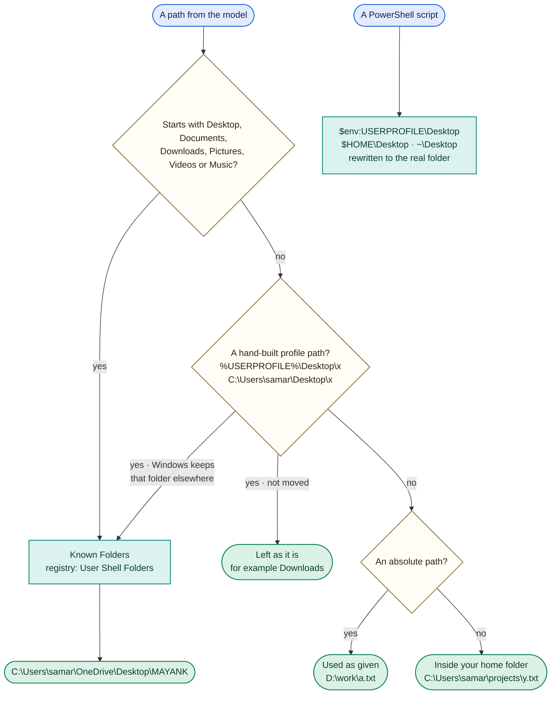
```mermaid
flowchart TD
    IN(["A path from the model"]):::engine --> Q1{"Starts with Desktop, Documents,<br/>Downloads, Pictures, Videos or Music?"}:::dec
    Q1 -->|yes| KF["Known Folders<br/>registry: User Shell Folders"]:::local
    KF --> R1(["C:\Users\samar\OneDrive\Desktop\MAYANK"]):::ok
    Q1 -->|no| Q2{"A hand-built profile path?<br/>%USERPROFILE%\Desktop\x<br/>C:\Users\samar\Desktop\x"}:::dec
    Q2 -->|"yes · Windows keeps<br/>that folder elsewhere"| KF
    Q2 -->|"yes · not moved"| R2(["Left as it is<br/>for example Downloads"]):::ok
    Q2 -->|no| Q3{"An absolute path?"}:::dec
    Q3 -->|yes| R3(["Used as given<br/>D:\work\a.txt"]):::ok
    Q3 -->|no| R4(["Inside your home folder<br/>C:\Users\samar\projects\y.txt"]):::ok
    PS(["A PowerShell script"]):::engine --> RW["$env:USERPROFILE\Desktop<br/>$HOME\Desktop · ~\Desktop<br/>rewritten to the real folder"]:::local

    classDef engine fill:#e3ecfd,stroke:#2d6be4,stroke-width:1.5px,color:#0f2350
    classDef local fill:#dcf2ee,stroke:#0f8a7e,stroke-width:1.5px,color:#0b3b36
    classDef ok fill:#dcf1e6,stroke:#17875a,stroke-width:1.5px,color:#0d3d29
    classDef dec fill:#fffdf5,stroke:#8b7a4a,stroke-width:1.5px,color:#2b2410
```

### 8.2 Search

| Tool | How it works |
|---|---|
| `list_recent_files(location, count)` | Lists a folder's files **newest first** with timestamps. For "my latest download". |
| `find_files(pattern, location)` | Searches file **names** below a folder, **nearest first** (breadth-first), skipping generated folders (`.venv`, `node_modules`, `.git`, `.next`, `dist`, `build`, `AppData`, …); returns up to 15 matches **newest first**; stops after 6 s and says so if it did. |
| `search_in_files(text, location, file_pattern)` | Searches **inside** text/code/log files (≤ 5 MB each), nearest first, with the same skip list; one fast check per file, then the matching lines with line numbers; stops after 20 s and starts its answer with **PARTIAL RESULT** if it did not finish. |
| `list_folder(path)` | Folders and files inside a folder. |

#### Flowchart: breadth-first search

"Nearest first" means the queue is worked from the front: every file directly on the Desktop is looked at before anything two folders deep.

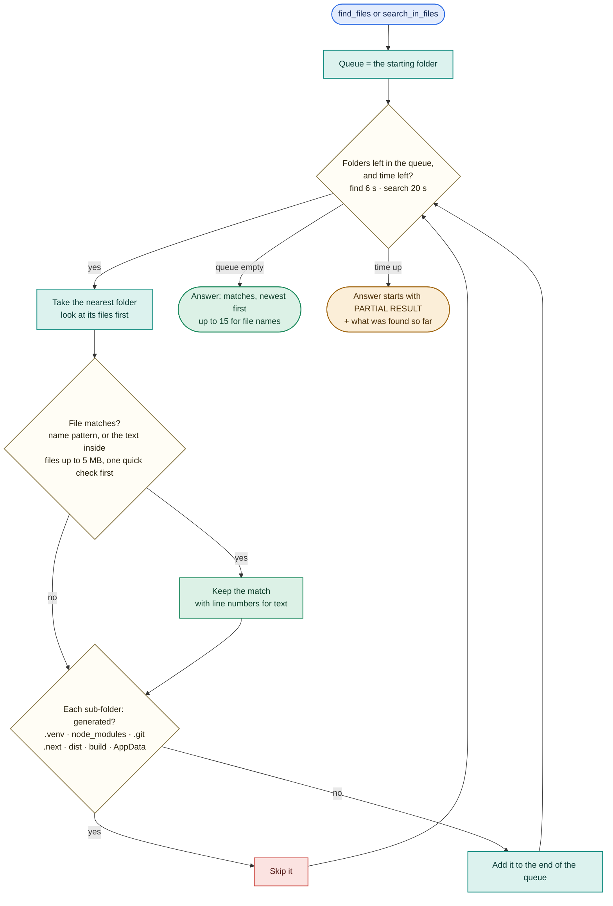
```mermaid
flowchart TD
    S(["find_files or search_in_files"]):::engine --> Q["Queue = the starting folder"]:::local
    Q --> N{"Folders left in the queue,<br/>and time left?<br/>find 6 s · search 20 s"}:::dec
    N -->|yes| D["Take the nearest folder<br/>look at its files first"]:::local
    D --> F{"File matches?<br/>name pattern, or the text inside<br/>files up to 5 MB, one quick check first"}:::dec
    F -->|yes| HIT["Keep the match<br/>with line numbers for text"]:::ok
    F -->|no| SUB
    HIT --> SUB{"Each sub-folder: generated?<br/>.venv · node_modules · .git<br/>.next · dist · build · AppData"}:::dec
    SUB -->|yes| SKIP["Skip it"]:::bad
    SUB -->|no| ADD["Add it to the end of the queue"]:::local
    SKIP & ADD --> N
    N -->|"queue empty"| DONE(["Answer: matches, newest first<br/>up to 15 for file names"]):::ok
    N -->|"time up"| PART(["Answer starts with PARTIAL RESULT<br/>+ what was found so far"]):::warn

    classDef engine fill:#e3ecfd,stroke:#2d6be4,stroke-width:1.5px,color:#0f2350
    classDef local fill:#dcf2ee,stroke:#0f8a7e,stroke-width:1.5px,color:#0b3b36
    classDef ok fill:#dcf1e6,stroke:#17875a,stroke-width:1.5px,color:#0d3d29
    classDef bad fill:#fbe3e1,stroke:#c93d36,stroke-width:1.5px,color:#4f1411
    classDef warn fill:#fbeed8,stroke:#a0650f,stroke-width:1.5px,color:#4a2e05
    classDef dec fill:#fffdf5,stroke:#8b7a4a,stroke-width:1.5px,color:#2b2410
```

### 8.3 Create, write, read, move, copy, delete

| Tool | How it works |
|---|---|
| `create_folder(path)` | `mkdir(parents=True)`; reports whether it already existed. |
| `write_file(path, content, append)` | Writes UTF-8 text; creates parent folders. |
| `read_file(path)` | Text files: only the first 2 MB is read. PDF (`pypdf`, 50 pages), Word (`python-docx`, paragraphs + tables), PowerPoint (`python-pptx`, text per slide), Excel (`openpyxl`, 10 sheets × 200 rows). |
| `move_path(source, destination)` | `shutil.move`; into a folder if the destination is one; also renames. |
| `copy_path(source, destination)` | `copy2` for files, `copytree` for folders; into an existing folder as a sub-folder; refuses to copy a folder into itself. |
| `delete_path(path)` | Sends to the **Recycle Bin** with `SHFileOperationW` (`FOF_ALLOWUNDO`), so it can be restored. **Refused:** drive roots, Windows, Program Files, `C:\Users`, your home folder, and your Desktop/Documents/Downloads/Pictures/Videos/Music/OneDrive folders themselves (their contents can be deleted). |
| `open_file_or_folder(path)` | `os.startfile` — opens with the default app (PDF viewer, Explorer, …). A web address is refused, because it would open in your own Chrome; web pages are opened with `navigate_browser`. |
| `clipboard(text)` | Reads (`Get-Clipboard`) or sets (`Set-Clipboard`, via a UTF-8 file, so quotes and Hindi text survive). |

#### Flowchart: delete

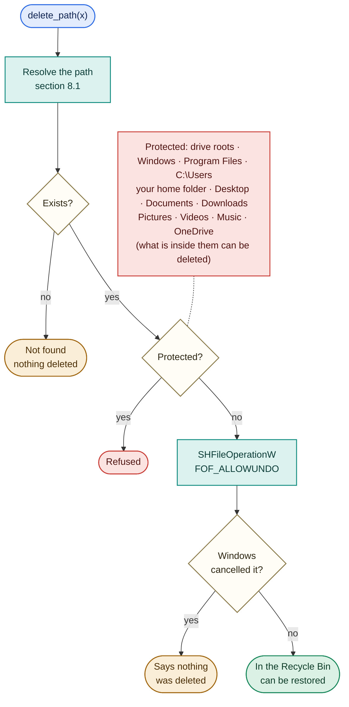
```mermaid
flowchart TD
    D(["delete_path(x)"]):::engine --> R["Resolve the path<br/>section 8.1"]:::local --> E{"Exists?"}:::dec
    E -->|no| NF(["Not found<br/>nothing deleted"]):::warn
    E -->|yes| P{"Protected?"}:::dec
    PL["Protected: drive roots · Windows · Program Files · C:\Users<br/>your home folder · Desktop · Documents · Downloads<br/>Pictures · Videos · Music · OneDrive<br/>(what is inside them can be deleted)"]:::bad -.- P
    P -->|yes| RF(["Refused"]):::bad
    P -->|no| RB["SHFileOperationW<br/>FOF_ALLOWUNDO"]:::local
    RB --> AB{"Windows<br/>cancelled it?"}:::dec
    AB -->|yes| NO(["Says nothing<br/>was deleted"]):::warn
    AB -->|no| OK(["In the Recycle Bin<br/>can be restored"]):::ok

    classDef engine fill:#e3ecfd,stroke:#2d6be4,stroke-width:1.5px,color:#0f2350
    classDef local fill:#dcf2ee,stroke:#0f8a7e,stroke-width:1.5px,color:#0b3b36
    classDef ok fill:#dcf1e6,stroke:#17875a,stroke-width:1.5px,color:#0d3d29
    classDef bad fill:#fbe3e1,stroke:#c93d36,stroke-width:1.5px,color:#4f1411
    classDef warn fill:#fbeed8,stroke:#a0650f,stroke-width:1.5px,color:#4a2e05
    classDef dec fill:#fffdf5,stroke:#8b7a4a,stroke-width:1.5px,color:#2b2410
```

#### Flowchart: copy

`move_path` follows the same shape with `shutil.move`, which also renames.

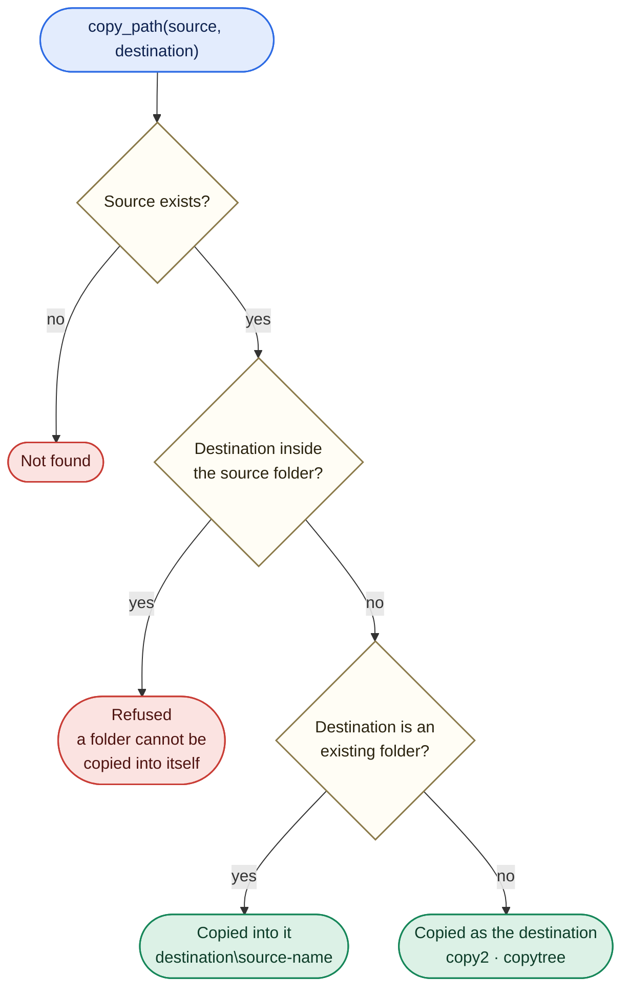
```mermaid
flowchart TD
    C(["copy_path(source, destination)"]):::engine --> Q0{"Source exists?"}:::dec
    Q0 -->|no| NF(["Not found"]):::bad
    Q0 -->|yes| Q1{"Destination inside<br/>the source folder?"}:::dec
    Q1 -->|yes| RF(["Refused<br/>a folder cannot be<br/>copied into itself"]):::bad
    Q1 -->|no| Q2{"Destination is an<br/>existing folder?"}:::dec
    Q2 -->|yes| IN(["Copied into it<br/>destination\source-name"]):::ok
    Q2 -->|no| AS(["Copied as the destination<br/>copy2 · copytree"]):::ok

    classDef engine fill:#e3ecfd,stroke:#2d6be4,stroke-width:1.5px,color:#0f2350
    classDef ok fill:#dcf1e6,stroke:#17875a,stroke-width:1.5px,color:#0d3d29
    classDef bad fill:#fbe3e1,stroke:#c93d36,stroke-width:1.5px,color:#4f1411
    classDef dec fill:#fffdf5,stroke:#8b7a4a,stroke-width:1.5px,color:#2b2410
```

### 8.4 Opening apps

`open_app(name)`:
1. Asks Windows for Start-menu apps: `Get-StartApps | Where Name -like '*name*'` (covers Store apps like WhatsApp and classic apps).
2. Launches it with `explorer.exe shell:AppsFolder\<AppID>`.
3. **Waits until the app is really ready** (`wait_until_app_ready`): up to 25 s for its window, then captures frames with `PrintWindow` (works even if the window is behind others) every 0.5 s. A near-empty frame (under 4.5 % non-background pixels and 2 % edges) is a splash screen — keep waiting. Two stable frames in a row (or 6 frames of an animating app) mean ready.
4. If no Start-menu app matches, it launches only a real path, a program on `PATH`, a registered App Path (e.g. `excel`) or a URI (`ms-settings:`). Web apps (Gemini, ChatGPT, YouTube) are told to use `navigate_browser`.in

**`open_app('chrome')`** (also "Google Chrome" or "browser") does not start your Chrome. It opens the **agent's own Chrome window**, or brings it to the front, and tells the model to work there with the browser tools. Found 2026-09-17: starting your Chrome picked its last-used profile, so a second task ran in a different profile from the first.

#### Flowchart: open_app

The three rounded ends on the right are the three answers the model can get back; each tells it what to do next.

```mermaid
flowchart TD
    O(["open_app(name)"]):::engine --> SA{"Get-StartApps:<br/>a Start-menu app matches?"}:::dec
    SA -->|yes| LA["explorer.exe shell:AppsFolder\AppID"]:::local
    SA -->|no| OT{"A real path, a program on PATH,<br/>an App Path or a URI like ms-settings:?"}:::dec
    OT -->|yes| LB["Start it"]:::local
    OT -->|no| WEB["Not started<br/>web apps like Gemini or YouTube:<br/>use navigate_browser"]:::bad
    LA --> WW{"A window appears<br/>within 25 s?"}:::dec
    WW -->|no| NW(["Launched, no window yet<br/>call list_windows before sending keys"]):::warn
    WW -->|yes| CAP["PrintWindow capture<br/>every 0.5 s, even behind other windows"]:::local
    CAP --> SPL{"Nearly empty frame?<br/>under 4.5 % content and 2 % edges"}:::dec
    SPL -->|"yes · splash screen"| T45
    SPL -->|no| STB{"Two stable frames in a row?<br/>or 6 frames of an animated app"}:::dec
    STB -->|no| T45{"45 s passed?"}:::dec
    T45 -->|no| CAP
    T45 -->|yes| LOAD(["Launched, still loading<br/>wait, then see_window"]):::warn
    STB -->|yes| RDY(["Launched and ready<br/>continue with the task"]):::ok

    classDef engine fill:#e3ecfd,stroke:#2d6be4,stroke-width:1.5px,color:#0f2350
    classDef local fill:#dcf2ee,stroke:#0f8a7e,stroke-width:1.5px,color:#0b3b36
    classDef ok fill:#dcf1e6,stroke:#17875a,stroke-width:1.5px,color:#0d3d29
    classDef bad fill:#fbe3e1,stroke:#c93d36,stroke-width:1.5px,color:#4f1411
    classDef warn fill:#fbeed8,stroke:#a0650f,stroke-width:1.5px,color:#4a2e05
    classDef dec fill:#fffdf5,stroke:#8b7a4a,stroke-width:1.5px,color:#2b2410
```

### 8.5 Typing and shortcuts inside apps

`send_keys(window_hint, text, keys)` — one PowerShell call with the `OaskUI` helper:
1. **Find** the window: every visible top-level window is scored (process name match +100, title match +50, WebView2/UWP host process −80, larger windows preferred). This picks the real WhatsApp window, not its WebView2 child. It waits up to 15 s.
2. **Focus and verify**: `ShowWindow`, `AttachThreadInput` with the current foreground thread, `SetForegroundWindow` — retried until `GetForegroundWindow` really returns our window. If Windows refuses, **nothing is sent**.
3. For WebView2 apps, keyboard focus is moved to the embedded `Chrome_WidgetWin_0` web view (otherwise keystrokes are swallowed).
4. **Keys first, then text.** `keys` uses SendKeys notation (`^f` = Ctrl+F, `{ENTER}`, `{DOWN}`, `+{TAB}`) but every keystroke is sent with `SendInput`. `text` is typed character by character as Unicode (`KEYEVENTF_UNICODE`), so any language works.

**Chrome windows are never targets.** The window finder skips every `chrome.exe` window, and `send_keys`, `focus_window`, `see_window` and `click_window` refuse a Chrome window name outright ("Refused: … is Chrome"), so keys and clicks never land in your own Chrome.

#### Flowchart: send_keys

```mermaid
flowchart TD
    K(["send_keys(window_hint, text, keys)"]):::engine --> F["Score every visible window<br/>process name +100 · title +50<br/>WebView2 or UWP host −80 · larger wins"]:::local
    F --> FW{"Found within 15 s?"}:::dec
    FW -->|no| NF["No window<br/>nothing was sent"]:::bad
    FW -->|yes| FO["ShowWindow · AttachThreadInput<br/>SetForegroundWindow, retried"]:::local
    FO --> FV{"GetForegroundWindow<br/>returns our window?"}:::dec
    FV -->|no| RF["Windows refused the focus<br/>NOTHING was sent"]:::bad
    FV -->|yes| WV["WebView2 app: move keyboard focus<br/>into the Chrome_WidgetWin_0 web view"]:::local
    WV --> KS["keys first, with SendInput<br/>^f · {ENTER} · {DOWN} · +{TAB}"]:::local
    KS --> TX["then text, one Unicode character at a time<br/>KEYEVENTF_UNICODE · any language"]:::local
    TX --> OK(["Sent to 'WhatsApp': …"]):::ok

    classDef engine fill:#e3ecfd,stroke:#2d6be4,stroke-width:1.5px,color:#0f2350
    classDef local fill:#dcf2ee,stroke:#0f8a7e,stroke-width:1.5px,color:#0b3b36
    classDef ok fill:#dcf1e6,stroke:#17875a,stroke-width:1.5px,color:#0d3d29
    classDef bad fill:#fbe3e1,stroke:#c93d36,stroke-width:1.5px,color:#4f1411
    classDef dec fill:#fffdf5,stroke:#8b7a4a,stroke-width:1.5px,color:#2b2410
```

The verified WhatsApp sequence the prompts teach: `open_app` → `^f^a{BACKSPACE}` (focus and clear search) → type the name → `{DOWN}` → `{ENTER}` (open chat) → type the message → `{ENTER}` as a separate step (send) → one `see_window` check.

#### Flowchart: the WhatsApp sequence

Each box is one `send_keys` or tool call. Sending is its own step so that the duplicate-send guard knows exactly when the message left.

```mermaid
flowchart TB
    subgraph ROW1["Find the chat"]
        direction LR
        W1["open_app<br/>WhatsApp"]:::local --> W2["keys ^f^a{BACKSPACE}<br/>focus + clear search"]:::local --> W3["text: the name<br/>the list filters"]:::local --> W4["keys {DOWN}<br/>first match"]:::local
    end
    subgraph ROW2["Send the message"]
        direction LR
        W5["keys {ENTER}<br/>open the chat"]:::local --> W6["text: the message<br/>text only"]:::local --> W7["keys {ENTER}<br/>send · its own step"]:::warn --> W8["see_window<br/>check once"]:::local
        W7 -.->|sent| G["Duplicate-send guard<br/>refuses to type it again"]:::bad
    end
    ROW1 --> ROW2

    classDef local fill:#dcf2ee,stroke:#0f8a7e,stroke-width:1.5px,color:#0b3b36
    classDef bad fill:#fbe3e1,stroke:#c93d36,stroke-width:1.5px,color:#4f1411
    classDef warn fill:#fbeed8,stroke:#a0650f,stroke-width:1.5px,color:#4a2e05
    style ROW1 fill:transparent,stroke:#8a94a6,stroke-width:1px,stroke-dasharray:6 4
    style ROW2 fill:transparent,stroke:#8a94a6,stroke-width:1px,stroke-dasharray:6 4
```

### 8.6 Seeing and clicking inside apps

- `list_windows()` — every visible window as `process :: title [size]`.
- `focus_window(window)` — the same find + verified focus as above.
- `see_window(window, question)`:
  1. Finds and focuses the window (never silently falls back to the whole screen if the named window does not exist).
  2. Captures it with `Graphics.CopyFromScreen` into a PNG.
  3. Sends it to the **vision chain** (Gemini first, Groq `qwen` second), asking for every clickable element as `label -> (X%, Y%)`, and to say "LOADING SCREEN" for splash screens.
  4. Converts the percentages to pixels relative to the window.
- `click_window(x, y, window, double_click)` — finds and focuses the window, adds the window's screen position, then `SetCursorPos` + `mouse_event` down/up. The rules: take a fresh `see_window` before every click; never guess coordinates.

#### Flowchart: see and click

Percentages are used because vision models estimate them far better than pixels. Asked for pixels, a model once answered x ≈ 900 for a window 786 pixels wide.

```mermaid
flowchart TD
    SW(["see_window(window, question)"]):::engine --> FF{"The named<br/>window exists?"}:::dec
    FF -->|no| MS(["Reported missing<br/>no whole-screen fallback"]):::bad
    FF -->|yes| CAP["Focus it<br/>CopyFromScreen → PNG"]:::local
    CAP --> VIS["Vision chain<br/>Gemini → Groq qwen"]:::ext
    VIS --> PCT["label → (X%, Y%)<br/>or LOADING SCREEN"]:::ext
    PCT --> PX["× the window size → pixels"]:::local
    PX --> CW["click_window(x, y)<br/>+ window origin<br/>SetCursorPos · mouse down/up"]:::local
    CW -.->|"before the next click: look again"| SW

    classDef engine fill:#e3ecfd,stroke:#2d6be4,stroke-width:1.5px,color:#0f2350
    classDef local fill:#dcf2ee,stroke:#0f8a7e,stroke-width:1.5px,color:#0b3b36
    classDef ext fill:#eceff4,stroke:#56657d,stroke-width:1.5px,color:#1f2733
    classDef bad fill:#fbe3e1,stroke:#c93d36,stroke-width:1.5px,color:#4f1411
    classDef dec fill:#fffdf5,stroke:#8b7a4a,stroke-width:1.5px,color:#2b2410
```

### 8.7 PowerShell for everything else

`run_command(command)`:
- The command is written to a temporary `.ps1` file and run with `powershell -NoProfile -NonInteractive -ExecutionPolicy Bypass -File …` — no quoting problems (inline `-Command` strings kept failing).
- Output (up to 8,000 characters) and the exit code are returned.
- **Blocked:** disk formatting (`format C:`, `Format-Volume`, `Clear-Disk`, `diskpart`), recursive deletes of `C:\`, `bcdedit`, `cipher /w`, shadow-copy deletion, shutdown/restart (`shutdown`, `Restart-Computer`, `Stop-Computer`), `-EncodedCommand`, and machine-wide registry deletes. Everyday commands like `Get-Date -Format "yyyy-MM-dd"` run normally.
- **Not run:** commands that would open a web page in your default browser, start Chrome or close it (`Start-Process chrome`, `start https://…`, `Stop-Process -Name chrome`, `chrome.exe …`). Web pages are opened with `navigate_browser`, in the agent's window.

#### Flowchart: run_command

```mermaid
flowchart TD
    RC(["run_command(command)"]):::engine --> BL{"Dangerous?"}:::dec
    BLL["Blocked: format C: · Format-Volume · Clear-Disk · diskpart<br/>bcdedit · cipher /w · shutdown · Restart-Computer<br/>-EncodedCommand · recursive delete of C:\"]:::bad -.- BL
    BL -->|yes| RF(["Blocked"]):::bad
    BL -->|no| RW["Rewrite profile folders<br/>to the real ones"]:::local
    RW --> PS1["Write a temporary .ps1<br/>UTF-8 output"]:::local
    PS1 --> RUN["powershell -NoProfile -NonInteractive<br/>-ExecutionPolicy Bypass -File …"]:::local
    RUN --> OUT(["Output up to 8,000 characters<br/>+ the exit code"]):::ok

    classDef engine fill:#e3ecfd,stroke:#2d6be4,stroke-width:1.5px,color:#0f2350
    classDef local fill:#dcf2ee,stroke:#0f8a7e,stroke-width:1.5px,color:#0b3b36
    classDef ok fill:#dcf1e6,stroke:#17875a,stroke-width:1.5px,color:#0d3d29
    classDef bad fill:#fbe3e1,stroke:#c93d36,stroke-width:1.5px,color:#4f1411
    classDef dec fill:#fffdf5,stroke:#8b7a4a,stroke-width:1.5px,color:#2b2410
```

### 8.8 Installing apps (`tools/apps.py`)

`install_app(name, source)` installs an app with **winget**, the installer built into Windows 11, without opening the Microsoft Store window. `source` is `store` (Microsoft Store only), `winget` (the winget catalogue only) or `any`.

1. `winget search --name <name>` (then a broader search) and the best match: the exact name first, then a name that starts with it, then winget's own order.
2. `winget list --id <id> --exact`: an app that is already there is reported as **Already installed**, and nothing is reinstalled.
3. With a window open, **you are asked** first ("Install 'Spotify' from the Microsoft Store on this computer"). A wake-word task has no window to ask, so the install goes ahead, as you asked for it by voice.
4. `winget install --id <id> --exact --source <msstore|winget>`, with the agreements accepted, waiting up to 4.5 minutes. Output goes to a log file in `%TEMP%\self_improving_agent`, so a long install cannot stall on a full pipe. An install that is still running is reported as such and continues in the background.
5. Success is exit code 0 or the app now showing in `winget list`. Then `open_app` opens it if you asked.

Some installers need administrator rights; Windows then shows its own permission prompt, which only you can answer.

#### Flowchart: install_app

```mermaid
flowchart TD
    I(["install_app(name, source)"]):::engine --> S["winget search<br/>by name, then any match"]:::local
    S --> F{"Found?"}:::dec
    F -->|no| NF(["Could not find it"]):::bad
    F -->|yes| P["Best match<br/>exact name → starts with → first"]:::local
    P --> AI{"Already installed?<br/>winget list"}:::dec
    AI -->|yes| AL(["Already installed<br/>open it with open_app"]):::ok
    AI -->|no| ASK{"A window is open<br/>to ask you?"}:::dec
    ASK -->|yes| YOU{"You approve?"}:::warn
    YOU -->|no| NO(["Not installed"]):::bad
    YOU -->|yes| RUN
    ASK -->|"no · wake word, REST"| RUN["winget install --exact<br/>Microsoft Store or winget · waits up to 4.5 min"]:::local
    RUN --> RES{"Result"}:::dec
    RES -->|"exit 0, or now listed"| OK(["Installed<br/>then open_app if asked"]):::ok
    RES -->|"still running"| BG(["Still installing<br/>it continues in the background"]):::warn
    RES -->|"error"| ERR(["Could not install<br/>with winget's message"]):::bad

    classDef engine fill:#e3ecfd,stroke:#2d6be4,stroke-width:1.5px,color:#0f2350
    classDef local fill:#dcf2ee,stroke:#0f8a7e,stroke-width:1.5px,color:#0b3b36
    classDef ok fill:#dcf1e6,stroke:#17875a,stroke-width:1.5px,color:#0d3d29
    classDef bad fill:#fbe3e1,stroke:#c93d36,stroke-width:1.5px,color:#4f1411
    classDef warn fill:#fbeed8,stroke:#a0650f,stroke-width:1.5px,color:#4a2e05
    classDef dec fill:#fffdf5,stroke:#8b7a4a,stroke-width:1.5px,color:#2b2410
```

---

## 9. How the agent operates Chrome

### 9.1 Connecting (`browser/controller.py`)

The agent works in **its own Chrome window**, on its own profile folder (`~/.self_improving_agent/chrome_profile`, named **"Self-Improving Agent"**). It never launches, copies or reads your Chrome profiles, so they stay signed in and keep opening normally while the agent's window is up. Strategies, in order:

1. **Attach** to a Chrome already listening on `127.0.0.1:9222`: normally the agent's window from an earlier run (`start_chrome_debugging.bat` opens it too). The agent opens its **own tab** and never takes over a tab you are reading.
2. **Launch the agent's window**: the installed Chrome with `--user-data-dir=<agent profile>`, `--remote-debugging-port=9222` and `--window-name="Self-Improving Agent"`, so the title bar and taskbar say whose window it is. The profile is kept between runs, so **sites you sign into in this window stay signed in** for the agent.
3. **A Playwright-managed window** on the same profile, then Playwright's bundled Chromium, as the last resort.

At back-end start-up only strategy 1 is tried (no window pops up); the rest happen when a task first needs the browser. On shut-down, a Chrome the agent launched is closed with a normal close (not a kill), so cookies are written to disk.

**Signing in for the agent.** When a task needs an account (Gemini, WhatsApp Web, a shop), sign in once in the agent's window; `wait_for_login` waits while you do. To do it ahead of time, run `start_chrome_debugging.bat`. This is a separate sign-in, like signing in on a second computer, and it does not sign your own Chrome out.

**Why not work in your own profile?** Chrome 136 and later refuse the debugging port on Chrome's normal profile folder. Until 17 September 2026 the agent worked around that in two ways, and both hurt your own Chrome:
- It ran on a **copy** of your last-used profile, Google sign-in included. One Google sign-in was then in use in two browsers at once, and your own "Person 1" profile kept being signed out.
- After `migrate_chrome_profile.py` had moved Chrome's data folder, it could start Chrome on your **real** profile folder under a second path. Chrome allows one browser per profile folder, so your other profiles would not open while that window was up.

On this PC, Chrome's data still lives in `AppData\Local\Google\ChromeProfile`, reached through a link at the usual `Chrome\User Data` path. Chrome works normally that way, and nothing needs to change.

#### Flowchart: connecting to Chrome

```mermaid
flowchart TD
    ST(["Backend start-up"]):::engine -.->|"only this check,<br/>no window opens"| A1
    N(["First browser task"]):::engine --> A1{"Chrome already listening<br/>on 127.0.0.1:9222?"}:::dec
    A1 -->|yes| AT["Attach<br/>open the agent's own tab"]:::ok
    A1 -->|no| NM["Name the agent's profile<br/>Self-Improving Agent"]:::engine
    NM --> A2["Launch Chrome on the agent's own profile<br/>~/.self_improving_agent/chrome_profile<br/>--remote-debugging-port=9222"]:::ext
    A2 -->|fails| A3["Playwright-managed window<br/>on the same profile"]:::ext
    A3 -->|fails| A4["Playwright's bundled Chromium"]:::ext
    AT --> CON
    A2 -->|works| CON
    A3 -->|works| CON
    A4 --> CON(["Connected · tools use the agent tab<br/>closed normally on shut-down"]):::ok
    A2 -.-|"separate folder,<br/>nothing shared"| YOU["Your Chrome and all its profiles<br/>never launched, copied or read"]:::local

    classDef engine fill:#e3ecfd,stroke:#2d6be4,stroke-width:1.5px,color:#0f2350
    classDef local fill:#dcf2ee,stroke:#0f8a7e,stroke-width:1.5px,color:#0b3b36
    classDef ext fill:#eceff4,stroke:#56657d,stroke-width:1.5px,color:#1f2733
    classDef ok fill:#dcf1e6,stroke:#17875a,stroke-width:1.5px,color:#0d3d29
    classDef dec fill:#fffdf5,stroke:#8b7a4a,stroke-width:1.5px,color:#2b2410
```

### 9.2 The browser tools (`tools/browser.py`, `browser/actions.py`)

Every action waits a random **1–3 s** first (human-like pacing).

| Tool | How it works |
|---|---|
| `navigate_browser(url)` | `page.goto(url, wait_until="commit")`, then up to 10 s for the DOM. A page still loading counts as reached (with a note). Detects Cloudflare "verify you are human" pages, waits 15 s for them to clear, then tells the agent to stop instead of reloading. |
| `perceive_page()` | Runs a JavaScript scan in the page and returns JSON lines: inputs and editors (CodeMirror, Monaco, Ace, contenteditable), buttons and call-to-action text, dropdowns with sample options, filters/facets, result/product links, canvases/iframes (games), output areas — each with a usable selector. If the scan finds fewer than 3 elements, a screenshot description is added. |
| `see_page(question)` | JPEG screenshot → vision chain → a description that always mentions popups, cookie banners, login walls, CAPTCHAs and errors, then the important buttons by their visible text. |
| `type_into_element(selector, text, press_enter)` | Finds the element (falls back to any visible search/text box), clicks it, then tries (1) `fill`, (2) focus + Ctrl+A + Backspace + `insert_text`, (3) direct injection into contenteditable / CodeMirror / Monaco. Optional Enter, then waits for the page. |
| `click_element(selector)` | Finds the target within a **6 s** budget: the selector itself; for text selectors also text match, button/link/tab roles, `href` slug, image alt, `aria-label`; game containers for "play/start"; up to 5 iframes. Visible matches win. Then: normal click → forced click → JavaScript click on the nearest clickable ancestor. A link that opens a new tab makes that tab the agent's working tab from then on, and a click that starts a download says so. **Payment/checkout clicks ask you first.** |
| `upload_file(path, selector)` | Refuses private files (keys, `.env`, password/credential files, `.ssh`, browser credential stores). **Asks you** before uploading. Then: fills a page file input directly, or clicks an attach/upload button while **intercepting the file chooser** (Playwright `expect_file_chooser`), including "Upload files" menus — the Windows file dialog is never touched. |
| `press_key(key)` | Keyboard press (Enter, Escape, arrows, WASD for games). Enter on a payment page asks you first. |
| `scroll_page(direction, amount)` | `window.scrollBy`. |
| `select_dropdown_option(selector, option)` | `select_option` by value or label. |
| `extract_page_data()` | URL, title, cart badge, first 1,000 characters of text. |
| `recall_domain_memory(domain)` | What SQL memory knows about the site (selectors, popup rules, tips, success counts). |
| `download_file(selector, url)` | Clicks the page's download link or button, or opens a direct file link, then waits (up to 240 s) until the file is saved in your **Downloads** folder and returns its path. Names are made unique (`report (1).pdf`). Every download in the agent's window is saved there, even one started by `click_element`. |
| `add_to_cart(product_selector, option)` | Opens a product from a search page first when asked (following a new tab), picks the size or colour in `option`, finds the Add to Cart / Add to Bag button (learned selectors, then common ids and labels, then the text; never Buy Now), clicks it, and checks the cart count or the site's "added to cart / bag" message. If the site asks for a size first, it lists the sizes on the page. It never buys or checks out. |
| `wait_for_login(timeout)` | Brings the tab to the front and polls every 2 s until the login URL and login buttons are gone (up to 180 s); remembers that the site's session is now saved. |

#### Flowchart: click_element

The 6-second budget exists because one click on chatgpt.com once spent 121 s searching iframes.

```mermaid
flowchart TD
    C(["click_element(selector)"]):::engine --> PAY{"Checkout or payment?<br/>payment words or a payment URL"}:::dec
    PAY -->|yes| ASK{"You approve?<br/>no window to ask → refused"}:::warn
    ASK -->|no| RF(["Not clicked"]):::bad
    ASK -->|yes| FIND
    PAY -->|no| FIND["Find it · 6 s in total · visible matches win<br/>selector → text → role: button, link, tab<br/>→ href, alt, aria-label → game area → up to 5 frames"]:::ext
    FIND --> CL{"Found?"}:::dec
    CL -->|no| NF(["Failed<br/>pick a selector from perceive_page"]):::bad
    CL -->|yes| K1["Normal click<br/>up to 3 s"]:::ext
    K1 -->|fails| K2["Forced click<br/>up to 1.5 s"]:::ext
    K2 -->|fails| K3["JavaScript click on the<br/>nearest clickable parent"]:::ext
    K3 -->|fails| NF
    K1 & K2 & K3 -->|works| NT(["Clicked<br/>follows a new tab if one opened"]):::ok

    classDef engine fill:#e3ecfd,stroke:#2d6be4,stroke-width:1.5px,color:#0f2350
    classDef ext fill:#eceff4,stroke:#56657d,stroke-width:1.5px,color:#1f2733
    classDef ok fill:#dcf1e6,stroke:#17875a,stroke-width:1.5px,color:#0d3d29
    classDef bad fill:#fbe3e1,stroke:#c93d36,stroke-width:1.5px,color:#4f1411
    classDef warn fill:#fbeed8,stroke:#a0650f,stroke-width:1.5px,color:#4a2e05
    classDef dec fill:#fffdf5,stroke:#8b7a4a,stroke-width:1.5px,color:#2b2410
```

#### Flowchart: type_into_element

```mermaid
flowchart TD
    T(["type_into_element(selector, text, press_enter)"]):::engine --> E["Find the element<br/>or any visible search box"]:::ext --> CK["Click it"]:::ext --> S1["fill"]:::ext
    S1 -->|fails| S2["focus · Ctrl+A · Backspace<br/>insert_text"]:::ext
    S2 -->|fails| S3["write straight into contenteditable,<br/>CodeMirror or Monaco"]:::ext
    S1 & S2 & S3 -->|typed| EN{"press_enter?"}:::dec
    EN -->|yes| PE["Enter, then wait<br/>for the page"]:::ext
    EN -->|no| DONE(["Typed"]):::ok
    PE --> DONE

    classDef engine fill:#e3ecfd,stroke:#2d6be4,stroke-width:1.5px,color:#0f2350
    classDef ext fill:#eceff4,stroke:#56657d,stroke-width:1.5px,color:#1f2733
    classDef ok fill:#dcf1e6,stroke:#17875a,stroke-width:1.5px,color:#0d3d29
    classDef dec fill:#fffdf5,stroke:#8b7a4a,stroke-width:1.5px,color:#2b2410
```

#### Flowchart: upload_file

The Windows file dialog is never opened: Playwright hands the file to the page's picker directly.

```mermaid
flowchart TD
    U(["upload_file(path, selector)"]):::engine --> R["Resolve the path<br/>like the file tools"]:::local
    R --> PV{"A private file?<br/>keys · .env · password or credential files<br/>.ssh · browser credential stores"}:::dec
    PV -->|yes| BL["Blocked"]:::bad
    PV -->|no| WIN{"A window is open<br/>to ask you?"}:::dec
    WIN -->|yes| ASK{"Upload name, size,<br/>to this site?"}:::warn
    ASK -->|no| NU["Not uploaded"]:::bad
    ASK -->|yes| GO
    WIN -->|"no · wake word or REST"| GO{"The page has<br/>a file input?"}:::dec
    GO -->|yes| FI["Fill the file input directly"]:::ext
    GO -->|no| BT{"An Attach or Upload button?"}:::dec
    BT -->|yes| FC["Click it while catching the file chooser<br/>expect_file_chooser · no Windows dialog"]:::ext
    BT -->|no| NB["No attach button found<br/>perceive_page, then retry with its selector"]:::warn
    FI & FC --> SP(["Wait 2 s · see_page confirms"]):::ok

    classDef engine fill:#e3ecfd,stroke:#2d6be4,stroke-width:1.5px,color:#0f2350
    classDef local fill:#dcf2ee,stroke:#0f8a7e,stroke-width:1.5px,color:#0b3b36
    classDef ext fill:#eceff4,stroke:#56657d,stroke-width:1.5px,color:#1f2733
    classDef ok fill:#dcf1e6,stroke:#17875a,stroke-width:1.5px,color:#0d3d29
    classDef bad fill:#fbe3e1,stroke:#c93d36,stroke-width:1.5px,color:#4f1411
    classDef warn fill:#fbeed8,stroke:#a0650f,stroke-width:1.5px,color:#4a2e05
    classDef dec fill:#fffdf5,stroke:#8b7a4a,stroke-width:1.5px,color:#2b2410
```

**Why downloads needed their own handling.** While Playwright is attached, Chrome hands every download to Playwright, which keeps it in a temporary folder that is deleted when it disconnects. Until 17 September 2026 a file downloaded with a click therefore never reached Downloads. The controller now saves each download to your real Downloads folder as soon as it starts (`BrowserController._watch_downloads`).

#### Flowchart: download_file

```mermaid
flowchart TD
    D(["download_file(selector or url)"]):::engine --> HOW{"Given"}:::dec
    HOW -->|selector| CL["Click the download link or button<br/>payment check first"]:::ext
    HOW -->|url| GO["Open the file link"]:::ext
    CL & GO --> W{"A download starts<br/>within 10 s?"}:::dec
    W -->|no| NO(["No download started<br/>look at the page with see_page"]):::bad
    W -->|yes| SAVE["The controller saves it to Downloads<br/>unique names: report (1).pdf"]:::local
    ANY(["Any download in the agent's window,<br/>even one started by click_element"]):::ext -.-> SAVE
    SAVE --> DONE{"Finished within<br/>the wait, at most 240 s?"}:::dec
    DONE -->|yes| OK(["Downloaded: full path and size"]):::ok
    DONE -->|no| BG(["Still downloading<br/>saved when it finishes"]):::warn

    classDef engine fill:#e3ecfd,stroke:#2d6be4,stroke-width:1.5px,color:#0f2350
    classDef local fill:#dcf2ee,stroke:#0f8a7e,stroke-width:1.5px,color:#0b3b36
    classDef ext fill:#eceff4,stroke:#56657d,stroke-width:1.5px,color:#1f2733
    classDef ok fill:#dcf1e6,stroke:#17875a,stroke-width:1.5px,color:#0d3d29
    classDef bad fill:#fbe3e1,stroke:#c93d36,stroke-width:1.5px,color:#4f1411
    classDef warn fill:#fbeed8,stroke:#a0650f,stroke-width:1.5px,color:#4a2e05
    classDef dec fill:#fffdf5,stroke:#8b7a4a,stroke-width:1.5px,color:#2b2410
```

#### Flowchart: add_to_cart

Tried on a test shop page: the first call reports that a size is needed and lists S, M, L; the second call with `option='M'` adds the item, and Buy Now is never pressed.

```mermaid
flowchart TD
    A(["add_to_cart(product_selector, option)"]):::engine --> PS{"product_selector<br/>given?"}:::dec
    PS -->|yes| OPEN["Open the product<br/>and follow a new tab"]:::ext
    PS -->|no| OPT
    OPEN --> OPT{"option given?"}:::dec
    OPT -->|yes| PICK["Click that size or colour"]:::ext
    OPT -->|no| FIND
    PICK --> FIND["Find the button<br/>learned selectors → common ids and labels → text<br/>never Buy Now or checkout"]:::ext
    FIND --> FB{"Found?"}:::dec
    FB -->|no| NB(["No button<br/>nothing added"]):::bad
    FB -->|yes| CLICK["Click it<br/>read the cart count before and after"]:::ext
    CLICK --> CHK{"Count went up, or the page<br/>says added to cart or bag?"}:::dec
    CHK -->|yes| OK(["Added to cart<br/>the button's selector is learned"]):::ok
    CHK -->|no| SZ{"The page asks to<br/>select a size or colour?"}:::dec
    SZ -->|yes| ASK(["Not added yet<br/>lists the sizes · call again with option"]):::warn
    SZ -->|no| UN(["Could not confirm<br/>check with see_page, never add twice"]):::warn

    classDef engine fill:#e3ecfd,stroke:#2d6be4,stroke-width:1.5px,color:#0f2350
    classDef ext fill:#eceff4,stroke:#56657d,stroke-width:1.5px,color:#1f2733
    classDef ok fill:#dcf1e6,stroke:#17875a,stroke-width:1.5px,color:#0d3d29
    classDef bad fill:#fbe3e1,stroke:#c93d36,stroke-width:1.5px,color:#4f1411
    classDef warn fill:#fbeed8,stroke:#a0650f,stroke-width:1.5px,color:#4a2e05
    classDef dec fill:#fffdf5,stroke:#8b7a4a,stroke-width:1.5px,color:#2b2410
```

### 9.3 Page state for verification (`browser/page_state.py`)

A compact snapshot: URL, title, the ARIA accessibility snapshot flattened into up to 150 role/name nodes, optional values from known selectors, and the first 2,000 characters of visible text.

---

## 10. Voice: the mic button and the wake word

### 10.1 Mic button (Local Agent page, desktop window, extension)

`MediaRecorder` records WebM audio (up to 60 s; recordings under 1.2 KB are rejected as too short), converts it to base64 with `FileReader`, and sends `voice_task`. The backend sends it to **Groq Whisper** (`voice.py`), rotating keys on rate limits and failing fast on rejected audio, then treats the transcript exactly like a typed task. The desktop window grants microphone permission to the agent page only.

#### Sequence: the mic button

```mermaid
sequenceDiagram
    autonumber
    actor You
    participant PG as Page
    participant SV as Server
    participant WH as Groq Whisper
    participant EN as Engine
    You->>PG: click the mic, speak, click again
    PG->>PG: MediaRecorder: WebM, up to 60 s → base64
    PG->>SV: voice_task
    SV->>WH: transcribe (keys rotate on 429)
    WH-->>SV: text
    SV-->>PG: voice_transcript
    SV->>EN: scope routing, then as if typed
    EN-->>PG: status_update … task_complete
```

### 10.2 Hands-free wake word (`wake_listener.py`)

The wake word is **"Emma"** (since 17 September 2026; `WAKE_WORD` in `.env`, and "hello" still works if you set it there). The stop word is **"done"**.

```
IDLE ── hears "Emma" ──► RECORDING ── hears "done" ──► PROCESSING ──► IDLE
                              └── 30 s without "done" ──► IDLE (nothing is run)
```

1. **Idle:** listens in short phrases (≤ 2 s) using `SpeechRecognition` + `PyAudio` with an adaptive energy threshold.
2. **Keyword spotting with Vosk:** each phrase is decoded with a **grammar** containing only the wake/stop words, their real-word variants, and **decoys** for each of them ("anna", "gemma", "emily", "ember", "summer", "comma", "amber", "mama" for "Emma"; "dawn", "gone", "dune", … for "done") so that similar-sounding words land on a decoy instead of triggering. "hammer" is deliberately not a decoy: with it, one speaker's "Emma" was heard as "hammer". If Vosk or its model is missing, Google's free recognizer is used.
3. **Strict matching:** the wake word must be the **first** word ("Emma open WhatsApp …"), or the first two words must be a variant ("hey Emma"). "…and ask Emma" and "amber emma" do not trigger. (Until 17 September a two-word phrase woke it on either word, so room noise heard as "amber emma" started a recording.)
4. **Recording:** a rising beep; the microphone stays open; audio chunks (≥ 0.3 s) are kept, and each is checked for the stop word: the whole phrase ("done"), the last one or two words ("okay I'm done"), or "done" said twice. **30 s without the stop word discards the recording** with a low buzz: nothing is run. (Until 17 September a timeout ran whatever had been recorded, so a conversation in the room became a task.)
5. **Transcription:** all chunks are joined into one WAV and transcribed by Whisper in **one pass**; the leading "Emma", everything from the first sentence that is only "done", and a trailing stop word are removed.
6. **Rating or task:** a transcript that starts with a rating ("good job", "wrong, …") is saved on the last task (section 10.3). Anything else runs through `AgentRunner` (scope routing as in section 7). Progress is printed to the console and **broadcast to every open window**, which also shows the result with 👍/👎. There is no confirmation channel, so payments are refused. A triple beep means success, a low buzz failure.

#### State diagram: the wake word

The listener is always in one of three states:

```mermaid
stateDiagram-v2
    [*] --> Idle
    Idle --> Idle: other words · decoys
    Idle --> Recording: “Emma” first
    Recording --> Recording: a chunk without the stop word
    Recording --> Discarded: 30 s, no “done”
    Discarded --> Idle: nothing is run
    Recording --> Processing: “done”
    Processing --> Idle: task result or saved rating

    Idle: Idle
    Idle: 2 s phrases · Vosk grammar
    Idle: emma, done + decoy words · offline
    Recording: Recording
    Recording: rising beep · mic stays open
    Recording: keeps chunks of 0.3 s or more
    Processing: Processing
    Processing: one Whisper pass
    Processing: strip Emma and done · rating or task
    Discarded: Discarded · low buzz

    class Idle ui
    class Recording warn
    class Processing engine
    class Discarded bad

    classDef ui fill:#ede9fe,stroke:#6a4be0,stroke-width:1.5px,color:#22184d
    classDef engine fill:#e3ecfd,stroke:#2d6be4,stroke-width:1.5px,color:#0f2350
    classDef bad fill:#fbe3e1,stroke:#c93d36,stroke-width:1.5px,color:#4f1411
    classDef warn fill:#fbeed8,stroke:#a0650f,stroke-width:1.5px,color:#4a2e05
```

#### Flowchart: does a phrase wake the agent?

Steps 3 and 4 as decisions:

```mermaid
flowchart TD
    PH(["A phrase decoded by Vosk"]):::engine --> W1{"First word “emma”,<br/>or first two “hey emma”?"}:::dec
    W1 -->|yes| WAKE(["Wake up · recording"]):::ok
    W1 -->|no| IGN["Ignore it<br/>“amber emma” · “…and ask Emma”"]:::bad
    WAKE --> STOP{"Each recorded chunk:<br/>is it a stop?"}:::dec
    STOP -->|"“done” alone · “okay I'm done”<br/>· “done done”"| STP(["Stop recording · go on"]):::warn
    STOP -->|"no, and under 30 s"| WAKE
    STOP -->|"30 s passed"| DROP(["Discard it · low buzz<br/>nothing is run"]):::bad

    classDef engine fill:#e3ecfd,stroke:#2d6be4,stroke-width:1.5px,color:#0f2350
    classDef ok fill:#dcf1e6,stroke:#17875a,stroke-width:1.5px,color:#0d3d29
    classDef bad fill:#fbe3e1,stroke:#c93d36,stroke-width:1.5px,color:#4f1411
    classDef warn fill:#fbeed8,stroke:#a0650f,stroke-width:1.5px,color:#4a2e05
    classDef dec fill:#fffdf5,stroke:#8b7a4a,stroke-width:1.5px,color:#2b2410
```

#### Flowchart: from recording to result

Steps 5 and 6:

```mermaid
flowchart TD
    P1["Join the chunks into one WAV"]:::engine --> P2["Groq Whisper · one pass"]:::ext --> P3["Remove the leading “Emma”,<br/>the “done” sentence and a trailing stop word"]:::engine
    P3 --> FBQ{"A rating?<br/>“good job” · “wrong, …”"}:::dec
    FBQ -->|"yes · section 10.3"| FBS(["Saved on the last task<br/>two short beeps"]):::mem
    FBQ -->|no| P4["Scope routing → AgentRunner"]:::engine --> P5["Progress to the console<br/>and every open window"]:::ui --> P6{"Result"}:::dec
    P6 -->|success| B1(["Triple beep"]):::ok
    P6 -->|failure| B2(["Low buzz"]):::bad

    classDef ui fill:#ede9fe,stroke:#6a4be0,stroke-width:1.5px,color:#22184d
    classDef engine fill:#e3ecfd,stroke:#2d6be4,stroke-width:1.5px,color:#0f2350
    classDef ext fill:#eceff4,stroke:#56657d,stroke-width:1.5px,color:#1f2733
    classDef mem fill:#f7e4f1,stroke:#a3478f,stroke-width:1.5px,color:#45173b
    classDef ok fill:#dcf1e6,stroke:#17875a,stroke-width:1.5px,color:#0d3d29
    classDef bad fill:#fbe3e1,stroke:#c93d36,stroke-width:1.5px,color:#4f1411
    classDef dec fill:#fffdf5,stroke:#8b7a4a,stroke-width:1.5px,color:#2b2410
```

### 10.3 Rating a task by voice (`voice_feedback.py`)

Every result in the windows has 👍 / 👎. A hands-free task may finish while no window is open, so the rating can also be spoken, with the same wake and stop words:

| You say | Saved as |
|---|---|
| "Emma … good job … done" | 👍 |
| "Emma … perfect, thanks … done" | 👍 |
| "Emma … wrong, you opened my own Chrome … done" | 👎 with the note "you opened my own Chrome" |
| "Emma … that was wrong because it added size L … done" | 👎 with the note "because it added size L" |
| "Emma … feedback bad, use install_app … done" | 👎 with the note "use install_app" |
| "Emma … correct the spelling in notes.txt … done" | a task, not a rating |

- **What counts as a rating:** the sentence must **start** with a rating phrase ("good job", "well done", "perfect", "correct", "it worked", "thumbs up", "shabash", "sahi hai"; "wrong", "that was wrong", "not correct", "it didn't work", "thumbs down", "galat") followed by a pause, the end, or the start of an explanation ("because", "but", "you …", "next time", "it should …"). A sentence starting with "feedback" is always a rating ("feedback good", "feedback bad, …"). Everything else is a task.
- **Which task:** the last task that finished, from any window, the wake word or REST, if it finished in the last 15 minutes.
- **What happens:** exactly what 👍 / 👎 does (section 11.5); your words after the rating become the note that the planner sees next time. Two short beeps confirm it (rising for 👍, falling for 👎), and the result card in every open window is marked. With nothing to rate, you hear the low buzz.
- **The mic button** in the windows works the same way: a spoken rating is saved instead of being run as a task.

#### Flowchart: rating a task by voice

```mermaid
flowchart TD
    V(["You say “Emma … good job … done”<br/>or “Emma … wrong, you should … done”"]):::ui --> T["One Whisper transcript"]:::ext
    T --> R{"Starts with a rating, then a pause<br/>or “because / but / you …”?"}:::dec
    R -->|no| TASK(["Run it as a task"]):::engine
    R -->|yes| L{"A task finished in<br/>the last 15 minutes?"}:::dec
    L -->|no| NONE(["Nothing to rate<br/>low buzz"]):::bad
    L -->|yes| SAVE[("Stored exactly like 👍 / 👎<br/>your words become the note")]:::mem
    SAVE --> SHOW(["Two short beeps: rising 👍, falling 👎<br/>the result card in every window is marked"]):::ok

    classDef ui fill:#ede9fe,stroke:#6a4be0,stroke-width:1.5px,color:#22184d
    classDef engine fill:#e3ecfd,stroke:#2d6be4,stroke-width:1.5px,color:#0f2350
    classDef ext fill:#eceff4,stroke:#56657d,stroke-width:1.5px,color:#1f2733
    classDef mem fill:#f7e4f1,stroke:#a3478f,stroke-width:1.5px,color:#45173b
    classDef ok fill:#dcf1e6,stroke:#17875a,stroke-width:1.5px,color:#0d3d29
    classDef bad fill:#fbe3e1,stroke:#c93d36,stroke-width:1.5px,color:#4f1411
    classDef dec fill:#fffdf5,stroke:#8b7a4a,stroke-width:1.5px,color:#2b2410
```

---

## 11. How the agent learns

### 11.1 The layers

| Layer | Where | What it holds | Used when |
|---|---|---|---|
| Episodic log | SQLite `tasks`, `steps` | Every task: instruction, status, summary, duration | History, `/tasks`, RL dataset export |
| Domain memory | SQLite `domain_memories` | Per site (and `local`): known selectors, popup rules, tips (last 12), success/failure counts | Planning (SQL context), `recall_domain_memory` |
| Skills | SQLite `skills` | Reusable patterns per type and domain, success rate, usage, last use | Planning; confidence decays 2 % per 7 idle days, dropped below 0.5 |
| Failure patterns | SQLite `failure_patterns` | Normalized error → root cause → solution | Planning ("KNOWN FAILURE PATTERNS") |
| Reflexion tips | domain tips + failure patterns | "Previous attempt failed: … → this time: …" | Planning |
| Brain stats | SQLite `brain_state` | Totals, success rate, average duration, mastered domains | Dashboard `/brain/stats` |
| **Experiences** (Level 3) | ChromaDB `experiences` | Instruction (embedded) + success, tools, steps, lesson, error, feedback, note | Recall before every task |
| **Lessons** (Level 3) | ChromaDB `lessons` | The lesson text of each experience, embedded on its own | Recall by relevance of the lesson |

### 11.2 What is written after a task

1. **SQL (awaited):** the task record is closed; local tasks get a tip `TASK: … -> DONE/FAILED. REPORT: …`; the run is counted **once** for its domain; on success a **skill** is created or strengthened (its type comes from the tools used — `app_interaction`, `file_write`, `file_read`, `open_app`, `file_search`, … — or, for browser work, from the wording — `search_product`, `add_to_cart`, …); on failure the **same** skill type is weakened, failed page selectors get a strike (pruned after enough strikes), and the failure pattern is recorded; stats are updated. Page selectors are learned from successful `type_into_element` (search boxes) and `click_element` (cart, close/dismiss) steps.
2. **LLM reflection (background):** one call (role `reflection`, 12 s timeout) receives the task, outcome, error, the step log with results, the final report, similar earlier failures (if this run succeeded: "explain what this run did differently"), and after a retry the failed first attempt ("what changed?"). It returns JSON: `what_succeeded`, `what_failed`, `root_cause`, `what_to_try_next`. Without the LLM a rule-based lesson is used.
3. **ChromaDB (background):** the instruction and lesson are embedded in **one** batched call; the experience and its lesson are upserted with metadata: domain, scope, success, tool sequence (repeats collapsed), up to 12 step details (`tool(target)`, `[FAILED]` marks), lesson (≤ 1,500 chars), error, feedback, disputed/confirmed flags, note, timestamp.

#### Flowchart: what is written after a task

The left box finishes before you see the result; the right box runs afterwards, so a slow model never delays your answer.

```mermaid
flowchart TD
    E(["Attempt finished"]):::engine --> NT{"Did any tool run?"}:::dec
    NT -->|no| KA["Not stored<br/>kept aside in case you rate it"]:::warn
    NT -->|yes| A1

    subgraph AW["Awaited · fast · on this computer"]
        A1[("Close the task record")]:::mem --> A2[("Local tip<br/>TASK … → DONE or FAILED")]:::mem --> A3[("Count the run once<br/>for its domain")]:::mem --> A4{"Success?"}:::dec
        A4 -->|yes| A5["Create or strengthen the skill<br/>learn the page selectors used"]:::ok
        A4 -->|no| A6["Weaken the same skill type<br/>strike failed selectors<br/>record the failure pattern"]:::bad
    end

    A5 & A6 --> RES(["Result sent to you"]):::ui
    RES -->|"then, while you read it"| B1

    subgraph BG["In the background"]
        B1["Reflection LLM · 12 s limit<br/>what succeeded · what failed<br/>root cause · what to try next"]:::engine --> B2["Embed the instruction and<br/>the lesson in one batch · MiniLM"]:::mem --> B3[("ChromaDB upsert<br/>experiences + lessons")]:::mem
    end

    KA -.->|"only if you rate it"| B3

    classDef ui fill:#ede9fe,stroke:#6a4be0,stroke-width:1.5px,color:#22184d
    classDef engine fill:#e3ecfd,stroke:#2d6be4,stroke-width:1.5px,color:#0f2350
    classDef mem fill:#f7e4f1,stroke:#a3478f,stroke-width:1.5px,color:#45173b
    classDef ok fill:#dcf1e6,stroke:#17875a,stroke-width:1.5px,color:#0d3d29
    classDef bad fill:#fbe3e1,stroke:#c93d36,stroke-width:1.5px,color:#4f1411
    classDef warn fill:#fbeed8,stroke:#a0650f,stroke-width:1.5px,color:#4a2e05
    classDef dec fill:#fffdf5,stroke:#8b7a4a,stroke-width:1.5px,color:#2b2410
    style AW fill:transparent,stroke:#8a94a6,stroke-width:1px,stroke-dasharray:6 4
    style BG fill:transparent,stroke:#8a94a6,stroke-width:1px,stroke-dasharray:6 4
```

### 11.3 How similar tasks are recalled

1. The new instruction is embedded once (MiniLM, 384 numbers).
2. `experiences` is searched for the nearest instructions; `lessons` is searched with the same vector. Cosine similarity = 1 − distance.
3. Kept: instructions ≥ 0.35 similar, or lessons ≥ 0.30 relevant (tagged "its lesson is N% relevant").
4. Each match gets a **score**:

   `score = similarity + 0.08 × feedback (−3…+3) + 0.05 if it effectively worked + 0.12 if you confirmed it with 👍`

5. The top 5 are used. If the vector index is still being written (a ChromaDB timing issue), the query is retried and, if needed, answered by a direct search over the stored documents.

#### Flowchart: recall and ranking

```mermaid
flowchart TD
    Q(["New instruction"]):::ui --> EM["Embed it once<br/>MiniLM · 384 numbers"]:::mem
    EM --> X1[("experiences<br/>nearest instructions")]:::mem
    EM --> X2[("lessons<br/>same vector")]:::mem
    X1 --> K1{"Similarity<br/>≥ 0.35?"}:::dec
    X2 --> K2{"Lesson relevance<br/>≥ 0.30?"}:::dec
    K1 -->|no| DROP(["Dropped"]):::bad
    K2 -->|no| DROP
    K1 -->|yes| SC
    K2 -->|yes| SC["score = similarity<br/>+ 0.08 × feedback, −3 … +3<br/>+ 0.05 if it worked<br/>+ 0.12 if you confirmed it 👍"]:::engine
    SC --> TOP["Top 5"]:::ok --> STRAT["Reflection LLM<br/>STRATEGY + AVOID"]:::engine --> PLAN(["Planner"]):::engine

    classDef ui fill:#ede9fe,stroke:#6a4be0,stroke-width:1.5px,color:#22184d
    classDef engine fill:#e3ecfd,stroke:#2d6be4,stroke-width:1.5px,color:#0f2350
    classDef mem fill:#f7e4f1,stroke:#a3478f,stroke-width:1.5px,color:#45173b
    classDef ok fill:#dcf1e6,stroke:#17875a,stroke-width:1.5px,color:#0d3d29
    classDef bad fill:#fbe3e1,stroke:#c93d36,stroke-width:1.5px,color:#4f1411
    classDef dec fill:#fffdf5,stroke:#8b7a4a,stroke-width:1.5px,color:#2b2410
```

### 11.4 From memories to a strategy

The reflection LLM gets the new task, each past task (outcome, similarity, feedback, steps, your note, lesson, error), the **success rate of each approach** (tool sequence → worked X of Y), the **anti-skills** (approaches tried at least twice that worked in fewer than a third of tries — "never use"), the **flow you confirmed** ("learn from its shape and adapt names, paths and details"), and **what you said went wrong** ("do not repeat it"). It answers with `STRATEGY:` (≤ 4 bullets) and `AVOID:` (≤ 2 bullets). Complete answers are cached for an hour per instruction and memory state.

#### Flowchart: from memories to a strategy

```mermaid
flowchart LR
    I1[("Each past task<br/>outcome · similarity · steps<br/>your note · lesson · error")]:::mem --> RF
    I2[("Success rate of each approach<br/>tool sequence → worked X of Y")]:::mem --> RF
    I3["Anti-skills<br/>tried at least twice,<br/>worked under a third of the time"]:::bad --> RF
    I4["The flow you confirmed 👍<br/>adapt it, never replay it"]:::ok --> RF
    I5["What you said went wrong 👎"]:::bad --> RF
    RF["Reflection LLM"]:::engine --> OUT(["STRATEGY: up to 4 bullets<br/>AVOID: up to 2 bullets<br/>cached for an hour"]):::engine

    classDef engine fill:#e3ecfd,stroke:#2d6be4,stroke-width:1.5px,color:#0f2350
    classDef mem fill:#f7e4f1,stroke:#a3478f,stroke-width:1.5px,color:#45173b
    classDef ok fill:#dcf1e6,stroke:#17875a,stroke-width:1.5px,color:#0d3d29
    classDef bad fill:#fbe3e1,stroke:#c93d36,stroke-width:1.5px,color:#4f1411
```

### 11.5 Feedback, precisely

| You do | Stored | Effect on future tasks |
|---|---|---|
| 👍 on a success | `feedback +1` | Ranked higher; its steps are shown as a confirmed flow to adapt |
| 👍 on a run marked failed | `feedback +1`, `user_confirmed` | Now counts as a success; its approach is reused |
| 👎 on a success | `feedback −1`, `user_disputed`; the skill it taught is weakened | No longer reused as a working example |
| 👎 on a failure | `feedback −1` | The approach is avoided more strongly |
| 👎 with a note | the note (≤ 300 chars) | Shown to the planner as "what the user said went wrong", first bullet of AVOID |
| Rate a run that is still being saved | queued | Applied the moment the experience is written |
| Rate a run that used no tool | the run is stored now, then rated | Your note is not lost |
| Say "Emma … good job … done" or "Emma … wrong, <what went wrong> … done" | the same as 👍 / 👎, with your words as the note, on the last task finished in the past 15 minutes | The same as the buttons (section 10.3) |

#### Flowchart: feedback

```mermaid
flowchart TD
    R(["You rate a finished task"]):::ui --> ST{"Is its experience<br/>stored yet?"}:::dec
    ST -->|"still being saved"| QU["Queued<br/>applied when it is written"]:::warn
    ST -->|"no tool ran, so not stored"| NS["Stored now, then rated"]:::warn
    ST -->|yes| RT
    QU & NS --> RT{"Rating"}:::dec
    RT -->|"👍"| UP{"The agent had<br/>marked it as"}:::dec
    UP -->|success| U1["feedback +1<br/>ranked higher · shown as a confirmed flow"]:::ok
    UP -->|failed| U2["feedback +1 · user_confirmed<br/>now counts as a success"]:::ok
    RT -->|"👎"| DN{"The agent had<br/>marked it as"}:::dec
    DN -->|success| D1["feedback −1 · user_disputed<br/>its skill weakened · no longer reused"]:::bad
    DN -->|failed| D2["feedback −1<br/>the approach is avoided more strongly"]:::bad
    D1 & D2 -.->|with a note| NOTE[("Your note, up to 300 characters<br/>the first AVOID bullet next time")]:::mem

    classDef ui fill:#ede9fe,stroke:#6a4be0,stroke-width:1.5px,color:#22184d
    classDef mem fill:#f7e4f1,stroke:#a3478f,stroke-width:1.5px,color:#45173b
    classDef ok fill:#dcf1e6,stroke:#17875a,stroke-width:1.5px,color:#0d3d29
    classDef bad fill:#fbe3e1,stroke:#c93d36,stroke-width:1.5px,color:#4f1411
    classDef warn fill:#fbeed8,stroke:#a0650f,stroke-width:1.5px,color:#4a2e05
    classDef dec fill:#fffdf5,stroke:#8b7a4a,stroke-width:1.5px,color:#2b2410
```

### 11.6 The explanation ("Why I did this")

Built from recorded facts only, no extra LLM call:

```
What I did: ✓ create_folder (Desktop\MAYANK) → ✓ write_file (…) → ✓ read_file (…)
Why: this matched 4 similar past task(s), so I reused what worked and avoided what failed:
• "create a new folder in desktop named MAYANK…" (worked, 8 min ago, 100% similar)
• "create a new folder in the desktop named it MAYANK…" (you said it did not work, 1 hour ago, 93% similar) 👎
I avoided what you reported last time: "it didn't do anything correctly so no use of this"
Strategy I followed: Use create_folder …; Use write_file …; Immediately follow with read_file …
```

---

## 12. LLM routing on free API keys

### 12.1 Roles and models (`utils/llm.py`)

| Role | Used by | Model on this account |
|---|---|---|
| `planner` | planner node | `groq/openai/gpt-oss-120b` |
| `actor` | first/important actor turns | `groq/openai/gpt-oss-120b` |
| `actor_fast` | routine actor turns | `groq/openai/gpt-oss-20b` |
| `reflection` | strategy + lessons | `groq/openai/gpt-oss-120b` |
| `judge` | text verification | `groq/openai/gpt-oss-120b` |
| vision | see_window, see_page, vision judge | Gemini first, Groq `qwen/qwen3.8-27b` second |
| speech | voice | Groq `whisper-large-v3-turbo` |

At start-up the preferred Llama models are checked against Groq's live model list and skipped if not offered; every choice is logged. All calls use `reasoning_effort="low"` and `temperature` 0–0.2. A registered, *accepted* RL adapter (Level 4) would replace the planner/actor models automatically if one existed.

### 12.2 Surviving free-tier limits (`utils/litellm_patch.py`, `utils/key_pool.py`)

- **Key pool:** all Groq keys rotate round-robin. A 429 puts that key into cooldown **for that model only** (Groq limits each model separately), for the exact time Groq names ("try again in 13.5s"), and the next key is used immediately.
- **Call spacing:** at least 2 s between Groq calls.
- **Fallback:** if every key is cooling for more than 3 s, or Groq is down (5xx, timeout, connection error), the same request goes to **Gemini** (`gemini-3.6-flash`, then `gemini-2.5-flash-lite`).
- **Gemini circuit breaker:** a Gemini model that hits its quota rests for 5 min; one that is overloaded or times out rests for 2 min; the next model is used meanwhile.
- **Payload hygiene:** Anthropic cache fields are removed; when the conversation grows past 16,000 characters, older messages are shortened — but the system prompt, the task message and the two newest messages are **never** shortened. The actor also shortens old tool results itself (keeps the newest 8 messages whole).
- **Tool-schema fixes:** only arguments without defaults are marked required; `tool_choice="none"` is turned into `"auto"` (Groq's gpt-oss models reject the former after a tool result); one parallel tool call at a time.

#### Flowchart: one LLM call on free keys

What happens inside every model call, for every role:

```mermaid
flowchart TD
    C(["LLM call<br/>role → model"]):::engine --> CL["Clean the payload<br/>past 16,000 characters, shorten old messages<br/>never the system prompt, the task or the 2 newest"]:::engine
    CL --> K["Next Groq key<br/>not cooling for this model"]:::engine
    K --> ALL{"Every key cooling<br/>for more than 3 s?"}:::dec
    ALL -->|no| SP["Wait until 2 s<br/>after the last call"]:::engine --> CALL["Call Groq"]:::ext
    CALL --> RSP{"Response"}:::dec
    RSP -->|ok| ANS(["Answer"]):::ok
    RSP -->|"429"| CD["Cool this key for this model<br/>for as long as Groq says"]:::warn
    CD --> K
    RSP -->|"5xx · timeout · connection error"| GEM
    ALL -->|yes| GEM["Gemini<br/>gemini-3.6-flash → gemini-2.5-flash-lite"]:::ext
    GEM --> GR{"Response"}:::dec
    GR -->|ok| ANS
    GR -->|"quota used"| Q5["That model rests 5 min<br/>try the next one"]:::warn
    GR -->|"overloaded · timeout"| Q2["That model rests 2 min<br/>try the next one"]:::warn
    Q5 & Q2 --> MORE{"Another Gemini<br/>model available?"}:::dec
    MORE -->|yes| GEM
    MORE -->|no| ERR(["The last error is returned"]):::bad

    classDef engine fill:#e3ecfd,stroke:#2d6be4,stroke-width:1.5px,color:#0f2350
    classDef ext fill:#eceff4,stroke:#56657d,stroke-width:1.5px,color:#1f2733
    classDef ok fill:#dcf1e6,stroke:#17875a,stroke-width:1.5px,color:#0d3d29
    classDef bad fill:#fbe3e1,stroke:#c93d36,stroke-width:1.5px,color:#4f1411
    classDef warn fill:#fbeed8,stroke:#a0650f,stroke-width:1.5px,color:#4a2e05
    classDef dec fill:#fffdf5,stroke:#8b7a4a,stroke-width:1.5px,color:#2b2410
```

---

## 13. Verification: deciding whether a task really worked

**Local tasks** (`nodes/verifier.py` + `toolkit.py`):
1. `report_indicates_failure` — failure words in the report ("could not", "cannot", "not found", "didn't work", …) after removing negated mentions ("no errors", "without any problems").
2. `local_completion_shortfall` — an action request where no tool ran; or an in-app request (search/send/message/type/click/play…) where only `open_app` ran and nothing was typed or clicked in an app or page.

**Browser tasks** (`verifier/engine.py`):
1. **Rules** — site rules where they exist (Amazon), otherwise **generic rules** inferred from the instruction: the search words appear in the URL/title/text (at least half); the requested site was reached; the page is not a login wall, CAPTCHA or error page (unless logging in was the task); the cart count went up (when both pages show one).
2. **Text judge** — the page snapshot and the action summary go to the `judge` model: `VERDICT / CONFIDENCE / REASONING`.
3. **Vision judge** — a screenshot of the final page goes to the vision chain, **only** when it can change the outcome (the rules passed, and the text judge did not already pass the task with ≥ 85 % confidence), with a 40 s limit. A vision verdict with confidence ≥ 60 % decides.
4. **Combined:** rules must pass **and** the deciding judge must pass. Without any judge, rules alone decide (80 % confidence).

#### Flowchart: checking a browser task

Local tasks are checked as shown in [verify and retry](#flowchart-verify-and-retry).

```mermaid
flowchart TD
    B(["Browser task finished"]):::engine --> RU["Rules<br/>site rules, or generic ones from the instruction:<br/>search words on the page · the named site reached<br/>no login wall, CAPTCHA or error page · cart count up"]:::engine
    RU --> TJ["Text judge<br/>page snapshot + action summary<br/>VERDICT · CONFIDENCE · REASONING"]:::engine
    TJ --> NEED{"Rules passed, and the text judge<br/>did not pass it with ≥ 85 %?"}:::dec
    NEED -->|yes| VJ["Vision judge<br/>screenshot of the final page · 40 s limit"]:::ext
    NEED -->|no| PICK
    VJ --> VC{"Vision confidence<br/>≥ 60 %?"}:::dec
    VC -->|yes| JV["The vision verdict decides"]:::ext
    VC -->|no| PICK{"Text judge<br/>answered?"}:::dec
    PICK -->|yes| JT["The text verdict decides"]:::engine
    PICK -->|no| JR(["Rules alone decide<br/>80 % confidence"]):::warn
    JV & JT --> FIN{"Rules passed AND<br/>the deciding judge passed?"}:::dec
    FIN -->|yes| P(["Passed"]):::ok
    FIN -->|no| F(["Failed"]):::bad

    classDef engine fill:#e3ecfd,stroke:#2d6be4,stroke-width:1.5px,color:#0f2350
    classDef ext fill:#eceff4,stroke:#56657d,stroke-width:1.5px,color:#1f2733
    classDef ok fill:#dcf1e6,stroke:#17875a,stroke-width:1.5px,color:#0d3d29
    classDef bad fill:#fbe3e1,stroke:#c93d36,stroke-width:1.5px,color:#4f1411
    classDef warn fill:#fbeed8,stroke:#a0650f,stroke-width:1.5px,color:#4a2e05
    classDef dec fill:#fffdf5,stroke:#8b7a4a,stroke-width:1.5px,color:#2b2410
```

---

## 14. Safety rules

| Risk | Protection |
|---|---|
| Paying, placing an order, checking out | Clicks/Enter matching payment words or on payment URLs (`/checkout`, `/payment`, `razorpay`, …) need **your confirmation**; with no UI (wake word, REST) they are refused |
| Sending a file to a website | Credential files are refused; other uploads need your confirmation when a UI is connected |
| Sending a message twice | The duplicate-send guard refuses to retype a sent message in the same window (unless you asked for "twice"/"again"); a success message with your text in it is still recognised as sent |
| A retry repeating an action | No automatic retry after any successful typing, clicking, sending, writing or command |
| Typing into the wrong window | Keys and clicks are sent only after the target window is confirmed in front |
| Clicking blindly | No screenshot of the whole screen when a named window is missing; the agent is told never to guess coordinates |
| Destroying data | Deletes go to the Recycle Bin; system and top-level user folders are refused; dangerous PowerShell commands are blocked |
| Wrong scope | Browser scope never gets local tools |
| Remote shutdown | `/app/shutdown` only accepts requests from this computer |
| Hung tools | Each tool call is capped at 300 s; each task at 180 s |
| Your own Chrome | The agent's Chrome has its own profile; your Chrome profiles are never launched, copied or read, so they stay signed in and keep opening while the agent works. Desktop keys and clicks never target a Chrome window, and commands or links that would open or close your Chrome are refused |
| Installing software | `install_app` asks you first when a window is open and only installs what winget finds; Windows still shows its own administrator prompt when an installer needs one |
| Adding to a cart | `add_to_cart` never presses Buy Now or checkout; payment pages still need your confirmation |

#### Flowchart: safety guards around a tool call

The table above as one flow: the guard that applies depends on what the tool call is about to do.

```mermaid
flowchart LR
    SC{"Tool call:<br/>offered in<br/>this scope?"}:::dec
    SC -->|no| X0(["Not available"]):::bad
    SC -->|yes| KIND{"What will<br/>it do?"}:::dec

    KIND -->|"click or Enter<br/>on a payment"| PAY{"You confirm?<br/>no window → no"}:::warn
    PAY -->|yes| R1(["Runs"]):::ok
    PAY -->|no| X1(["Refused"]):::bad

    KIND -->|"upload<br/>a file"| UP{"Credential<br/>file?"}:::dec
    UP -->|yes| X2(["Refused"]):::bad
    UP -->|no| UPA{"You approve?<br/>asked if a window<br/>is open"}:::warn
    UPA -->|yes| R2(["Runs"]):::ok
    UPA -->|no| X2B(["Not uploaded"]):::bad

    KIND -->|"type a message<br/>in an app"| DUP{"Already sent<br/>in this window?"}:::dec
    DUP -->|"yes, and you did not<br/>say twice or again"| X3(["Refused"]):::bad
    DUP -->|no| R3(["Runs"]):::ok

    KIND -->|"keys or clicks<br/>in an app"| FOC{"Target window<br/>confirmed in front?"}:::dec
    FOC -->|no| X4(["Nothing sent<br/>no guessed clicks"]):::bad
    FOC -->|yes| R4(["Runs"]):::ok

    KIND -->|delete| DEL{"Protected<br/>folder?"}:::dec
    DEL -->|yes| X5(["Refused"]):::bad
    DEL -->|no| R5(["Recycle Bin"]):::ok

    KIND -->|run_command| CMD{"Dangerous<br/>command?"}:::dec
    CMD -->|yes| X6(["Blocked"]):::bad
    CMD -->|no| R6(["Runs"]):::ok

    classDef ok fill:#dcf1e6,stroke:#17875a,stroke-width:1.5px,color:#0d3d29
    classDef bad fill:#fbe3e1,stroke:#c93d36,stroke-width:1.5px,color:#4f1411
    classDef warn fill:#fbeed8,stroke:#a0650f,stroke-width:1.5px,color:#4a2e05
    classDef dec fill:#fffdf5,stroke:#8b7a4a,stroke-width:1.5px,color:#2b2410
```

---

## 15. The desktop app

`desktop/agent_desktop.pyw` is both the window and the **supervisor** of the backend.

- **Window:** pywebview on Edge WebView2 (`gui="edgechromium"`), data in `backend/data/desktop_webview`; first a loading page with live status, then `http://localhost:8000/local`. The window icon is set and the **microphone is allowed only for the agent page**.
- **Close button (X):** stops **everything**: the agent, its Chrome window and the wake word, then the app closes. Until 17 September it only hid the window, and the agent kept listening in the tray.
- **Tray menu:** Open Agent (a new chat if the window was hidden) · status line · **Hide window, keep listening** (the only way to run with no window; a notification says it is still listening) · Start with Windows (`HKCU\…\Run`, starts hidden with `--hidden` and says so in a notification) · Restart/Start agent · Open log · **Quit (stops the agent and the wake word)**, which also stops an agent the app only attached to.
- **From a script:** `pythonw agent_desktop.pyw --quit` asks the running app to quit (message `quit` on port 8767) and stops any agent still answering.
- **Opening the icon again:** the second launch sends `show` to port 8767. The running app then:
  1. restarts **itself** if `agent_desktop.pyw` changed on disk;
  2. starts the agent if it is not running;
  3. restarts the agent if its code is **older than the code on disk** — the backend reports the code version it loaded in `/health` (`code_stamp`), so this works even for an agent the app did not start — unless a task is running;
  4. otherwise opens the window with a **new chat** (unless a task is running).

#### Flowchart: opening the icon again

```mermaid
flowchart TD
    I(["Icon opened again"]):::ui --> S["The second copy sends “show”<br/>to port 8767 and exits"]:::ui
    S --> A{"agent_desktop.pyw<br/>changed on disk?"}:::dec
    A -->|yes| RA(["Restart the app<br/>the new copy takes over"]):::warn
    A -->|no| H{"The agent answers<br/>/health?"}:::dec
    H -->|no| SA(["Start the agent<br/>the loading page shows progress"]):::engine
    H -->|yes| O{"Its code_stamp is older<br/>than the code on disk?"}:::dec
    O -->|"yes, and no task is running"| RS(["Restart the agent"]):::warn
    O -->|"no, or a task is running"| T{"A task running?"}:::dec
    T -->|no| NC(["Show the window<br/>with a new chat"]):::ok
    T -->|yes| KP(["Show the window<br/>the running task keeps its page"]):::ok

    classDef ui fill:#ede9fe,stroke:#6a4be0,stroke-width:1.5px,color:#22184d
    classDef engine fill:#e3ecfd,stroke:#2d6be4,stroke-width:1.5px,color:#0f2350
    classDef ok fill:#dcf1e6,stroke:#17875a,stroke-width:1.5px,color:#0d3d29
    classDef warn fill:#fbeed8,stroke:#a0650f,stroke-width:1.5px,color:#4a2e05
    classDef dec fill:#fffdf5,stroke:#8b7a4a,stroke-width:1.5px,color:#2b2410
```
- **Health watch:** every 15 s, for the status only. The app **never starts or restarts the agent on its own**: an agent stopped on purpose (exit code 0, e.g. Ctrl+C in `start_agent.ps1`) closes the app too; a crash is reported in the window and the tray, and opening the icon or "Start agent" starts it again. (Until 17 September the app restarted a stopped agent and started one when none was running, which is how a stopped project kept listening.)

#### Flowchart: health watch

Two watchers run side by side: one waits for the agent the app started to exit, the other asks `/health` every 15 seconds. Neither starts anything.

```mermaid
flowchart TD
    subgraph W1["The agent the app started exits by itself"]
        direction TB
        EX(["It exits"]):::ext --> C{"Exit code"}:::dec
        C -->|"0 · stopped on purpose<br/>start_agent.ps1 · /app/shutdown"| Q(["The app quits too"]):::ok
        C -->|"other · a crash"| NR(["Not restarted<br/>window and tray say it stopped"]):::warn
    end
    subgraph W2["Every 15 s"]
        direction TB
        T(["Check /health"]):::ui --> H{"Answers?"}:::dec
        H -->|yes| OK(["The tray shows the status<br/>Listening for “Emma”"]):::ok
        H -->|no| NS(["Window and tray: not running<br/>nothing is started on its own"]):::warn
    end

    classDef ui fill:#ede9fe,stroke:#6a4be0,stroke-width:1.5px,color:#22184d
    classDef ext fill:#eceff4,stroke:#56657d,stroke-width:1.5px,color:#1f2733
    classDef ok fill:#dcf1e6,stroke:#17875a,stroke-width:1.5px,color:#0d3d29
    classDef warn fill:#fbeed8,stroke:#a0650f,stroke-width:1.5px,color:#4a2e05
    classDef dec fill:#fffdf5,stroke:#8b7a4a,stroke-width:1.5px,color:#2b2410
    style W1 fill:transparent,stroke:#8a94a6,stroke-width:1px,stroke-dasharray:6 4
    style W2 fill:transparent,stroke:#8a94a6,stroke-width:1px,stroke-dasharray:6 4
```
- **Logs:** `backend/data/logs/desktop.log` (app) and `backend.log` (agent, rotated at 5 MB).
- **Smoke test:** `pythonw agent_desktop.pyw --smoke-test` starts a backend, checks the page is served, renders it in a hidden WebView2 window, starts a tray icon, stops everything, and writes `desktop-smoke-test.json`.
- **Install:** `backend\.venv\Scripts\python.exe backend\scripts\install_desktop_app.py` installs pywebview/pystray, checks WebView2, draws the icon and creates Desktop + Start-menu shortcuts.

---

## 16. The Chrome extension

- **`manifest.json`** (Manifest V3): side panel, `sidePanel`/`activeTab`/`storage` permissions, a content script on every page.
- **`background.js`** (service worker): keeps one WebSocket to `ws://localhost:8765`, reconnects with growing delays (up to 20 attempts), and relays messages between the side panel and the backend (`task_submit`, `voice_task`, `confirmation_response`, `task_cancel`, `task_feedback`).
- **`sidepanel.js`**: connection status, task box (Ctrl+Enter), mic, live progress bar and step timeline, confirmation card, result card with duration, "Why I did this", 👍/👎 with the "what went wrong" box, and the last 10 tasks.
- **`content.js`**: reports the page URL and title; it does not touch the page (Playwright does the work).
- Add it once via `chrome://extensions` → Load unpacked, in your own Chrome or in the agent's window; either can send tasks. (The agent also passes Chrome's `--load-extension` flag, but Chrome 137 and later ignore it.)

#### Sequence: extension messages

```mermaid
sequenceDiagram
    autonumber
    participant SP as Side panel
    participant BG as Service worker
    participant SV as Backend :8765
    participant CS as content.js
    SP->>BG: task_submit · voice_task<br/>confirmation_response<br/>task_cancel · task_feedback
    BG->>SV: relayed over one WebSocket
    SV-->>BG: status_update · confirmation_request<br/>task_complete · feedback_recorded
    BG-->>SP: relayed
    CS-->>BG: page URL and title
    Note over BG,SV: reconnects with growing delays, up to 20 attempts
    Note over CS: never touches the page<br/>Playwright does the work
```

---

## 17. APIs, messages and configuration

### 17.1 REST (`http://localhost:8000`)

| Method & path | Purpose |
|---|---|
| `GET /health` | Status, browser connection, key pool, wake listener, `task_running`, `code_stamp` |
| `GET /local` | The Local Agent page |
| `POST /task?instruction=…&scope=local\|browser` | Run a task and return its result (no confirmation channel) |
| `POST /tasks/{task_id}/feedback?rating=1\|-1&comment=…` | 👍 / 👎 |
| `GET /tasks?limit=20` | Recent task history |
| `GET /brain/stats` | Learning stats + number of stored experiences |
| `GET /brain/skills` · `GET /brain/failures` | Learned skills · failure patterns |
| `GET /brain/experiences?query=…&k=5` | What the agent remembers about a kind of task |
| `GET /brain/models` · `GET /brain/keys` | Model routing · key-pool status |
| `POST /app/shutdown` | Clean stop (local callers only) |

### 17.2 WebSocket messages (`ws://localhost:8765`)

| Direction | Type | Fields |
|---|---|---|
| UI → agent | `task_submit` | `instruction`, `scope` |
| UI → agent | `voice_task` | `audio_base64`, `mime`, `scope` |
| UI → agent | `confirmation_response` | `task_id`, `confirmed` |
| UI → agent | `task_cancel` | `task_id` |
| UI → agent | `task_feedback` | `task_id`, `rating` (±1), `comment` |
| agent → UI | `connected` | `message`, `version` |
| agent → UI | `status_update` | `task_id`, `status`, `current_step`, `progress`, `details` |
| agent → UI | `voice_transcript` | `text`, `scope` |
| agent → UI | `confirmation_request` | `task_id`, `action_description`, `details` |
| agent → UI | `task_complete` | `task_id`, `success`, `summary`, `error`, `duration_seconds`, `explanation`, `retried` |
| agent → UI | `feedback_recorded` | `task_id`, `rating`, `applied`, `queued`, `message` |
| agent → UI | `error` | `message`, `task_id` |

`status` values: `thinking`, `planning`, `acting`, `verifying`, `replanning`, `learning`, `waiting_confirmation`, `completed`, `failed`.

#### Sequence: one task over the WebSocket

The order in which the messages above are exchanged for one task:

```mermaid
sequenceDiagram
    autonumber
    participant UI as Any window
    participant AG as Agent (ws://localhost:8765)
    AG-->>UI: connected (message, version)
    UI->>AG: task_submit (instruction, scope)
    loop while the task runs
        AG-->>UI: status_update (status, current_step, progress)
    end
    opt a payment or an upload
        AG-->>UI: confirmation_request (action_description)
        UI->>AG: confirmation_response (confirmed)
    end
    opt you cancel
        UI->>AG: task_cancel
    end
    AG-->>UI: task_complete (success, summary, explanation, retried)
    UI->>AG: task_feedback (rating, comment)
    AG-->>UI: feedback_recorded (applied or queued)
```

### 17.3 Main settings (`.env`, see `backend/app/config.py`)

| Setting | Default | Meaning |
|---|---|---|
| `GROQ_API_KEYS` | — | Comma-separated free Groq keys (rotated) |
| `GEMINI_API_KEY` | — | Free Gemini key (fallback + vision) |
| `GROQ_PLANNING_MODEL` / `GROQ_ACTION_MODEL` | `openai/gpt-oss-120b` | Strong models |
| `GROQ_FAST_ACTION_MODEL` | `llama-3.1-8b-instant` (→ `gpt-oss-20b` if not offered) | Routine steps |
| `LLM_FALLBACK_MODEL` / `GEMINI_VISION_MODEL` | `gemini/gemini-3.6-flash,gemini/gemini-2.5-flash-lite` | Tried in order |
| `VISION_PROVIDER` | `auto` | `auto` / `gemini` / `groq` first |
| `TWO_TIER_ACTOR` | `true` | Fast model for routine steps |
| `TASK_TIMEOUT_SECONDS` | `180` | Per task |
| `ACTOR_MAX_ITERATIONS_LOCAL` / `_BROWSER` | `30` / `20` | Tool steps per attempt |
| `AUTO_RETRY_ON_FAILURE` | `true` | One safe retry |
| `ACTION_DELAY_MIN` / `_MAX` | `1.0` / `3.0` | Browser pacing (s) |
| `HUMAN_CONFIRMATION_TIMEOUT_SECONDS` | `120` | Then "no" |
| `SEMANTIC_MEMORY_ENABLED`, `LLM_REFLECTION_ENABLED`, `REFLEXION_ENABLED` | `true` | Learning switches |
| `SEMANTIC_RECALL_K` / `SEMANTIC_MIN_SIMILARITY` / `SEMANTIC_LESSON_MIN_SIMILARITY` | `5` / `0.35` / `0.3` | Recall |
| `CHROMA_PATH` / `DB_URL` | `./data/chroma` / `sqlite+aiosqlite:///./data/agent.db` | Relative paths are inside `backend/`, wherever the agent is started from |
| `CDP_ENDPOINT` | `http://127.0.0.1:9222` | Chrome debugging port |
| `LOCAL_TOOLS_ENABLED` / `SHELL_COMMANDS_ENABLED` | `true` | Local access switches |
| `BROWSER_VISION_ENABLED` / `VISION_VERIFICATION_ENABLED` | `true` | Screenshots in tools / verification |
| `WAKE_WORD_ENABLED` / `WAKE_WORD` / `WAKE_WORD_STOP` / `WAKE_WORD_LISTEN_TIMEOUT` | `true` / `emma` / `done` / `30` | Hands-free mode |
| `WAKE_WORD_ENGINE` / `VOSK_MODEL_PATH` | `vosk` / `./data/vosk-model-small-en-us-0.15` | Offline keyword spotting |
| `FASTAPI_PORT` / `WS_PORT` | `8000` / `8765` | Ports |

---

## 18. Data on disk, logs, tests and the RL pipeline

### 18.1 Files the agent creates

| Path | Content |
|---|---|
| `backend/data/agent.db` | SQLite: tasks, steps, domain memory, skills, failure patterns, brain stats |
| `backend/data/chroma/` | ChromaDB: experiences and lessons |
| `backend/data/logs/backend.log`, `desktop.log` | Logs |
| `backend/data/vosk-model-small-en-us-0.15/` | Offline wake-word model (`install_vosk_model.py`, ~40 MB) |
| `backend/data/desktop_webview/` | Desktop window storage (microphone permission) |
| `backend/data/rl/` | RL datasets and adapter registry |
| `~/.self_improving_agent/chrome_profile/` | The agent's own Chrome profile ("Self-Improving Agent") with the logins made in its window |
| `~/.self_improving_agent/screenshots/` | Latest window captures |
| `%TEMP%/self_improving_agent/` | Temporary PowerShell scripts and clipboard text (deleted after use) |

### 18.2 Tests

```powershell
cd backend
.venv\Scripts\python -m pytest -q                              # 551 tests
.venv\Scripts\python ..\desktop\agent_desktop.pyw --smoke-test  # desktop app end to end
.venv\Scripts\python -m app.evals.run_eval                      # frozen browser benchmark (live)
```

- Tests use a **scratch database and memory store** (set in `tests/conftest.py`), never the agent's real memory.
- Memory tests use a deterministic offline embedding; engine tests use scripted LLM replies; voice tests use 36 real recordings (`tests/fixtures/voice`, CC BY-SA).
- Several tests replay real incidents (duplicate WhatsApp message, OneDrive Desktop, frozen server, …) so they cannot come back unnoticed.

### 18.3 Level 4: reinforcement learning (built, not active)

The `backend/app/rl/` package implements the 5-rung plan in `rl_implementation_plan_v2.md`. It stays dormant until enough verified task trajectories exist (the SFT trainer requires at least 50).

| Rung | Module | Idea |
|---|---|---|
| 1 | `state/brain.py` | Reflexion — lessons injected into planning (active) |
| 2 | `train_sft.py` | LoRA imitation of verified successful trajectories |
| 3 | `train_dpo.py` | Preference learning: successful vs failed runs of the same task |
| 4 | `train_grpo.py` | Group-relative RL: several rollouts per task, scored by a process reward model |
| 5 | `train_ppo.py` | WebRL-style PPO, sandbox only |

#### Flowchart: the RL ladder

Only rung 1 runs today; the orange rungs wait for enough verified runs and a GPU.

```mermaid
flowchart TD
    D[("SQLite trajectories<br/>verified runs")]:::mem --> R1(["Rung 1 · Reflexion<br/>active now"]):::ok
    D --> DS["dataset.py → JSONL<br/>no checkout steps · no benchmark tasks"]:::engine
    DS --> R2["Rung 2 · SFT<br/>imitate successful runs · needs 50+"]:::warn
    R2 --> R3["Rung 3 · DPO<br/>success vs failure pairs"]:::warn
    R3 --> R4["Rung 4 · GRPO<br/>group rollouts + reward model"]:::warn
    R4 --> R5["Rung 5 · PPO<br/>sandbox only"]:::warn
    R2 & R3 & R4 & R5 -.-> REG["registry.py<br/>rolls back if accuracy drops over 2 points"]:::engine
    REG --> RT(["The model router picks up<br/>an accepted adapter"]):::engine

    classDef engine fill:#e3ecfd,stroke:#2d6be4,stroke-width:1.5px,color:#0f2350
    classDef mem fill:#f7e4f1,stroke:#a3478f,stroke-width:1.5px,color:#45173b
    classDef ok fill:#dcf1e6,stroke:#17875a,stroke-width:1.5px,color:#0d3d29
    classDef warn fill:#fbeed8,stroke:#a0650f,stroke-width:1.5px,color:#4a2e05
```

Supporting pieces: `dataset.py` (SQLite → JSONL, never includes checkout steps or benchmark tasks), `reward.py` (dense step rewards, anti-gaming penalties), `env.py` (Gymnasium environment with a hermetic sandbox), `curriculum.py` (new practice tasks from failure patterns), `rollout_server.py`, `registry.py` (adapter registry with an automatic rollback if accuracy drops more than 2 points). Training dependencies (`requirements-rl.txt`: PyTorch, transformers, PEFT, TRL, …) are separate and only needed on a GPU machine. A trained adapter would be served through a LiteLLM model string (e.g. `ollama/…`) and picked up by the model router.

---

## 19. Reliability fixes from the 2026-09-16 review

Every change below fixes a defect without changing how the project is meant to work. Each has a test in `backend/tests/test_hidden_bug_fixes.py` (or the file named). Later fixes are listed [after the table](#fixes-on-2026-09-17).

| # | Problem found | Effect | Fix |
|---|---|---|---|
| 1 | Local and desktop tool bodies (blocking PowerShell, file scans, 45 s window watches) ran **on the server's event loop** | The whole agent froze during those tools: `/health` stopped answering (the tray then said "The agent is not running"), progress stopped streaming, the wake word could not transcribe | They run in their worker thread (`run_in_worker`); the one vision call goes to the main loop. Verified live: a 20 s search with 98/98 health checks answered (median 2 ms) |
| 2 | A success message containing your own words ("Sent to 'WhatsApp': sorry, I **can't** come") was read as a failure | The send was not recorded, and a retry could **send the message twice** | Success is decided by each tool's own success message |
| 3 | Quiet refusals ("Windows refused … NOTHING was sent", "No visible window … nothing was clicked", "Refused: …") were read as successes | A send that never happened was recorded as sent | Same fix as 2 |
| 4 | "open chrome … attach the last ppt from **downloads**" went to browser scope | The agent had no way to look in Downloads and said so | Tasks naming local files stay in local scope (both tool sets) |
| 5 | `find_files` returned matches in folder order, capped | "The last ppt" could be the wrong file | Newest first |
| 6 | Searches went depth-first into huge project/dataset folders and stopped silently at their time limit | Shallow folders were never searched; partial results were reported as complete | Nearest-first search, generated folders skipped, faster per-file check, a clear PARTIAL RESULT notice |
| 7 | "Desktop" meant `C:\Users\samar\Desktop`, not the OneDrive Desktop | Files were created where you could not see them | Windows Known Folders, also for hand-built paths and PowerShell scripts |
| 8 | The tray app could not update an agent it had not started itself | Fixes on disk never reached the running agent | `/health` reports the loaded code version; outdated agents are replaced |
| 9 | Runs with **no tool call** were stored as successes, and a first attempt that never tried was stored as a lesson ("I have no tool for that") | Bad lessons recalled for similar tasks, nudging the agent to refuse again | Such runs are not stored — but if you rate one, it is stored with your note |
| 10 | Each task was counted 2–3 times per domain; each failed local step added another failure | Inflated dashboard and "mastered site" numbers | Each run is counted once; tips and reflections do not count |
| 11 | Failure penalised a skill guessed from the wording; success rewarded the skill of the tools used | The real skill kept a perfect score | Both use the same classification |
| 12 | Selector learning still expected the old engine's step names | No page selector had been learned from a run since the engine changed | Current tool names |
| 13 | A failed selector removed every stored selector that merely contained it | A failed "button" wiped all `button:…` selectors | Exact match only |
| 14 | `delete_path("desktop")` would recycle the entire Desktop | Only the home folder itself was protected | Your top-level folders are protected too |
| 15 | `copy_path` of a folder into an existing folder merged the contents | Different from the tool description and from `move_path` | Copied into the folder; copying a folder into itself is refused |
| 16 | `read_file` loaded whole files into memory | A large video or archive could exhaust memory | Only the first 2 MB of text files is read |
| 17 | The command blocklist matched the text "format " | Everyday commands like `Get-Date -Format "yyyy"` were blocked | Only real disk-format commands are blocked (plus `Format-Volume`, `Clear-Disk`, `Stop-Computer`) |
| 18 | PowerShell `-Command` output came back in the OEM code page; the clipboard read its file as ANSI | Non-English window titles became `??????`; Hindi clipboard text became mojibake (both verified) | UTF-8 output for every script; UTF-8 clipboard read |
| 19 | Rejected voice audio was re-sent with every Groq key | Slower failure, wasted rate limit | Fails on the first rejection |
| 20 | The code-editor typing fallback always threw | Typing into CodeMirror/Monaco relied only on the first two strategies | Corrected call |
| 21 | The database path was relative to the start folder | A run started from the project folder used an empty separate database (a stale `data/agent.db` existed) | Relative paths always mean `backend/` |
| 22 | **The test suite wrote into the agent's real database** | 163 fake test domains and 32 fake skills in your memory; inflated stats | Tests use a scratch database and memory store |
| 23 | Reconnecting to Chrome started a new Playwright driver each time | Leaked driver processes | The old driver is stopped first |
| 24 | The first Chrome profile copy and `tasklist` ran on the event loop | The server could freeze during a profile copy | Run in a thread |
| 25 | A hung tool could hold a task forever | — | 300 s cap per tool call |
| 26 | Progress messages were fire-and-forget tasks without a reference | A message could be dropped | References kept until sent |
| 27 | The model retyped identifiers wrongly (`…_nowwhere_…`) | Searches for the wrong text | Identifiers and file names are added to the exact-spellings list |
| 28 | Smaller items | — | The dashboard shares the engine's memory object; uploads resolve folder names like the file tools; the extension no longer logs "Unknown message type" on every page; `pyproject.toml` lists the document readers; `.env.example` shows the models actually used |

### Fixes on 2026-09-17

Tests: `backend/tests/test_agent_chrome_profile.py` (29–31), `backend/tests/test_voice_feedback_and_new_tools.py` (32–36), `backend/tests/test_stopping_everything.py` (37–41) and `backend/tests/test_wake_word_emma.py` (42).

| # | Problem found | Effect | Fix |
|---|---|---|---|
| 29 | The agent's Chrome ran on a copy of your last-used profile, Google sign-in included (copied on 7 September and reused on every browser task) | One Google sign-in was in use in two browsers at once; your own "Person 1" profile kept being signed out | The agent's Chrome has its own profile, named "Self-Improving Agent"; your profiles are never launched, copied or read |
| 30 | With `CHROME_USER_DATA_DIR` set by `migrate_chrome_profile.py`, the agent could start Chrome on your real profile folder under a second path, with your extensions switched off | Chrome allows one browser per profile folder, so your other profiles would not open while that window was up | Removed that launch path, the migration script and its "Chrome (Agent)" shortcut; `CHROME_PROFILE_DIR` and `CHROME_USER_DATA_DIR` are now ignored; `launch_linked_chrome.py` and `start_chrome_debugging.bat` open the agent's window |
| 31 | The rows the test suite wrote before it was isolated (fix 22) were still in the agent's database: 243 tasks, their 486 steps, 213 sites, 32 skills and 2 failure patterns | Inflated history and statistics, with 45 fake "mastered" sites | Removed after a backup (`Self_Improving_RK_backup_before_cleanup_2026-09-17.zip`, next to the project folder); the statistics were recalculated from the 98 real runs |
| 32 | `open_app('Chrome')` started your own Chrome on its last-used profile, and `send_keys('Chrome')` then typed into it | A second task ran in a different profile from the first; the agent could type into your own Chrome | `open_app('chrome')` opens the agent's window; desktop tools never target a Chrome window; commands and links that would open or close your Chrome are refused |
| 33 | Files downloaded with a click went to Playwright's temporary folder, deleted when it disconnects | "Download X" reported success, but nothing reached Downloads | Every download in the agent's window is saved to Downloads; new `download_file` tool waits for it and returns the path |
| 34 | Adding to a cart relied on guessing the button; a product opened in a new tab was ignored; sizes were not handled | "Add … to my cart" often failed or was reported wrongly | New `add_to_cart` tool (finds the button, picks a size, checks the cart); `click_element` follows a new tab |
| 35 | No tool could install an app | "Download X from the Microsoft Store" was given up | New `install_app` tool (winget: Microsoft Store and winget catalogue) |
| 36 | A wake-word task could only be rated in a window | Hands-free tasks usually went unrated, so the agent could not learn from them | Spoken ratings: "Emma … good job … done" / "Emma … wrong, … done" (section 10.3) |
| 37 | Closing the window only hid it, and the app started or restarted the agent on its own | After the project was "stopped", the agent kept listening, heard a conversation and ran it as a task | The X button stops everything; running with no window is an explicit tray choice; nothing is started or restarted silently; Quit also stops an agent the app only attached to |
| 38 | A backend outlived a desktop app that was killed or crashed | The wake word kept listening with no window and no tray icon | The backend watches the app's process (`AGENT_PARENT_PID`) and shuts itself down within seconds |
| 39 | A wake-word recording that timed out without "done" was run anyway, and a two-word phrase woke the agent on either word | "Emma?" said in a conversation, or noise heard as "amber emma", turned 30 s of talk into a task | A timeout discards the recording; the wake word must start the phrase |
| 40 | Ctrl+C in `start_agent.ps1` only stopped watching an agent the desktop app ran, and `-Force` let the app start it again | Stopping from the terminal left the agent running | Ctrl+C (or Q) stops the desktop app and the agent; D only stops watching; `-Force` quits the app first |
| 41 | An agent Chrome window left open by an earlier run stayed open after the agent stopped | A Chrome window of the project kept running | The backend recognises its own Chrome on the debug port and closes it on shut-down |
| 42 | The wake word changed from "hello" to "Emma" (your choice) | — | New variants and decoys, measured on real recordings (section 10.2); every window and message names the configured word |

---

## 20. Known limitations

- **Installs** need winget (App Installer), which Windows 11 includes; an installer that needs administrator rights waits for you to approve the Windows prompt.
- **`add_to_cart`** confirms the result from the cart count or the site's own message; a shop that shows neither is reported as unconfirmed, not as added.
- **Spoken ratings** only rate the last task finished in the past 15 minutes; an older task can still be rated with its 👍 / 👎 buttons.
- **Sites need one sign-in in the agent's window.** Its profile is separate from yours, so the first task on Gemini, WhatsApp Web or a shop asks you to log in there once.
- **Wake-word false triggers** can still happen when someone in the room says "Emma" at the start of a sentence. Nothing runs unless "done" follows within 30 seconds, and a spoken "Emma" works best said clearly, first.
- **Closing the `start_agent.ps1` console window with its X** ends the backend abruptly (Windows does not give it time for a clean shut-down): the wake word stops with it, but an agent Chrome window it opened stays open until the next run closes it. Ctrl+C is the clean way.
- **Content search** covers what it can in 20 s. On a Desktop with very large project trees, search a narrower folder for a complete answer (the agent now says when a search was incomplete).
- **Vision coordinates** are estimates; the agent prefers keyboard shortcuts in apps.
- **Sites with bot checks** (Cloudflare) may need you to pass the check once in the agent's Chrome window.
- **One task at a time**, by design (tasks share the keyboard, mouse and tab).
- **Free-tier rate limits** can slow long tasks; the key pool and Gemini fallback soften but do not remove them.
- **Level 4 (RL)** needs more verified trajectories and a GPU before it can be switched on.
- "Start with Windows" is off unless you enable it in the tray menu; after a restart, open the icon once.

---

## 21. Glossary

| Term | Meaning |
|---|---|
| **Agent** | A program where an LLM repeatedly chooses a tool, sees the result and decides the next step |
| **Tool / function calling** | The LLM returns a structured request (`name` + JSON arguments) instead of text; the program runs it and sends back the result |
| **LangGraph** | A library for writing an agent as a graph of steps (nodes) that share a state |
| **Trajectory** | The list of tool calls a task made, with their results |
| **Scope** | Which tools a task may use: `local` (computer + browser) or `browser` |
| **CDP** | Chrome DevTools Protocol — the remote-control interface Chrome exposes on a port |
| **Playwright** | A library that drives browsers through CDP |
| **Agent profile** | The Chrome profile only the agent's window uses (`chrome_profile`, named "Self-Improving Agent"), separate from your own profiles |
| **WebView2** | Microsoft Edge's browser engine embedded in Windows apps |
| **Win32 API** | Windows' low-level functions (`user32.dll`) for windows, keyboard and mouse |
| **SendInput** | The Win32 function that injects keyboard and mouse events |
| **Known Folders** | Windows' registry of where Desktop, Documents, Downloads… really are |
| **Embedding** | A list of numbers representing a text's meaning; similar texts have similar numbers |
| **Cosine similarity** | How closely two embeddings point the same way (1 = same meaning) |
| **ChromaDB** | A local database that stores embeddings and finds the nearest ones |
| **Vector index (HNSW)** | The data structure ChromaDB uses to find nearest embeddings quickly |
| **Reflection / lesson** | An LLM's short analysis of what worked, what failed and what to do next time |
| **Anti-skill** | An approach that keeps failing on similar tasks and is avoided |
| **Key pool** | Several API keys used in rotation to stay under free rate limits |
| **429** | The HTTP status for "too many requests" (rate limit) |
| **Circuit breaker** | Temporarily skipping a service that just failed, instead of retrying it immediately |
| **Wake word / keyword spotting** | Listening for one specific word continuously |
| **Vosk grammar** | A restricted word list the offline recognizer may choose from |
| **Whisper** | OpenAI's speech-recognition model, hosted for free by Groq |
| **winget** | Windows' command-line app installer (App Installer); installs Microsoft Store apps and other programs |
| **Event loop** | Python `asyncio`'s scheduler; blocking work on it stops everything else |
| **LoRA / SFT / DPO / GRPO / PPO** | Ways to fine-tune a model: small adapter weights / imitation / preference pairs / group-relative RL / proximal policy optimisation |

---

## 22. Flowchart index

Every chart in this document. The illustrated versions, with notes beside each figure, are in [flowcharts.html](flowcharts.html).

| Chart | Section |
|---|---|
| [How to read the charts](#reading-the-flowcharts) | Colours and shapes |
| [System map](#flowchart-system-map) | 2 |
| [How the technologies connect](#33-how-the-technologies-connect) | 3.3 |
| [How a tool call is executed](#sequence-how-a-tool-call-is-executed) | 5.2 |
| [The LangGraph engine](#flowchart-the-langgraph-engine) | 5.3 |
| [Start-up](#flowchart-start-up) | 6 |
| [Shut-down](#flowchart-shut-down) | 6 |
| [Every way to stop the agent](#flowchart-every-way-to-stop-the-agent) | 6 |
| [One task, end to end](#flowchart-one-task-end-to-end) | 7.1 |
| [Scope routing](#flowchart-scope-routing) | 7.2 |
| [The actor loop](#flowchart-the-actor-loop) | 7.2 |
| [Is this step a success?](#flowchart-is-this-step-a-success) | 7.2 |
| [Verify and retry](#flowchart-verify-and-retry) | 7.2 |
| [The local example](#sequence-the-local-example) | 7.3 |
| [The mixed local + web example](#sequence-the-mixed-example) | 7.4 |
| [Resolving a path](#flowchart-resolving-a-path) | 8.1 |
| [Breadth-first search](#flowchart-breadth-first-search) | 8.2 |
| [Delete](#flowchart-delete) | 8.3 |
| [Copy](#flowchart-copy) | 8.3 |
| [open_app](#flowchart-open_app) | 8.4 |
| [send_keys](#flowchart-send_keys) | 8.5 |
| [The WhatsApp sequence](#flowchart-the-whatsapp-sequence) | 8.5 |
| [See and click](#flowchart-see-and-click) | 8.6 |
| [run_command](#flowchart-run_command) | 8.7 |
| [install_app](#flowchart-install_app) | 8.8 |
| [Connecting to Chrome](#flowchart-connecting-to-chrome) | 9.1 |
| [click_element](#flowchart-click_element) | 9.2 |
| [type_into_element](#flowchart-type_into_element) | 9.2 |
| [upload_file](#flowchart-upload_file) | 9.2 |
| [download_file](#flowchart-download_file) | 9.2 |
| [add_to_cart](#flowchart-add_to_cart) | 9.2 |
| [The mic button](#sequence-the-mic-button) | 10.1 |
| [The wake word (states)](#state-diagram-the-wake-word) | 10.2 |
| [Does a phrase wake the agent?](#flowchart-does-a-phrase-wake-the-agent) | 10.2 |
| [From recording to result](#flowchart-from-recording-to-result) | 10.2 |
| [Rating a task by voice](#flowchart-rating-a-task-by-voice) | 10.3 |
| [What is written after a task](#flowchart-what-is-written-after-a-task) | 11.2 |
| [Recall and ranking](#flowchart-recall-and-ranking) | 11.3 |
| [From memories to a strategy](#flowchart-from-memories-to-a-strategy) | 11.4 |
| [Feedback](#flowchart-feedback) | 11.5 |
| [One LLM call on free keys](#flowchart-one-llm-call-on-free-keys) | 12.2 |
| [Checking a browser task](#flowchart-checking-a-browser-task) | 13 |
| [Safety guards around a tool call](#flowchart-safety-guards-around-a-tool-call) | 14 |
| [Opening the icon again](#flowchart-opening-the-icon-again) | 15 |
| [Health watch](#flowchart-health-watch) | 15 |
| [Extension messages](#sequence-extension-messages) | 16 |
| [One task over the WebSocket](#sequence-one-task-over-the-websocket) | 17.2 |
| [The RL ladder](#flowchart-the-rl-ladder) | 18.3 |
